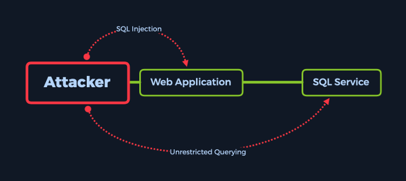

# Appointment

## Introduction

Appointment là một box chủ yếu hướng đến ứng dụng web. Cụ thể hơn, sẽ tìm hiểu cách thực hiện `SQL Injection` đối với ứng dụng web hỗ trợ `SQL Database`. Mục tiêu là chạy một trang web có khả năng tìm kiếm đối với cơ sở dữ liệu phụ trợ chứa các mục có thể tìm kiếm dễ bị tấn công theo kiểu này. Không phải tất cả các mục trong cơ sở dữ liệu này đều có thể được người dùng nhìn thấy, vì vậy các đặc quyền khác nhau trên trang web sẽ cấp các kết quả tìm kiếm khác nhau.

Về mặt lý thuyết, người quản trị trang web sẽ tìm kiếm người dùng, email, thông tin thanh toán, địa chỉ giao hàng và các thông tin khác. Ngược lại, người dùng đơn giản hoặc khách truy cập chưa xác thực chỉ có thể có quyền tìm kiếm các sản phẩm đang được bán. Các `table` này sẽ tách biệt. Tuy nhiên, đối với kẻ tấn công có kiến ​​thức về lỗ hổng ứng dụng web - cụ thể là SQL Injection trong trường hợp này - thì việc tách biệt giữa các bảng đó sẽ không có ý nghĩa gì vì chúng sẽ có thể khai thác ứng dụng web để trực tiếp truy vấn bất kỳ bảng nào được tìm thấy trên Cơ sở dữ liệu SQL của máy chủ web.


Một ví dụ tuyệt vời về cách thức hoạt động thông thường của Dịch vụ SQL là quy trình đăng nhập được sử dụng cho bất kỳ người dùng nào. Mỗi lần người dùng muốn đăng nhập, ứng dụng web sẽ gửi thông tin đầu vào trang đăng nhập (tên người dùng/mật khẩu kết hợp) đến Dịch vụ SQL, so sánh với các mục nhập cơ sở dữ liệu được lưu trữ cho người dùng cụ thể đó. Giả sử tên người dùng và mật khẩu được chỉ định khớp với bất kỳ mục nhập nào trong cơ sở dữ liệu. Trong trường hợp đó, Dịch vụ SQL sẽ báo cáo lại cho ứng dụng web, sau đó, ứng dụng web sẽ đăng nhập người dùng, cấp cho họ quyền truy cập vào các phần bị hạn chế của trang web. Sau khi đăng nhập, ứng dụng web sẽ đặt cho người dùng một quyền đặc biệt dưới dạng cookie hoặc mã thông báo xác thực liên kết sự hiện diện trực tuyến của người dùng với sự hiện diện đã xác thực của người dùng trên trang web. Cookie này được lưu trữ cục bộ, trên bộ nhớ trình duyệt của người dùng và máy chủ web.

Sau đó, nếu người dùng muốn tìm kiếm trong danh sách các mục được liệt kê trên trang để tìm một mục cụ thể, người dùng sẽ nhập tên đối tượng vào thanh tìm kiếm, điều này sẽ kích hoạt cùng một Dịch vụ SQL để chạy truy vấn SQL thay mặt cho người dùng. Giả sử một mục nhập cho mục được tìm kiếm tồn tại trong cơ sở dữ liệu, thường là dưới một bảng khác. Trong trường hợp đó, thông tin liên quan được truy xuất và gửi đến ứng dụng web để trình bày cho người dùng dưới dạng hình ảnh, văn bản, liên kết và các loại khác, chẳng hạn như bình luận và đánh giá.


Lý do các trang web sử dụng cơ sở dữ liệu như MySQL, MariaDB hoặc các loại khác là vì dữ liệu mà chúng thu thập hoặc phục vụ cần được lưu trữ ở đâu đó. Dữ liệu có thể là tên người dùng, mật khẩu, bài đăng, tin nhắn hoặc các tập hợp nhạy cảm hơn như PII (Thông tin nhận dạng cá nhân), được bảo vệ bởi luật bảo mật dữ liệu quốc tế. Bất kỳ doanh nghiệp nào coi thường việc bảo vệ PII của người dùng đều bị các cơ quan quản lý quốc tế và các cơ quan bảo mật dữ liệu phạt rất nặng.

SQLi là một cách phổ biến để khai thác các trang web sử dụng `SQL Statements` để truy xuất và lưu trữ dữ liệu đầu vào của người dùng. Nếu cấu hình không đúng cách, người ta có thể sử dụng cuộc tấn công này để khai thác lỗ hổng `SQL Injection` nổi tiếng, rất nguy hiểm. Có nhiều kỹ thuật khác nhau để bảo vệ khỏi các cuộc tấn công tiêm SQL, một số trong số đó là xác thực đầu vào, truy vấn tham số, quy trình được lưu trữ và triển khai WAF (Tường lửa ứng dụng web) trên chu vi mạng của máy chủ. Tuy nhiên, có thể tìm thấy những trường hợp không có bản sửa lỗi nào trong số này được áp dụng, đó là lý do tại sao loại tấn công này lại phổ biến, theo danh sách 10 lỗ hổng web hàng đầu của OWASP.



Hãy xem xét mục tiêu và xem liệu nó có phù hợp với tình huống này không.

## Enumeration

Đầu tiên, thực hiện quét nmap để tìm các cổng mở và khả dụng cùng các dịch vụ của chúng. Nếu không có cờ thay thế nào được chỉ định trong cú pháp lệnh, nmap sẽ quét 1000 cổng TCP phổ biến nhất để tìm các dịch vụ đang hoạt động. Điều này phù hợp trong trường hợp này.

Ngoài ra, sẽ cần các đặc quyền siêu người dùng để chạy lệnh bên dưới với cờ `-sC` hoặc `-sV`. Điều này là do quét tập lệnh (`-sC`) và phát hiện phiên bản (`-sV`) được coi là các phương pháp quét mục tiêu mang tính xâm nhập hơn. Điều này dẫn đến khả năng bị thiết bị bảo mật chu vi trên mạng của mục tiêu phát hiện cao hơn.

```
-sC: Thực hiện quét tập lệnh bằng bộ tập lệnh mặc định. Nó tương đương với --script=default. Một số tập lệnh trong danh mục này được coi là xâm phạm và không nên chạy trên mạng đích mà không được phép.

-sV: Bật phát hiện phiên bản, tính năng này sẽ phát hiện phiên bản nào đang chạy trên cổng nào.
```


Cổng mở duy nhất phát hiện là cổng 80 TCP, đang chạy phiên bản máy chủ `Apache httpd 2.4.38`.

Apache HTTP Server là một ứng dụng mã nguồn mở và miễn phí chạy các trang web trên máy chủ web vật lý hoặc ảo. Đây là một trong những máy chủ HTTP phổ biến nhất và thường chạy trên các cổng HTTP chuẩn như cổng 80 TCP, 443 TCP và trên các cổng HTTP như 8080 TCP hoặc 8000 TCP. HTTP là viết tắt của Hypertext Transfer Protocol (Giao thức truyền siêu văn bản) và là giao thức lớp ứng dụng được sử dụng để truyền các tài liệu siêu phương tiện, chẳng hạn như HTML (Ngôn ngữ đánh dấu siêu văn bản).

Quét nmap cung cấp phiên bản chính xác của dịch vụ Apache httpd, đó là 2.4.38. Thông thường, một ý tưởng hay là tìm kiếm phiên bản dịch vụ trên các cơ sở dữ liệu lỗ hổng phổ biến trực tuyến để xem có lỗ hổng nào tồn tại đối với phiên bản đã chỉ định hay không. Tuy nhiên, trong trường hợp này, phiên bản này không chứa bất kỳ lỗ hổng nào đã biết có thể khai thác.

Để liệt kê thêm dịch vụ đang chạy trên cổng 80, có thể điều hướng trực tiếp đến địa chỉ IP của mục tiêu từ trình duyệt, bên trong phiên bản Pwnbox hoặc Máy ảo.


Lưu ý: Bắt đầu từ bên dưới, sẽ khám phá khái niệm về việc dùng brute-force để tấn công các thư mục khác nhau để đưa vào giai đoạn Liệt kê, điều này sẽ không giúp khai thác mục tiêu và được coi là một bước tùy chọn nhưng cần biết. Phần này được coi là tùy chọn đối với Bậc 0, nhưng lại là một bước có giá trị trong quy trình đánh giá. Nếu muốn bỏ qua, có thể cuộn xuống phần `Foothold`.

Khi nhập địa chỉ IP của mục tiêu vào trường URL của trình duyệt, sẽ thấy một trang web có biểu mẫu đăng nhập. Biểu mẫu đăng nhập được sử dụng để xác thực người dùng và cấp cho họ quyền truy cập vào các phần bị hạn chế của trang web tùy thuộc vào cấp độ đặc quyền liên quan đến tên người dùng đầu vào. Vì không biết bất kỳ thông tin xác thực cụ thể nào mà có thể sử dụng để đăng nhập, nên sẽ kiểm tra xem có bất kỳ thư mục hoặc trang nào khác hữu ích trong quy trình liệt kê hay không. Luôn được coi là một thông lệ tốt khi liệt kê đầy đủ mục tiêu trước khi chúng ta nhắm mục tiêu vào một lỗ hổng cụ thể, chẳng hạn như lỗ hổng SQL Injection trong trường hợp này. Cần có cái nhìn toàn diện để đảm bảo rằng không bỏ sót bất kỳ điều gì và không rơi vào tình trạng mơ hồ, điều này có thể nhanh chóng gây ra sự bực bội.

Hãy nghĩ về các thư mục web như "thư mục web" nơi các tài nguyên khác và các tệp có liên quan được lưu trữ và sắp xếp, chẳng hạn như các trang khác, biểu mẫu đăng nhập, biểu mẫu đăng nhập quản trị, hình ảnh và lưu trữ tệp cấu hình như CSS, JavaScript, PHP, v.v. Một số tài nguyên này được liên kết trực tiếp từ trang đích của trang web. Các trang mà đều quen thuộc, chẳng hạn như `Home`, `About`, `Contact`, `Register` và các trang `Log-in`, được coi là các thư mục web riêng biệt. Khi điều hướng đến các trang này, địa chỉ URL ở đầu cửa sổ trình duyệt sẽ thay đổi tùy thuộc vào vị trí hiện tại. Ví dụ: nếu điều hướng từ `Home` đến trang `Contact` của một trang web, URL sẽ thay đổi như sau:

Trang chủ:

```
https://www.example.com/home
```

Trang liên hệ:

```
https://www.example.com/contact
```

Một số trang có thể được `nested` vào các trang khác, nghĩa là thư mục của một trang có thể được tìm thấy trong một thư mục lớn hơn chứa trang trước đó. Hãy lấy trang `Forgot Password` làm ví dụ. Những trang này thường nằm trong thư mục
`Login` vì có thể được chuyển hướng đến thư mục này từ biểu mẫu đăng nhập nếu quên mật khẩu người dùng.

Trang đăng nhập:

```
https://www.example.com/login
```

Trang quên mật khẩu:

```
https://www.example.com/login/forgot
```

Tuy nhiên, giả sử các nút và liên kết đến các thư mục mong muốn không được cung cấp. Trong trường hợp đó, vì các thư mục đang tìm kiếm có chứa tài liệu nhạy cảm hoặc chỉ là tài nguyên để trang web tải hình ảnh và video, có thể cung cấp tên của các thư mục hoặc trang web đó trong cùng một trường URL của trình duyệt để xem liệu nó có tải được bất kỳ thứ gì không. Bản thân trình duyệt sẽ không chặn quyền truy cập vào các thư mục này chỉ vì không có liên kết hoặc nút nào trên trang web dành cho chúng. Người quản trị trang web sẽ cần đảm bảo các thư mục chứa thông tin nhạy cảm được bảo mật đúng cách để người dùng không thể chỉ đơn giản điều hướng thủ công đến chúng.

Khi điều hướng qua các thư mục web, máy khách HTTP, tức là trình duyệt sẽ giao tiếp với máy chủ HTTP (trong trường hợp này là Apache 2.4.38) bằng giao thức HTTP bằng cách gửi Yêu cầu HTTP (tin nhắn GET hoặc POST) mà sau đó máy chủ sẽ xử lý và trả về với Phản hồi HTTP.

Phản hồi HTTP chứa mã trạng thái, trong đó nêu chi tiết trạng thái tương tác giữa yêu cầu của máy khách và cách máy chủ xử lý yêu cầu đó. Một số mã trạng thái phổ biến hơn cho giao thức HTTP là:

```
HTTP1/1 200 OK: Trang/tài nguyên tồn tại, tiến hành gửi dữ liệu cho bạn.

HTTP1/1 404 Không tìm thấy: Trang/tài nguyên không tồn tại.

HTTP1/1 302 Đã tìm thấy: Trang/tài nguyên đã tìm thấy, nhưng bằng cách chuyển hướng đến thư mục khác (tạm thời di chuyển). Đây là lời mời đến tác nhân người dùng (trình duyệt web) để thực hiện yêu cầu thứ hai giống hệt với URL mới được chỉ định trong trường vị trí. Sẽ nhận thấy toàn bộ quá trình như một chuyển hướng liền mạch đến URL mới của tài nguyên đã chỉ định.
```

Nếu muốn tìm hiểu thêm về cách thức hoạt động của Yêu cầu Web, có thể xem mô-đun có tên là Web Request!


Hãy xem xét toàn bộ quy trình tìm kiếm và truy cập thư mục ẩn. Bằng cách chỉ định địa chỉ IP của mục tiêu chạy máy chủ HTTP trong trường URL của trình duyệt theo sau là dấu gạch chéo (/) và tên thư mục hoặc tệp đang tìm kiếm, các sự kiện sau sẽ diễn ra:

- Tác nhân người dùng (trình duyệt / máy khách HTTP) sẽ gửi yêu cầu GET đến Máy chủ HTTP với URL của tài nguyên yêu cầu

- Máy chủ HTTP sẽ tra cứu tài nguyên ở vị trí đã chỉ định (URL đã cho)

- Nếu tài nguyên hoặc thư mục tồn tại, sẽ nhận được phản hồi của Máy chủ HTTP chứa dữ liệu yêu cầu (có thể là trang web, hình ảnh, tệp âm thanh, tập lệnh, v.v.) và mã phản hồi `200 OK`, vì tài nguyên đã được tìm thấy và yêu cầu đã được thực hiện thành công.

- Nếu không tìm thấy tài nguyên hoặc thư mục tại địa chỉ đã chỉ định và quản trị viên máy chủ không triển khai chuyển hướng cho tài nguyên hoặc thư mục đó, phản hồi của Máy chủ HTTP sẽ chứa `404 Page` thông thường có kèm theo mã phản hồi `404 Not Found`.

Hai trường hợp trên là những gì sẽ tập trung vào khi cố gắng liệt kê các thư mục hoặc tài nguyên ẩn. Tuy nhiên, thay vì điều hướng thủ công qua thanh tìm kiếm URL để tìm dữ liệu ẩn này, sẽ sử dụng một công cụ tự động tìm kiếm. Đây là nơi các công cụ như Gobuster, Dirbuster, Dirb và các công cụ khác phát huy tác dụng.

Chúng được gọi là các công cụ brute-forcing. Brute-force là phương pháp gửi dữ liệu được cung cấp thông qua danh sách các biến được tạo đặc biệt gọi là danh sách từ để cố gắng đoán đầu vào chính xác để xác thực và giành quyền truy cập. Áp dụng phương pháp brute-forcing cho các thư mục và tài nguyên web bằng một công cụ như vậy sẽ đưa các biến từ danh sách từ từng cái một, các yêu cầu không liên quan đến máy chủ HTTP, sau đó đọc mã phản hồi HTTP cho mỗi yêu cầu để xem nó có được chấp nhận là tài nguyên hiện có hay không. Trong trường hợp này, wordlist sẽ sử dụng sẽ chứa tên thư mục và file chuẩn (chẳng hạn như `images`, `scripts`, `login.php`, `admin.php`), kết hợp với các tên không phổ biến hơn.

Kiểu tấn công tương tự cũng được áp dụng cho việc tấn công brute-forcing mật khẩu - gửi mật khẩu từ danh sách từ cho đến khi tìm thấy đúng mật khẩu cho tên người dùng đã chỉ định. Phương pháp này phổ biến đối với những kẻ tấn công có kỹ năng thấp do độ phức tạp thấp, với nhược điểm là "ồn ào", nghĩa là nó liên quan đến việc gửi một số lượng lớn yêu cầu mỗi giây, nhiều đến mức nó dễ dàng bị phát hiện bởi các thiết bị bảo mật chu vi được tinh chỉnh để lắng nghe các tương tác không phải của con người với các biểu mẫu đăng nhập.

Trong trường hợp này, sẽ chạy một công cụ có tên là Gobuster, công cụ này sẽ tấn công brute-force các thư mục và tệp được cung cấp trong danh sách từ theo lựa chọn. Gobuster được cài đặt sẵn với Parrot OS. Tuy nhiên, nếu đang sử dụng một hệ điều hành khác, có thể cài đặt nó bằng cách tiến hành theo các bước bên dưới.

### Gobuster

Gobuster được viết bằng Golang, viết tắt của ngôn ngữ lập trình Go. Theo định nghĩa của Wikipedia về Golang:

```
Go is a statically typed, compiled programming language designed at Google [..].

Go is syntactically similar to C but with memory safety, garbage collection, structural typing, and CSP-style concurrency. The language is often referred to as Golang because of its domain name, golang.org, but the proper name is Go.
 
Go is influenced by C, but with an emphasis on greater simplicity and safety. The language consists of:

- A syntax and environment adopting patterns more common in dynamic languages:
  - Optional concise variable declaration and initialization through type inference 
[..].
  - Fast compilation.
  - Remote package management (go get) and online package documentation.

- Distinctive approaches to particular problems:
  - Built-in concurrency primitives: light-weight processes (goroutines), channels, and the select statement.
  - An interface system in place of virtual inheritance and type embedding instead of non-virtual inheritance.
  - A toolchain that, by default, produces statically linked native binaries without external dependencies.
  
- A desire to keep the language specification simple enough to hold in a programmer's head, in part by omitting features that are common in similar languages.
```

### Installation

Vì công cụ này được viết bằng Go, cần cài đặt ngôn ngữ/trình biên dịch Go/v.v. Chi tiết đầy đủ về cài đặt và thiết lập có thể được tìm thấy trên trang web ngôn ngữ Go. Cần ít nhất phiên bản Go 1.16.0 để biên dịch Gobuster.

Sau khi cài đặt, có hai tùy chọn:

#### A. Using the `go install` command

Nếu đã có sẵn môi trường `Go` (ít nhất là go 1.16), có thể thực hiện dễ dàng như sau:

```
go install github.com/OJ/gobuster/v3@latest
```

Sau khi quá trình cài đặt hoàn tất, có thể chuyển đến phần "Using Gobuster".

#### B. Building from source code and compiling

Đầu tiên, sẽ cần sao chép kho lưu trữ:

```
git clone https://github.com/OJ/gobuster.git
```

Sau khi quá trình sao chép hoàn tất, sẽ có một thư mục `gobuster` trong thư mục đang ở. Điều hướng đến thư mục chứa các tệp. `Gobuster` có các phụ thuộc bên ngoài, do đó, trước tiên chúng cần được kéo vào:

```
go get && go build
```

Thao tác này sẽ tạo một tệp nhị phân `gobuster`. Nếu muốn cài đặt nó trong thư mục `$GOPATH/bin`, có thể chạy:

```
go install
```

Nếu đã có tất cả các phụ thuộc, có thể sử dụng các tập lệnh dựng:

- `make` - dựng cho cấu hình Go hiện tại (tức là chạy `go build` ).
- `make windows` - dựng các tệp nhị phân 32 và 64 bit cho Windows và ghi chúng vào thư mục `build`.
- `make linux` - dựng các tệp nhị phân 32 và 64 bit cho Linux và ghi chúng vào thư mục `build`.
- `make darwin` - dựng các tệp nhị phân 32 và 64 bit cho Darwin và ghi chúng vào thư mục `build`.
- `make all` - dựng cho tất cả các nền tảng và kiến ​​trúc, và ghi các tệp nhị phân kết quả vào thư mục `build`.
- `make clean` - xóa thư mục `build`.
- `make test` - chạy các test.

### Using Gobuster

Để biết cách sử dụng Gobuster, có thể sử dụng cú pháp sau.


Sau khi kiểm tra tùy chọn `help`, giờ có thể sử dụng chương trình để tìm các trang và thư mục thú vị. Tuy nhiên, vẫn thiếu wordlist. Có một thư mục chuyên dụng với vô số wordlist, từ điển và bảng cầu vồng được cài đặt sẵn với Parrot OS, nằm trong đường dẫn /usr/share/wordlists. Tuy nhiên, cũng có thể tải xuống bộ sưu tập SecLists, đây là một trong những bộ sưu tập danh sách từ nổi tiếng nhất hiện nay. 

Để tải xuống, hãy nhập lệnh sau:

```
git clone https://github.com/danielmiessler/SecLists.git
```

Bây giờ, có thể bắt đầu sử dụng Gobuster đúng cách với đầy đủ khả năng của nó. Các cờ sẽ sử dụng với lệnh này như sau:

```
dir: Chỉ định rằng muốn thực hiện liệt kê thư mục web.
--url: Chỉ định địa chỉ web của máy đích chạy máy chủ HTTP.
--wordlist: Chỉ định wordlist muốn sử dụng.
```


Sau khi kiểm tra các thư mục web, không tìm thấy thông tin hữu ích nào. Các kết quả có trong đầu ra đại diện cho các thư mục mặc định cho hầu hết các trang web và hầu hết thời gian, chúng không chứa các tệp có thể khai thác hoặc hữu ích cho kẻ tấn công theo bất kỳ cách nào. Tuy nhiên, vẫn đáng để kiểm tra chúng vì đôi khi, chúng có thể chứa các tệp không chuẩn được đặt ở đó do nhầm lẫn.

## Foothold

Vì Gobuster không tìm thấy bất kỳ thông tin hữu ích nào, cần kiểm tra bất kỳ thông tin xác thực mặc định nào hoặc bỏ qua trang đăng nhập bằng cách nào đó. Để kiểm tra thông tin xác thực mặc định, có thể nhập các kết hợp phổ biến nhất vào trường tên người dùng và mật khẩu, chẳng hạn như:

```
admin:admin
guest:guest 
user:user
root:root
administrator:password
```

Sau khi thử tất cả các kết hợp đó, vẫn không đăng nhập được. Về mặt lý thuyết, có thể sử dụng một công cụ để thử tấn công brute-force trang đăng nhập. Tuy nhiên, điều đó sẽ mất nhiều thời gian và có thể kích hoạt một biện pháp bảo mật.

Chiến thuật hợp lý tiếp theo là kiểm tra biểu mẫu đăng nhập để tìm lỗ hổng SQL Injection có thể xảy ra. Vectơ này đã được mô tả kỹ lưỡng trong phần `Introduction` của bài viết:

```
SQL Injection là một cách phổ biến để khai thác các trang web sử dụng SQL Statements để truy xuất và lưu trữ dữ liệu đầu vào của người dùng. Nếu cấu hình không đúng, người ta có thể sử dụng cuộc tấn công này để khai thác lỗ hổng SQL Injection nổi tiếng, rất nguy hiểm. Có nhiều kỹ thuật khác nhau để bảo vệ khỏi SQL Injection, một số trong số đó là xác thực đầu vào, truy vấn tham số, quy trình được lưu trữ và triển khai WAF (Tường lửa ứng dụng web) trên chu vi mạng của máy chủ. Tuy nhiên, có thể tìm thấy những trường hợp không có bản sửa lỗi nào trong số này được áp dụng, đó là lý do tại sao loại tấn công này lại phổ biến, theo danh sách [10 lỗ hổng hàng đầu của OWASP](https://owasp.org/www-project-top-ten/) về các lỗ hổng web.
```

Sau đây là ví dụ về cách xác thực hoạt động bằng PHP và SQL:

```
<?php
 
mysql_connect("localhost", "db_username", "db_password"); # Connection to the SQL 
Database.
mysql_select_db("users"); # Database table where user information is stored.

$username=$_POST['username']; # User-specified username.
$password=$_POST['password']; #User-specified password.

$sql="SELECT * FROM users WHERE username='$username' AND password='$password'"; 
# Query for user/pass retrieval from the DB.

$result=mysql_query($sql);
# Performs query stored in $sql and stores it in $result.

$count=mysql_num_rows($result);
# Sets the $count variable to the number of rows stored in $result.

if ($count==1){
  # Checks if there's at least 1 result, and if yes:
  $_SESSION['username'] = $username; # Creates a session with the specified $username.
  $_SESSION['password'] = $password; # Creates a session with the specified $password.
  header("location:home.php"); # Redirect to homepage.
}
else { # If there's no singular result of a user/pass combination:
  header("location:login.php");
  # No redirection, as the login failed in the case the $count variable is not equal to 1, HTTP Response code 200 OK.
}
?>
```

Lưu ý rằng sau ký hiệu `#`, mọi thứ đều chuyển thành bình luận? Đây là cách ngôn ngữ PHP hoạt động. Hãy ghi nhớ điều đó để sử dụng sau.

Đoạn mã trên dễ bị tấn công SQL Injection, khi đó có thể sửa đổi truy vấn (biến `$sql`) thông qua biểu mẫu đăng nhập trên trang web để khiến truy vấn thực hiện một việc không được phép thực hiện - bỏ qua hoàn toàn việc đăng nhập!

Lưu ý rằng có thể chỉ định tên người dùng và mật khẩu thông qua biểu mẫu đăng nhập trên trang web. Tuy nhiên, nó sẽ được nhúng trực tiếp vào biến $sql thực hiện truy vấn SQL mà không cần xác thực đầu vào. Lưu ý rằng không có biểu thức chính quy hoặc hàm nào cấm chèn các ký tự đặc biệt như dấu ngoặc đơn hoặc hashtag. Đây là một hành vi nguy hiểm vì các ký tự đặc biệt đó có thể được sử dụng để sửa đổi các truy vấn. Cặp dấu ngoặc đơn được sử dụng để chỉ định dữ liệu chính xác cần được lấy từ Cơ sở dữ liệu SQL, trong khi ký hiệu hashtag được sử dụng để tạo bình luận. Do đó, có thể thao tác lệnh truy vấn bằng cách nhập lệnh sau:

```
Username: admin'#
```

Sẽ đóng truy vấn bằng dấu ngoặc đơn đó, cho phép tập lệnh tìm kiếm tên người dùng `admin`. Bằng cách thêm hashtag, sẽ bình luận phần còn lại của truy vấn, điều này sẽ khiến việc tìm kiếm mật khẩu khớp với tên người dùng đã chỉ định trở nên lỗi thời. Nếu xem xét sâu hơn trong mã PHP ở trên, sẽ thấy rằng mã sẽ chỉ chấp thuận đăng nhập khi có chính xác một kết quả là tổ hợp tên người dùng và mật khẩu. Tuy nhiên, vì đã bỏ qua phần tìm kiếm mật khẩu trong truy vấn, nên tập lệnh hiện sẽ chỉ tìm kiếm nếu bất kỳ mục nào tồn tại với tên người dùng là `admin`. Trong trường hợp này đã may mắn. Thực sự có một tài khoản có tên là `admin`, sẽ xác thực SQL Injection và trả về giá trị `1` cho biến $count, sẽ được đưa vào `if statement`, cho phép đăng nhập mà không cần biết mật khẩu. Nếu không có
tài khoản quản trị viên, có thể thử bất kỳ tài khoản nào khác cho đến khi tìm thấy một tài khoản tồn tại. (`administrator`, `root`, `john_doe`, v.v.) Bất kỳ tên người dùng hợp lệ, hiện có nào cũng sẽ khiến SQL Injection của hoạt động.

Trong trường hợp này, vì phần tìm kiếm mật khẩu của truy vấn đã bị bỏ qua nên có thể đưa bất cứ thông tin gì vào trường mật khẩu và điều đó không quan trọng.

```
Password: abc123
```

Nói chính xác hơn, đây là cách phần truy vấn của mã PHP bị ảnh hưởng.


Lưu ý đầu vào, đã chú thích phần kiểm tra mật khẩu của truy vấn? Điều này sẽ dẫn đến tập lệnh PHP trả về giá trị 1 (tìm thấy 1 hàng) cho `username = 'admin'` mà không kiểm tra trường mật khẩu để khớp với mục nhập đó. Điều này là do thiếu xác thực đầu vào trong mã PHP được hiển thị ở trên.


Sau khi nhấn nút đăng nhập, mã khai thác sẽ được gửi đi và đúng như nghi ngờ, sẽ thấy trang sau:


Đã thực hiện thành công một SQL Injection và nhận được flag.