# Crocodile

## Introduction

Tier I là tất cả về các vectơ khai thác được liên kết với nhau để cung cấp khả năng có được chỗ đứng trên mục tiêu từ dịch vụ này sang dịch vụ khác. Thông tin xác thực có thể bị mất ở đâu đó trong một thư mục có thể truy cập công khai, cho phép đăng nhập thông qua một shell từ xa không được giám sát và bảo vệ. Một dịch vụ được định cấu hình sai có thể làm rò rỉ thông tin, cho phép mạo danh danh tính kỹ thuật số của nạn nhân. Có rất nhiều khả năng tồn tại trong thế giới thực. Tuy nhiên, sẽ bắt đầu với một số khả năng đơn giản hơn.

Xử lý một ví dụ được ghép lại từ hai mục tiêu trước đó, sẽ xem xét cấu hình truy cập không an toàn trên FTP và thông tin đăng nhập quản trị cho một trang web. Hãy tiến hành phân tích vectơ này và phân tích các thành phần của nó.

## Enumeration

Sẽ bắt đầu bằng cách liệt kê mục tiêu. Bước đầu tiên, như thường lệ, là quét nmap toàn diện. Bằng cách sử dụng hai công tắc sau để quét đảm bảo rằng tập lệnh nmap phân tích dịch vụ đang chạy trên bất kỳ cổng nào được tìm thấy ở trạng thái mở và trả về giá trị phiên bản dịch vụ gần như chính xác trong đầu ra và tất cả các tập lệnh phân tích mặc định đều được chạy trên mục tiêu, vì không bị hạn chế về mức độ xâm nhập có thể có với quá trình quét. Khi chạy quá trình quét như đã đề cập, có thể nhận được kết quả như bên dưới, với các đoạn trích của các thư mục mà quá trình quét thậm chí đã tìm thấy!

```
-sC: Thực hiện quét tập lệnh bằng bộ tập lệnh mặc định. Nó tương đương với --script=default. Một số tập lệnh trong danh mục này được coi là xâm phạm và không nên chạy trên mạng đích mà không được phép.

-sV: Bật phát hiện phiên bản, tính năng này sẽ phát hiện phiên bản nào đang chạy trên cổng nào.
```

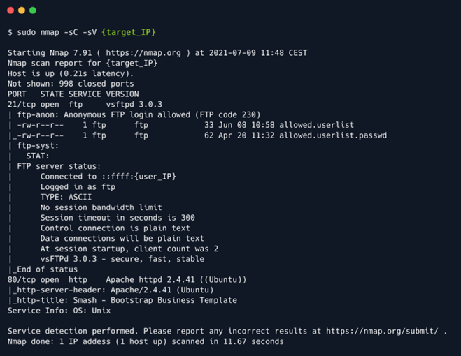

Có hai cổng mở: 21 và 80. Cổng 21 là cổng dành riêng cho FTP (Giao thức truyền tệp), nghĩa là mục đích sử dụng chính của nó là truyền tệp giữa các máy chủ trên cùng một mạng.

Theo Wikipedia, một lời nhắc nhở nhanh:

```
The File Transfer Protocol (FTP) is a standard communication protocol used to transfer computer files from a server to a client on a computer network. FTP users may authenticate themselves with a clear-text sign-in protocol, generally using a username and password. However, they can connect anonymously if the server is configured to allow it.
```

Người dùng có thể kết nối đến máy chủ FTP ẩn danh nếu máy chủ được cấu hình để cho phép, nghĩa là có thể sử dụng ngay cả khi không có thông tin xác thực hợp lệ. Nếu xem lại kết quả quét nmap, máy chủ FTP thực sự được cấu hình để cho phép đăng nhập ẩn danh:

```
ftp-anon: Anonymous FTP login allowed (FTP code 230)
```

Nếu cần ôn lại, lệnh ftp -h sẽ giúp tìm ra các lệnh khả dụng cho dịch vụ FTP trên máy chủ cục bộ.

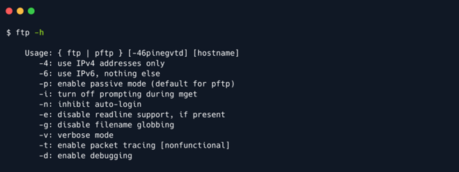

Để kết nối với máy chủ FTP từ xa, cần chỉ định địa chỉ IP của mục tiêu (hoặc tên máy chủ), như được hiển thị trên trang lab Starting Point. Sau đó, prompt sẽ yêu cầu nhập thông tin đăng nhập, đây là nơi có thể điền tên người dùng `anonymous`. Trong trường hợp này, máy chủ FTP không yêu cầu mật khẩu và việc nhập tên người dùng ẩn danh đủ để nhận được mã 230, `Login successful`.

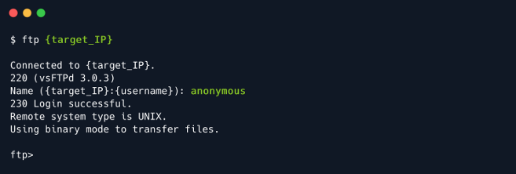

Sau khi đăng nhập, có thể nhập lệnh `help` để kiểm tra các lệnh có sẵn.

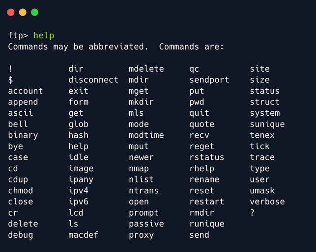

Sẽ sử dụng `dir` và `get` để liệt kê các thư mục và thao tác các tệp được lưu trữ trên máy chủ FTP. Với lệnh `dir`, có thể kiểm tra nội dung của thư mục hiện tại trên máy chủ từ xa, nơi có hai tệp thú vị thu hút sự chú ý. Chúng có vẻ là các tệp còn sót lại từ cấu hình của một dịch vụ khác trên máy chủ, rất có thể là Máy chủ web HTTPD. Tên của chúng mang tính mô tả, ám chỉ đến danh sách tên người dùng có thể có và mật khẩu liên quan.

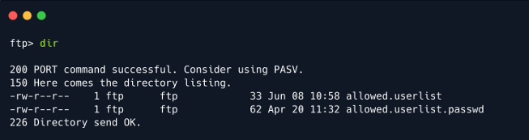

Cả hai tệp đều có thể dễ dàng tải xuống bằng lệnh `get`. Dịch vụ FTP sẽ báo cáo trạng thái tải xuống hoàn tất trong giai đoạn này. Sẽ không mất nhiều thời gian để cả hai tệp đều nằm gọn gàng trên VM tấn công.

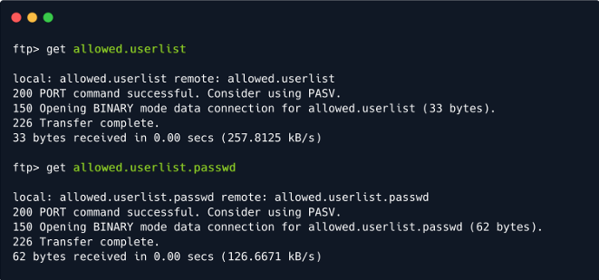

Có thể chấm dứt kết nối FTP bằng lệnh `exit`. Lệnh này sẽ đưa tab terminal hiện tại trở về trạng thái trước đó.

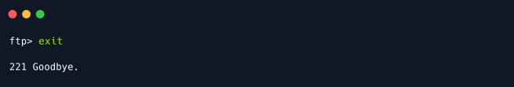

Ngay sau khi thoát khỏi shell dịch vụ FTP, có thể nhập lệnh `ls` để kiểm tra xem các tệp có nằm trong thư mục đã định vị lần cuối hay không. Để đọc nội dung của chúng và khám phá tên người dùng và mật khẩu bên trong, có thể sử dụng lệnh `cat`, theo sau là tên tệp muốn mở.

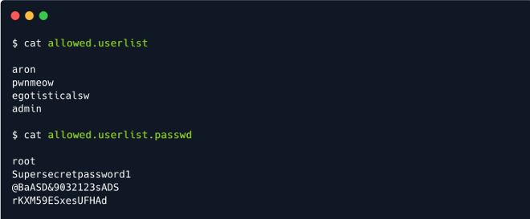

## Foothold

Sau khi đã có thông tin xác thực, bước tiếp theo là kiểm tra xem chúng có được sử dụng trên dịch vụ FTP để truy cập nâng cao hay máy chủ web đang chạy trên cổng 80 được phát hiện trong quá trình quét nmap không. Cố gắng đăng nhập bằng bất kỳ thông tin xác thực nào trên máy chủ FTP sẽ trả về mã lỗi `530 This FTP server is anonymous only`. Không may mắn ở đây, vì vậy có thể thoát khỏi shell dịch vụ FTP.

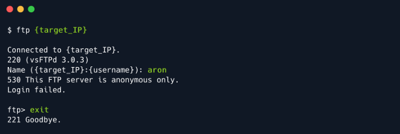

Tuy nhiên, còn một lựa chọn nữa. Trong quá trình quét nmap, dịch vụ chạy trên cổng 80 được báo cáo là `Apache httpd 2.4.41`, một máy chủ Apache HTTP. Nhập địa chỉ IP của mục tiêu vào thanh tìm kiếm URL của trình duyệt sẽ cho ra trang web này. Có vẻ như đây là một cửa hàng cho một công ty lưu trữ máy chủ.


Đọc về mục tiêu có ích, nhưng chỉ ở mức độ bề mặt. Để hiểu sâu hơn về công nghệ mà họ đã sử dụng để tạo trang web và có thể tìm thấy bất kỳ lỗ hổng nào liên quan, có thể sử dụng một trình cắm thêm tiện dụng có tên là Wappalyzer. Trình cắm thêm này phân tích mã của trang web và trả về tất cả các công nghệ khác nhau được sử dụng để xây dựng trang web, chẳng hạn như loại máy chủ web, thư viện JavaScript, ngôn ngữ lập trình, v.v.

Sau khi cài đặt, có thể truy cập Wappalyzer bằng cách nhấn vào biểu tượng của nó ở góc trên bên phải của cửa sổ trình duyệt. Dưới đây là kết quả cho mục tiêu hiện tại.

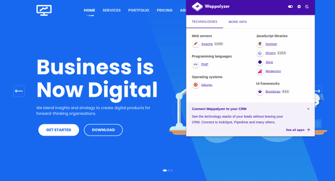

Từ kết quả đầu ra của Wappalyzer, có thể lưu ý một số mục thú vị hơn, cụ thể là ngôn ngữ lập trình PHP được sử dụng để xây dựng trang web. Tuy nhiên, hiện tại không có gì cung cấp một kế hoạch tấn công trực tiếp. Trong khi đó, việc điều hướng xung quanh trang bằng các tab và nút được cung cấp trên đó không dẫn đến đâu cả. Tham khảo các bài viết trước, có đề cập đến một cách khác, trực tiếp hơn để điều hướng bất kỳ thư mục và trang ẩn hoặc khó truy cập nào, đó là thông qua dir busting. Sử dụng gobuster làm công cụ lựa chọn, có thể sử dụng các công tắc sau cho tập lệnh để có được kết quả nhanh nhất và chính xác nhất.

```
dir : Sử dụng chế độ liệt kê thư mục/tệp.
--url : URL đích.
--wordlist : Đường dẫn đến wordlist.
-x : Phần mở rộng file để tìm kiếm
```

Đối với lệnh chuyển đổi `-x`, có thể chỉ định `php` và `html` để lọc ra tất cả những thứ lộn xộn không cần thiết mà không quan tâm. Các tệp PHP và HTML thường là các trang. Có thể may mắn và tìm thấy một trang đăng nhập bảng điều khiển quản trị có thể giúp tìm ra đòn bẩy chống lại mục tiêu kết hợp với thông tin xác thực trích xuất từ ​​máy chủ FTP.

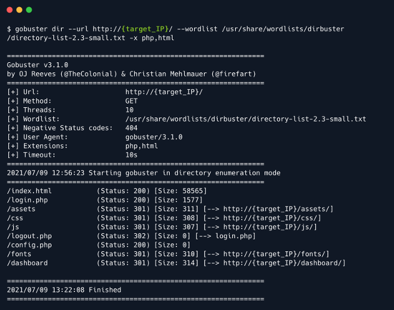

Một trong những tệp thú vị nhất mà gobuster thu thập được là trang `/login.php`. Khi điều hướng thủ công đến URL, dưới dạng `http://{target_IP}/login.php`, sẽ thấy một trang đăng nhập yêu cầu kết hợp tên người dùng/mật khẩu.

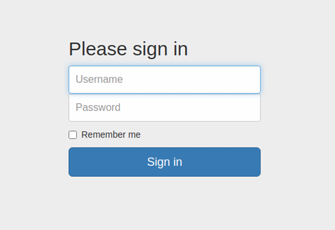

Nếu danh sách thông tin xác thực mà tìm thấy dài hơn, có thể sử dụng mô-đun Metasploit hoặc tập lệnh brute-force để chạy qua các kết hợp từ cả hai danh sách nhanh hơn so với lao động thủ công. Tuy nhiên, trong trường hợp này, danh sách tương đối nhỏ, cho phép thử đăng nhập thủ công.

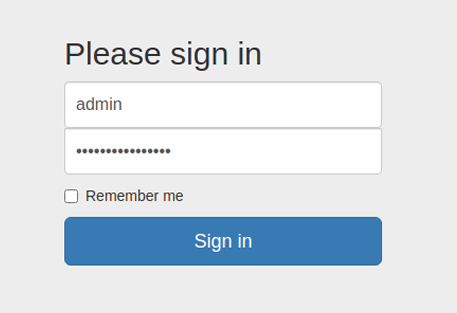

Sau khi thử nhiều tổ hợp tên người dùng/mật khẩu, đã đăng nhập được và gặp bảng quản trị Server Manager. Khi vào được đây, kẻ tấn công có thể thao túng trang web theo bất kỳ cách nào chúng muốn, gây hỗn loạn cho cơ sở người dùng và chủ sở hữu hoặc trích xuất thêm thông tin giúp chúng có được chỗ đứng trên các máy chủ lưu trữ trang web.

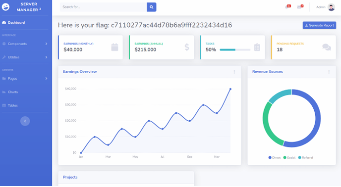

Đã nhận được flag! Nó được hiển thị ở đầu bảng quản trị.