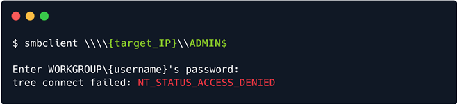

# Dancing

## Introduction

Có nhiều cách để chuyển một file giữa hai máy chủ (máy tính) trên cùng một mạng. Một trong những giao thức này được nghiên cứu trong ví dụ này, đó là SMB (Server Message Block). Giao thức truyền thông này cung cấp quyền truy cập được chia sẻ vào các file, máy in và cổng nối tiếp giữa các endpoint trên mạng. Chủ yếu thấy các dịch vụ SMB chạy trên máy Windows.

Trong quá trình quét, thường thấy cổng 445 TCP mở trên mục tiêu, dành riêng cho giao thức SMB. Thông thường, SMB chạy ở lớp Ứng dụng hoặc Trình bày của mô hình OSI, được mô tả bên dưới. Do đó, nó dựa vào các giao thức cấp thấp hơn để vận chuyển. Giao thức lớp Vận chuyển mà Giao thức SMB của Microsoft thường được sử dụng nhất là NetBIOS qua TCP/IP (NBT). Đây là lý do tại sao, trong quá trình quét, rất có thể sẽ thấy cả hai giao thức đều có cổng mở chạy trên mục tiêu. Sẽ thấy điều này trong giai đoạn liệt kê của bài viết.


Nếu muốn tìm hiểu thêm về mô hình OSI và các khái niệm mạng cơ bản khác, hãy xem mô-đun Introduction to Network trên HTB Academy. Đây cũng sẽ là một trong những mô-đun được đề xuất ở đầu trang lab.


Sử dụng giao thức SMB, một ứng dụng (hoặc người dùng ứng dụng) có thể truy cập các tệp tại máy chủ từ xa, cùng với các tài nguyên khác như máy in. Do đó, ứng dụng máy khách có thể đọc, tạo và cập nhật các tệp trên máy chủ từ xa. Nó cũng có thể giao tiếp với bất kỳ chương trình máy chủ nào được thiết lập để nhận yêu cầu máy khách SMB.


Một kho lưu trữ hỗ trợ SMB trên mạng được gọi là `share`. Những kho lưu trữ này có thể được truy cập bởi bất kỳ máy khách nào có địa chỉ của máy chủ và thông tin xác thực phù hợp. Giống như nhiều giao thức truy cập tệp khác, SMB yêu cầu một số lớp bảo mật để hoạt động phù hợp trong cấu trúc mạng. Nếu SMB cho phép máy khách tạo, chỉnh sửa, truy xuất và xóa tệp trên một chia sẻ, thì rõ ràng là cần có cơ chế xác thực. Ở cấp độ người dùng, máy khách SMB được yêu cầu cung cấp tổ hợp tên người dùng/mật khẩu để xem hoặc tương tác với nội dung của chia sẻ SMB.

Mặc dù có khả năng bảo mật quyền truy cập vào chia sẻ, đôi khi người quản trị mạng có thể mắc lỗi và vô tình cho phép đăng nhập mà không có bất kỳ thông tin xác thực hợp lệ nào hoặc sử dụng tài khoản `guest` hoặc `anonymous`. Sẽ chứng kiến ​​điều này trong các phần sau.

## Enumeration

Bắt đầu, như thường lệ, bằng cách quét mục tiêu sau khi kết nối với VPN. Chạy lệnh sau sẽ khiến nmap quét tất cả các cổng và hiển thị phiên bản dịch vụ cho từng cổng.

```
-sV: Kiểm tra các cổng mở để xác định thông tin dịch vụ/phiên bản
```


Như đã đề cập trước đó, nhận thấy rằng cổng 445 TCP dành cho SMB đang hoạt động, điều đó có nghĩa là có một share đang hoạt động mà có thể khám phá. Hãy coi share này như một thư mục có thể truy cập qua internet. Để làm như vậy, sẽ cần các dịch vụ và tập lệnh phù hợp được cài đặt.

Để liệt kê thành công nội dung share trên hệ thống từ xa, có thể sử dụng một tập lệnh có tên là smbclient. Nếu tập lệnh không có trên Máy ảo, có thể cài đặt nó bằng cách nhập lệnh sau vào terminal (đối với hệ điều hành dựa trên Debian):


Nếu đầu ra của terminal giống như trên, điều đó có nghĩa là đã cài đặt phiên bản smbclient mới nhất. Nếu không, có thể tiếp tục cài đặt. Bước tiếp theo là bắt đầu liệt kê nội dung của share được tìm thấy trên mục tiêu trong cả hai trường hợp.

Smbclient sẽ cố gắng kết nối với máy chủ từ xa và kiểm tra xem có yêu cầu xác thực nào không. Nếu có, nó sẽ yêu cầu nhập mật khẩu cho tên người dùng cục bộ. Nên lưu ý điều này. Nếu không chỉ định tên người dùng cụ thể cho smbclient khi cố gắng kết nối với máy chủ từ xa, nó sẽ chỉ sử dụng tên người dùng của máy cục bộ. Đó là tên người dùng mà hiện đang đăng nhập vào Máy ảo. Điều này là do xác thực SMB luôn yêu cầu tên người dùng, vì vậy bằng cách không cung cấp cho nó một tên người dùng rõ ràng để thử đăng nhập, nó sẽ chỉ phải truyền tên người dùng cục bộ hiện tại để tránh gây ra lỗi với giao thức.


Tuy nhiên, hãy sử dụng tên người dùng cục bộ vì không biết về bất kỳ tên người dùng từ xa nào có trên máy chủ đích mà có thể đăng nhập. Tiếp theo, sau đó sẽ được nhắc nhập mật khẩu. Mật khẩu này liên quan đến tên người dùng mà đã nhập trước đó. Theo giả thuyết, nếu là người dùng từ xa hợp pháp đang cố gắng đăng nhập vào tài nguyên của họ, sẽ biết tên người dùng và mật khẩu và đăng nhập bình thường để truy cập vào share. Trong trường hợp này, không có thông tin xác thực như vậy, vì vậy sẽ cố gắng thực hiện bất kỳ điều nào sau đây:

- Xác thực guest

- Xác thực anonymous

Bất kỳ điều nào trong số này sẽ dẫn đến việc đăng nhập mà không biết kết hợp tên người dùng/mật khẩu phù hợp và không thấy các tệp được lưu trữ trên share.Hhãy tiến hành thử điều đó. Để trống trường mật khẩu, chỉ cần nhấn Enter để yêu cầu tập lệnh tiếp tục.


Như thường lệ, có thể nhập tên tập lệnh vào terminal theo sau là lệnh -h hoặc --help để tìm hiểu thêm về khả năng của tập lệnh này cũng như cách sử dụng nó.

```
[-L|--list=HOST]: Chọn máy chủ mục tiêu cho yêu cầu kết nối.
```

Chạy lệnh trên, thấy bốn share riêng biệt được hiển thị. Hãy xem xét từng share và xem chúng có ý nghĩa gì.

- `ADMIN$` - Chia sẻ quản trị là chia sẻ mạng ẩn do họ hệ điều hành Windows NT tạo ra cho phép quản trị viên hệ thống có quyền truy cập từ xa vào mọi ổ đĩa trên hệ thống được kết nối mạng. Những chia sẻ này không thể bị xóa vĩnh viễn nhưng có thể bị vô hiệu hóa.

- `C$` - Chia sẻ quản trị cho ổ đĩa C:\\. Đây là nơi lưu trữ hệ điều hành.

- `IPC$` - Chia sẻ giao tiếp giữa các tiến trình. Được sử dụng cho giao tiếp giữa các tiến trình thông qua các pipe được đặt tên và không phải là một phần của hệ thống tệp.

- `WorkShares` - Chia sẻ tùy chỉnh.

## Foothold

Sẽ thử kết nối đến từng share ngoại trừ share IPC$, không có giá trị vì nó không thể duyệt được như bất kỳ thư mục thông thường nào và không chứa bất kỳ tệp nào mà có thể sử dụng ở giai đoạn này của quá trình học tập. Sẽ sử dụng cùng một chiến thuật như trước, cố gắng đăng nhập mà không có thông tin xác thực phù hợp để tìm các quyền được cấu hình không đúng trên bất kỳ chia sẻ nào trong số này. Sẽ chỉ cung cấp một mật khẩu trống cho mỗi tên người dùng để xem nó có hoạt động không. Đầu tiên, hãy thử ADMIN$.



`NT_STATUS_ACCESS_DENIED` được xuất ra, cho biết rằng không có thông tin xác thực phù hợp để kết nối với share này. Sẽ theo dõi với share quản trị `C$`.


Ý tưởng tương tự ở đây. Cơ hội cuối cùng. Tiến hành thử đăng nhập vào share WorkShares SMB tùy chỉnh. Có vẻ như đây là do con người tạo ra, do đó dễ bị cấu hình sai.


Thành công! Share WorkShares SMB được cấu hình kém, cho phép đăng nhập mà không có thông tin xác thực phù hợp. Có thể thấy terminal prompt đã thay đổi thành `smb: \>` , cho biết rằng shell hiện đang tương tác với dịch vụ. Có thể sử dụng lệnh `help` để xem những gì có thể làm trong shell này.


Từ đầu ra, có thể nhận thấy rằng hầu hết các lệnh mà quen dùng trong Linux đều có mặt. Sẽ sử dụng lệnh sau để điều hướng share:

```
ls: liệt kê nội dung của các thư mục trong sahre
cd: thay đổi các thư mục hiện tại trong share
get: tải xuống nội dung của các thư mục trong share
exit: thoát khỏi shell smb
```

Gõ lệnh `ls` sẽ hiển thị cho hai thư mục, một cho `Amy.J` và một cho `James.P`. Truy cập thư mục đầu tiên và thấy một tệp có tên là `worknotes.txt`, có thể tải xuống bằng lệnh get.


File này hiện được lưu bên trong vị trí mà đã chạy lệnh `smbclient`. Hãy tiếp tục tìm kiếm các tệp có giá trị khác trong thư mục của `James.P`. Khi điều hướng đến file này, cũng có thể tìm thấy tệp `flag.txt`. Sau khi truy xuất file này, có thể sử dụng lệnh `exit` để thoát khỏi shell và kiểm tra các file vừa truy xuất.


Sau khi shell SMB bị vô hiệu hóa, có thể đọc hai file đã trích xuất. File `worknotes.txt` dường như đang ám chỉ đến các dịch vụ khác có thể bị khai thác. Thông thường, có thể tìm thấy những loại tệp này nằm rải rác trong các máy trong Lab Hack The Box Pro, ám chỉ đến mục tiêu tiếp theo hoặc có thể được sử dụng làm tài nguyên để khai thác thêm hoặc di chuyển ngang trong Lab. Trong trường hợp này, đó chỉ là bằng chứng về khái niệm. Sẽ không cần tệp này.


Tuy nhiên, tệp flag.txt là thứ cần. Đọc nó và nhập flag vào nền tảng, sở hữu box Dancing.