# Fawn

## Introduction

Đôi khi, khi được yêu cầu liệt kê các dịch vụ của các máy chủ cụ thể trên mạng máy khách, sẽ gặp phải các dịch vụ truyền file có khả năng cao bị cấu hình kém. Mục đích của bài tập này là để làm quen với Giao thức truyền File (FTP), một giao thức gốc cho tất cả các hệ điều hành máy chủ và được sử dụng trong thời gian dài cho các tác vụ truyền file đơn giản, dù là tự động hay thủ công. FTP có thể dễ dàng bị cấu hình sai nếu không hiểu đúng. Có những trường hợp nhân viên của công ty khách hàng có thể muốn bỏ qua các kiểm tra file hoặc quy tắc tường lửa để truyền file từ chính họ sang các đồng nghiệp của họ. Xem xét nhiều cơ chế khác nhau để kiểm soát và giám sát luồng dữ liệu trong mạng doanh nghiệp hiện nay, kịch bản này trở thành một trường hợp đáng kể và khả thi mà có thể gặp phải ngoài thực tế.

Đồng thời, FTP có thể được sử dụng để truyền tệp nhật ký từ thiết bị mạng này sang thiết bị mạng khác hoặc máy chủ thu thập nhật ký. Giả sử kỹ sư mạng chịu trách nhiệm xử lý cấu hình quên bảo mật máy chủ FTP nhận đúng cách hoặc không coi trọng thông tin có trong nhật ký và quyết định cố tình để dịch vụ FTP không được bảo mật. Trong trường hợp đó, kẻ tấn công có thể tận dụng các bản ghi và trích xuất mọi loại thông tin từ chúng, sau đó có thể sử dụng để lập bản đồ mạng, liệt kê tên người dùng, phát hiện các dịch vụ đang hoạt động, v.v.

Hãy cùng xem FTP là gì, theo định nghĩa trên Wikipedia:

```
The File Transfer Protocol (FTP) is a standard communication protocol used to transfer computer files from a server to a client on a computer network. FTP is built on a client-server model architecture using separate control and data connections between the client and the server. FTP users may authenticate themselves with a clear-text sign-in protocol, generally in the form of a username and password. However, they can connect anonymously if the server is configured to allow it. For secure transmission that protects the username and password and encrypts the content, FTP is often secured with SSL/TLS (FTPS) or replaced with SSH File Transfer Protocol (SFTP). 
```

Từ những dòng đầu tiên của đoạn trích trên, có thể thấy đề cập đến kiến ​​trúc mô hình client-server. Điều này đề cập đến các vai trò mà máy chủ trong mạng có trong quá trình truyền dữ liệu giữa chúng. Người dùng có thể tải xuống và tải lên các tệp từ máy khách (máy chủ của riêng họ) đến máy chủ (thiết bị lưu trữ dữ liệu tập trung) hoặc ngược lại. Về mặt khái niệm, máy khách luôn là máy chủ tải xuống và tải lên các tệp đến máy chủ, và máy chủ luôn là máy chủ lưu trữ an toàn dữ liệu đang được truyền.

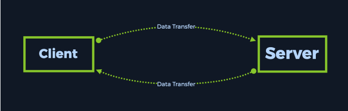

Khách hàng cũng có thể duyệt các tệp có sẵn trên máy chủ khi sử dụng giao thức FTP. Theo quan điểm của thiết bị đầu cuối của người dùng, hành động này sẽ giống như duyệt các thư mục hệ điều hành của riêng họ để tìm các tệp họ cần. Các dịch vụ FTP cũng đi kèm với GUI (Giao diện người dùng đồ họa), tương tự như Chương trình hệ điều hành Windows, cho phép điều hướng dễ dàng hơn cho người mới bắt đầu. Một ví dụ về Dịch vụ FTP hướng đến GUI nổi tiếng là FileZilla. Tuy nhiên, trước tiên hãy hiểu ý nghĩa của việc một cổng đang chạy một dịch vụ công khai.

Một cổng đang chạy một dịch vụ đang hoạt động là một không gian được dành riêng cho địa chỉ IP của mục tiêu để nhận yêu cầu và gửi kết quả. Nếu chỉ có địa chỉ IP hoặc tên máy chủ, thì các máy chủ chỉ có thể thực hiện 1 tác vụ tại một thời điểm. Điều này có nghĩa là nếu bạn muốn duyệt web và phát nhạc từ một ứng dụng trên máy tính cùng một lúc, không thể làm như vậy, vì địa chỉ IP sẽ được sử dụng để xử lý dịch vụ đầu tiên hoặc dịch vụ sau, nhưng không phải cả hai cùng một lúc. Bằng cách có các cổng, có thể có một địa chỉ IP xử lý nhiều dịch vụ, vì nó thêm một lớp phân biệt khác.

Trong trường hợp hiển thị bên dưới, có thể thấy FTP đang hoạt động trên cổng 21. Tuy nhiên, hãy thêm một số dịch vụ bổ sung như SSH (Giao thức Secure Shell) và HTTPD (Máy chủ Web) để khám phá một ví dụ điển hình hơn. Với loại cấu hình này, quản trị viên mạng đã thiết lập cấu hình máy chủ web cốt lõi cơ bản, cho phép họ đạt được những điều sau, tất cả cùng một lúc nếu cần:

- Nhận và gửi các tệp có thể được sử dụng để cấu hình máy chủ web hoặc nhật ký máy chủ tới một nguồn bên ngoài

- Có thể đăng nhập để quản lý từ xa từ một máy chủ ở xa, trong trường hợp cần thay đổi cấu hình

- Phục vụ nội dung web có thể truy cập từ xa thông qua trình duyệt web của máy chủ khác

Từ biểu đồ bên dưới, có thể thấy vị trí của FTP trong cấu trúc logic của máy chủ, cùng với các dịch vụ khác có khả năng chạy trên đó cùng lúc.

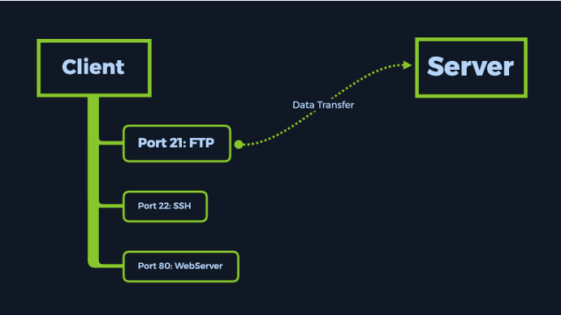

Bài viết trên Wiki cho thấy FTP được coi là không chuẩn khi sử dụng mà không có lớp mã hóa do các giao thức như SSL/TLS (FTPS) hoặc SSH-tunneling (SFTP) cung cấp. Bản thân FTP có khả năng yêu cầu thông tin xác thực trước khi cho phép truy cập vào các tệp được lưu trữ. Tuy nhiên, điểm yếu ở đây là lưu lượng truy cập chứa các tệp đó có thể bị chặn bằng cái gọi là Tấn công trung gian (MitM). Nội dung của các tệp có thể được đọc ở dạng văn bản thuần túy (tức là dạng không được mã hóa, có thể đọc được bằng con người).

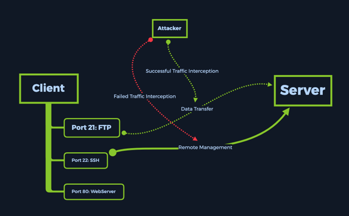

Tuy nhiên, nếu quản trị viên mạng chọn bọc kết nối bằng giao thức SSL/TLS hoặc tạo đường hầm kết nối FTP qua SSH (như được hiển thị bên dưới) để thêm một lớp mã hóa mà chỉ máy chủ nguồn và đích mới có thể giải mã, điều này sẽ ngăn chặn thành công hầu hết các cuộc tấn công Man-in-the-Middle. Lưu ý cách cổng 21 đã biến mất, vì giao thức FTP được di chuyển theo giao thức SSH trên cổng 22, do đó được tạo đường hầm qua đó và được bảo mật chống lại mọi hành vi chặn bắt.

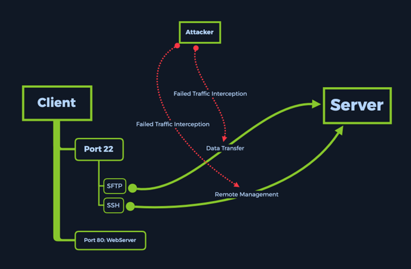

Tuy nhiên, tình huống đang giải quyết trong trường hợp này đơn giản hơn nhiều. Sẽ chỉ tương tác với mục tiêu đang chạy một dịch vụ FTP đơn giản, được cấu hình sai. Hãy tiến hành và phân tích xem một dịch vụ như vậy đang chạy trên máy chủ nội bộ sẽ trông như thế nào.

## Enumeration

Trước tiên, hãy kiểm tra xem kết nối VPN đã được thiết lập chưa. Sử dụng giao thức ping có thể giúp ích vì đây là phương pháp ít tốn kém để tiếp cận mục tiêu để nhận phản hồi, do đó xác nhận kết nối đã được thiết lập và mục tiêu có thể tiếp cận được. Ít tốn kém có nghĩa là rất ít dữ liệu được gửi đến mục tiêu theo mặc định, cho phép nhanh chóng kiểm tra trạng thái của kết nối mà không phải đợi toàn bộ quá trình quét hoàn tất trước đó. Giao thức ping có thể được gọi từ thiết bị đầu cuối bằng lệnh ping {target_IP}, trong đó {target_IP} là địa chỉ IP của phiên bản máy Fawn, như được hiển thị trên trang web Hack The Box, trong lab Starting Point.

Lưu ý rằng điều này có thể không phải lúc nào cũng hiệu quả trong môi trường doanh nghiệp quy mô lớn, vì tường lửa thường có các quy tắc để ngăn chặn việc ping giữa các máy chủ, ngay cả trong cùng một mạng con (LAN), để tránh các mối đe dọa nội gián và phát hiện ra các máy chủ và dịch vụ khác.

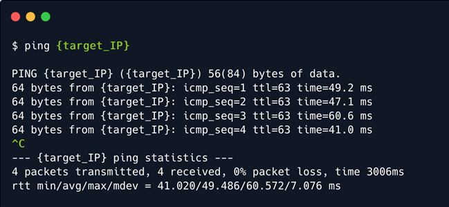

Có thể hủy lệnh ping bằng cách nhấn CTRL+C trên bàn phím, nếu không lệnh sẽ chạy vô hạn. Sau khi lệnh xuất ra, có thể thấy phản hồi đang được nhận từ máy chủ đích. Điều này có nghĩa là máy chủ có thể truy cập được thông qua đường hầm VPN đã tạo. Bây giờ có thể bắt đầu quét các dịch vụ mở trên máy chủ.

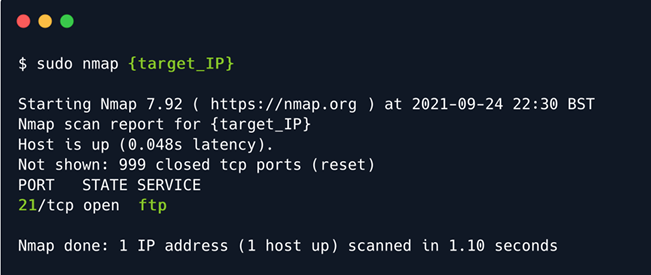

Quét bằng lệnh đã sử dụng trước đó, có thể thấy dịch vụ FTP mở và chạy trên cổng 21. Tuy nhiên, nếu muốn biết phiên bản thực tế của dịch vụ đang chạy trên cổng này thì sao? Quét bằng các công tắc khác nhau có thể cung cấp thông tin cần thiết không?

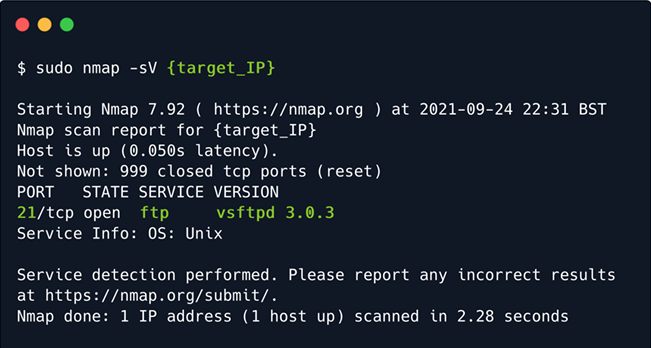

Trong trường hợp này, công tắc -sV là viết tắt của phát hiện phiên bản. Do đó, việc sử dụng công tắc này sẽ khiến quá trình quét mất nhiều thời gian hơn nhưng sẽ cung cấp nhiều thông tin chi tiết hơn về phiên bản dịch vụ đang chạy trên cổng đã phát hiện trước đó. Điều này có nghĩa là chỉ cần nhìn thoáng qua, có thể biết mục tiêu có dễ bị tấn công do chạy phần mềm lỗi thời hay cần đào sâu hơn để tìm vectơ tấn công.

Sẽ thực hiện các bước nhỏ hướng tới mục tiêu và bước tiếp theo sẽ chỉ liên quan đến việc tương tác với dịch vụ như hiện trạng để tìm hiểu thêm về cách nên tiếp cận mục tiêu. Tuy nhiên, việc có phiên bản dịch vụ luôn giúp hiểu rõ hơn về những gì đang chạy trên cổng được quét.

## Foothold

Đã đến lúc tương tác với mục tiêu. Để truy cập dịch vụ FTP, sẽ sử dụng lệnh ftp trên host của mình. Thực hành tốt là kiểm tra nhanh xem ftp đã được cập nhật và cài đặt đúng cách chưa. Chạy lệnh bên dưới sẽ hiển thị cùng một đầu ra như trong hình nếu dịch vụ ftp đã được cài đặt. Nếu không, nó sẽ tiếp tục cài đặt. Công tắc -y ở cuối lệnh được sử dụng để chấp nhận cài đặt mà không làm gián đoạn quá trình để hỏi có muốn tiếp tục không.

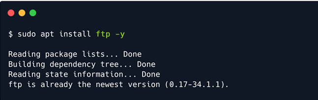

Sau khi cài đặt xong, có thể chạy lệnh ftp -? để xem dịch vụ này có khả năng gì.

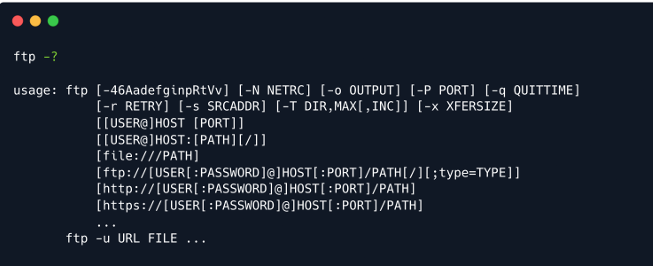

Từ hình ảnh trên, có thể thấy rằng có thể kết nối với máy chủ đích bằng lệnh bên dưới. Lệnh này sẽ khởi tạo yêu cầu xác thực trên dịch vụ FTP đang chạy trên máy chủ đích, yêu cầu này sẽ trả về lời nhắc cho máy chủ:

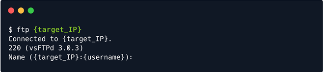

Prompt sẽ yêu cầu nhập tên người dùng muốn đăng nhập. Đây là nơi phép thuật xảy ra.

Một cấu hình sai điển hình để chạy dịch vụ FTP cho phép bất kỳ người dùng nào khác được xác thực. Tài khoản `anonymous` để truy cập dịch vụ như tên người dùng ẩn danh có thể được nhập khi prompt xuất hiện, theo sau là bất kỳ mật khẩu nào vì dịch vụ sẽ bỏ qua mật khẩu cho tài khoản cụ thể này.

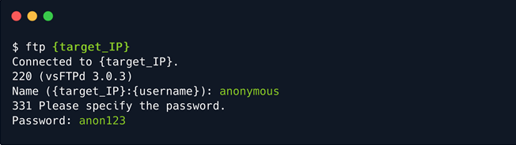

Nhấn Enter sau khi nhập mật khẩu, có thể thấy rằng đã đăng nhập thành công. Terminal thay đổi để thấy rằng bây giờ có thể đưa ra lệnh ftp.

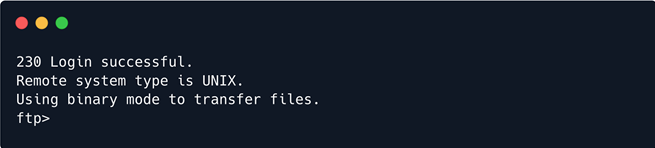

Việc nhập lệnh `help` cho phép xem những lệnh nào khả dụng. Sẽ có thể thấy mẫu này với mọi tập lệnh và dịch vụ mà có quyền truy cập. Việc nhập lệnh -h , --help hoặc lệnh trợ giúp sẽ luôn đưa ra danh sách tất cả các lệnh khả dụng với tư cách là người dùng, đôi khi có kèm theo mô tả. Nếu muốn tìm hiểu sâu hơn về một lệnh cụ thể, có thể sử dụng lệnh khác: man {commandName}. Tuy nhiên, bây giờ, hãy quay lại mục tiêu.

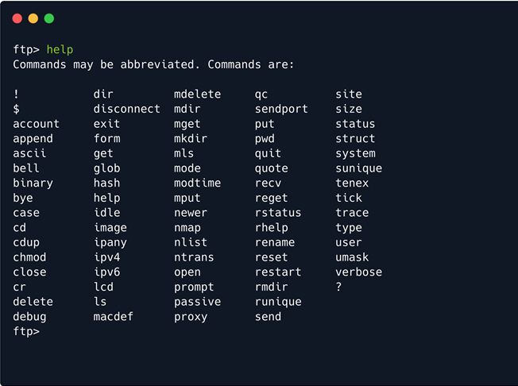

Một số lệnh được liệt kê ở đây có vẻ quen thuộc. Hãy xem nội dung của thư mục.

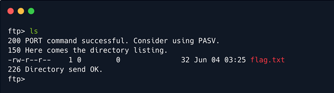

Như có thể thấy từ đầu ra, hoạt động của dịch vụ FTP cũng phát hành trạng thái cho các lệnh đang gửi đến máy chủ từ xa. Ý nghĩa của cập nhật trạng thái như sau:

```
200: Lệnh PORT thành công. Hãy cân nhắc sử dụng PASV.
150: Đây là danh sách thư mục.
226: Thư mục gửi OK.
```

Bây giờ, có thể tiến hành tải xuống sử dụng flag.txt vào máy chủ (Máy ảo). Để làm như vậy, có thể sử dụng lệnh `get`, theo sau là tên của file muốn tải xuống. Trong trường hợp của này, nó sẽ trông như thế này:

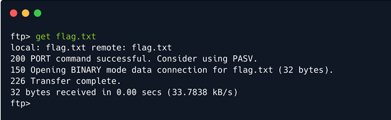

Thao tác này sẽ kích hoạt việc tải xuống file vào cùng thư mục đã ở khi bạn phát lệnh ftp {machineIP}. Nếu thoát khỏi dịch vụ FTP, sẽ thấy cùng một tệp trên máy chủ ngay bây giờ.

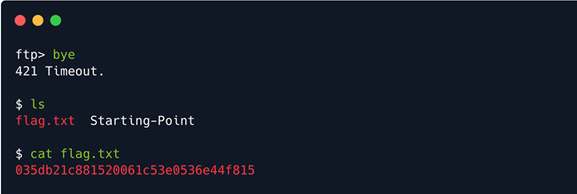

Bây giờ có thể lấy flag và gửi lên nền tảng để sở hữu box!