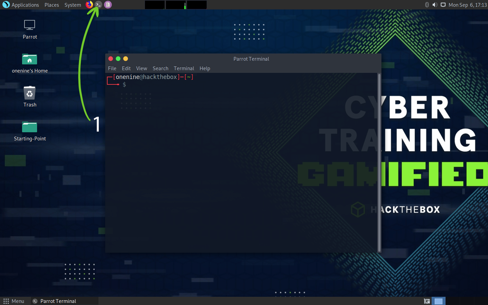
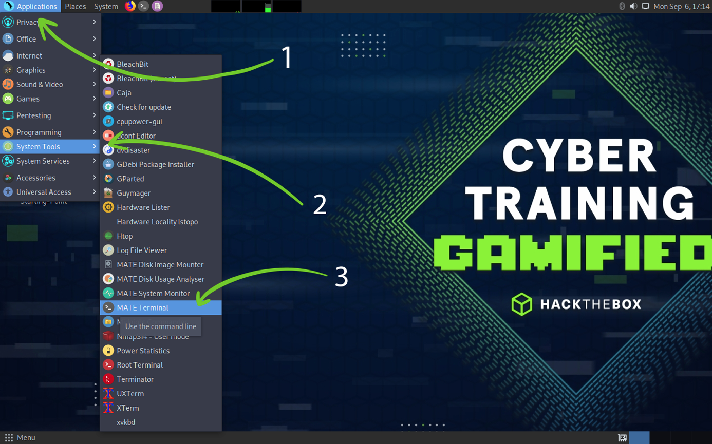
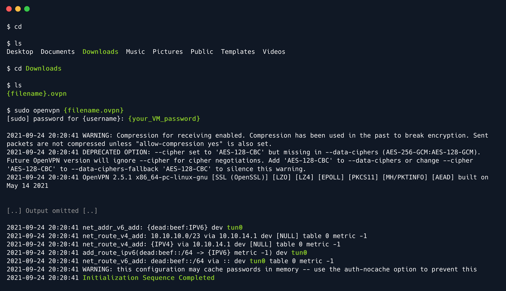
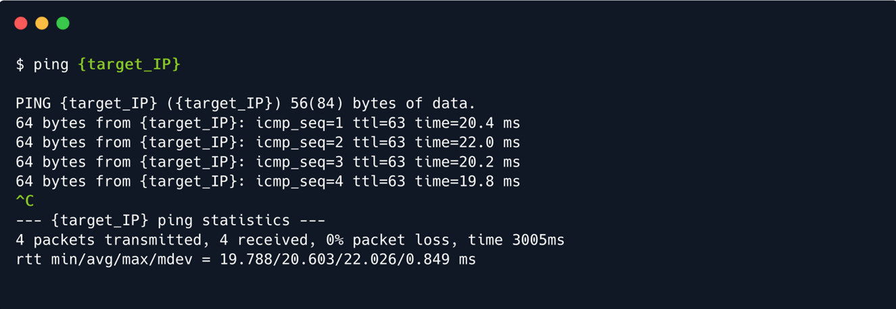
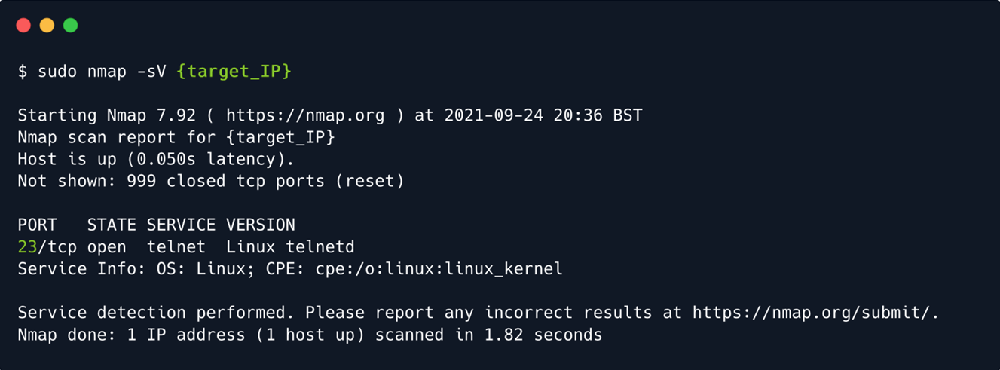
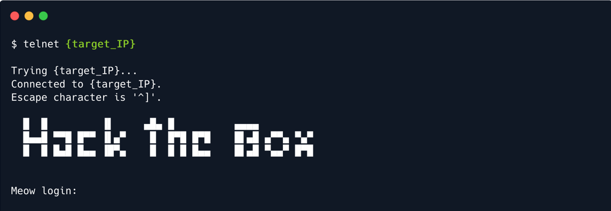
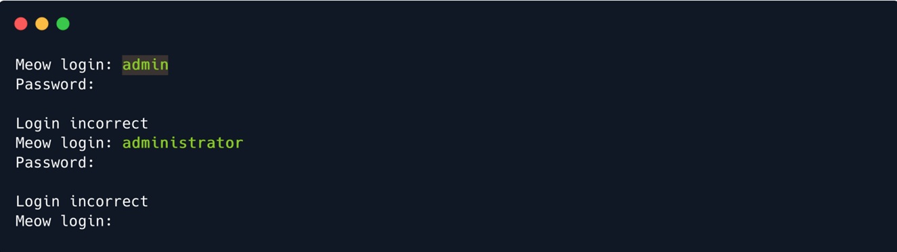
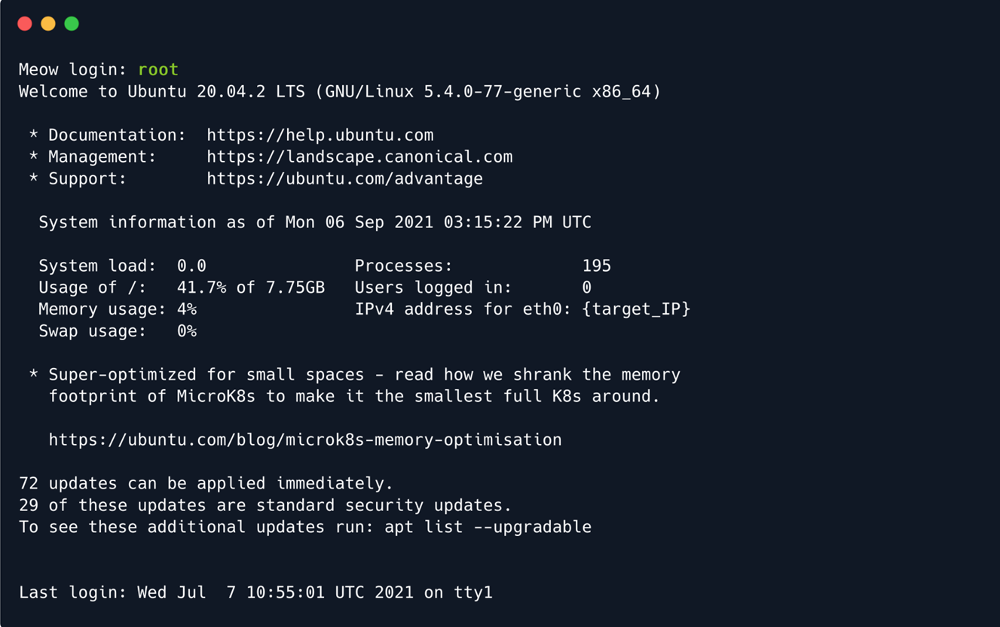
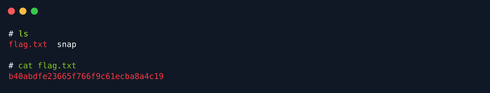

# Meow

## Setting Up

Trước khi bắt đầu với vulnerable machine đầu tiên, hãy đảm bảo rằng đã kết nối với mạng của mục tiêu và biết cách sử dụng terminal. Khi truy cập trang lab Starting Point, có thể được nhắc chọn giữa kết nối Pwnbox hoặc tệp cấu hình VPN mà có thể tải xuống và chạy trên máy ảo. Nếu chưa biết cách thiết lập máy ảo, hãy xem https://academy.hackthebox.eu/module/details/87.

Chạy Pwnbox rất đơn giản và không cần thêm bất kỳ bước nào để kết nối với máy mục tiêu. Nếu khởi động một phiên bản Pwnbox mới theo tùy chọn Starting Point, sẽ tự động được đặt trong cùng một mạng với máy mục tiêu. Có thể đọc thêm về Pwnbox: https://help.hackthebox.eu/en/articles/5185608-gs-introduction-to-pwnbox

Nếu chọn tải xuống tệp cấu hình VPN (.ovpn) trên máy ảo, thì đây là cách sử dụng tệp này để kết nối với mạng của mục tiêu. Để mở cửa sổ terminal, có thể nhấp vào biểu tượng terminal trên Desktop.

Ngoài ra, có thể điều hướng đến menu System Tools và chọn terminal từ đó. Trong trường hợp này, đang sử dụng MATE terminal. Cuối cùng, không quan trọng sử dụng terminal nào. Di chuột qua terminal, có thể thấy mô tả về tool: Sử dụng command line, đó chính xác là những gì sẽ làm tiếp theo.

Sau khi chọn cửa sổ terminal, sẽ cần điều hướng đến nơi tệp .ovpn đã được tải xuống. Trong hầu hết các trường hợp, tệp này nằm trong thư mục Downloads. Để đến đúng nơi, hãy bắt đầu bằng lệnh cd, viết tắt của change directory, để đảm bảo đang ở trong thư mục home của người dùng hiện đang đăng nhập. Chạy lệnh này mà không chỉ định vị trí để điều hướng đến sẽ chỉ đưa đến thư mục home. Lệnh tiếp theo có thể nhập là ls, lệnh này sẽ hiển thị các thư mục home directory, một số trong số đó là Desktop, Downloads, v.v... Downloads là mục được quan tâm và sử dụng lệnh cd Downloads để điều hướng bên trong đó.

Sau khi điều hướng đến thư mục Downloads, hãy nhập ls để đảm bảo tệp .ovpn có trên hệ thống, theo sau là lệnh để chạy OpenVPN client và kết nối với mạng nội bộ Hack The Box: `sudo openvpn {filename}.ovpn`, trong đó {filename} phải được thay thế bằng tên tệp .ovpn của bạn cho lab Starting Point. Văn bản được đánh dấu bằng màu xanh lá cây và dấu ngoặc nhọn {} là văn bản thay thế cho phiên bản đầu vào. Đây sẽ là cảnh tượng thường xuyên xuất hiện trong các bài viết Starting Point, vì vậy hãy ghi nhớ điều đó!

Sau khi chạy lệnh, sẽ được nhắc nhập mật khẩu super-user, giống với mật khẩu hiện tại cho tài khoản Operating System. Đừng lo lắng nếu không thấy bất cứ thứ gì được nhập vào terminal sau khi nhập mật khẩu. Đây là biện pháp bảo mật của Linux để ngăn nhìn trộm. Hoàn tất việc nhập mật khẩu và nhấn phím Enter sau khi hoàn tất để khởi tạo kết nối OpenVPN.

Hãy để tập lệnh cấu hình chạy cho đến khi bạn thấy thông báo Initialization Sequence Completed ở cuối đầu ra. Khi thông báo đó xuất hiện, hãy đảm bảo rằng không có đề cập nào đến nhiều giao diện tunnel, chẳng hạn như tun1, tun2, ... Việc có nhiều giao diện tunnel có thể làm hỏng tính ổn định của kết nối với mục tiêu và tạo ra xung đột định tuyến trên Hệ điều hành, điều này sẽ chỉ gây ra bực bội. Chỉ nên đề cập đến tun0 trong đầu ra như được đánh dấu trong hình ảnh bên dưới.

Nếu cảm thấy khó hiểu, có lẽ cần phải ôn lại các kỹ năng Linux. Để tìm hiểu thêm về cách điều hướng và sử dụng Linux với tư cách là người dùng mới, nên xem https://academy.hackthebox.com/module/details/18. Sau khi hoàn thành module này, có thể quay lại Starting Point với một bộ kỹ năng mới giúp giảm bớt sự thất vọng mà nhiều người mới cảm thấy khi lần đầu tiên bắt đầu kiểm thử thâm nhập mà không có bất kỳ kiến thức nào về Linux, giao diện dòng lệnh và các tính năng lớn.

Sau khi đảm bảo mọi thứ ổn, có thể mở một tab hoặc của sổ terminal mới. Để tab hoặc cửa sổ terminal hiện tại chạy; nếu không sẽ mất kết nối với mục tiêu. 

## Introduction

Khi bắt đầu thử nghiệm thâm nhập hoặc bất kỳ đánh giá bảo mật nào trên mục tiêu, bước chính được gọi là Enumeration. Bước này bao gồm việc ghi lại trạng thái hiện tại của mục tiêu để tìm hiểu càng nhiều càng tốt về mục tiêu đó.

Vì bây giờ đang ở cùng Mạng riêng ảo (VPN) với mục tiêu, có thể truy cập trực tiếp vào đó như bất kỳ người dùng nào khác. Nếu mục tiêu là máy chủ web, chạy trang web công khai, có thể điều hướng đến địa chỉ IP của mục tiêu để xem trang đó chứa nội dung gì. Nếu mục tiêu là máy chủ lưu trữ, có thể kết nối với mục tiêu đó bằng cùng địa chỉ IP để khám phá các tệp và thư mục được lưu trữ trên đó, miễn là có thông tin xác thực cần thiết. Câu hỏi đặt ra là, làm thế nào để tìm thấy các dịch vụ này? Không thể tìm kiếm chúng theo cách thủ công vì sẽ mất nhiều thời gian.

Mỗi máy chủ đều sử dụng các cổng để phục vụ dữ liệu cho các máy khách khác. Các bước đầu tiên trong giai đoạn Enumeration bao gồm quét các cổng mở này để xem mục đích của mục tiêu trên mạng và những lỗ hổng tiềm ẩn nào có thể xuất hiện từ các dịch vụ đang chạy trên đó. Để quét nhanh các cổng, có thể sử dụng một công cụ có tên là nmap, sẽ trình bày chi tiết hơn trong chương Enumeration của bài viết này.

Sau khi tìm thấy các cổng mở trên mục tiêu, có thể truy cập thủ công từng cổng bằng các công cụ khác nhau để tìm hiểu xem có quyền truy cập vào nội dung của chúng hay không. Các dịch vụ khác nhau sẽ sử dụng các công cụ hoặc tập lệnh khác nhau để truy cập. Những điều này chỉ có thể được khám phá và học được bởi một người kiểm tra thâm nhập mới bắt đầu thông qua thời gian và thực hành (và một số tìm kiếm siêng năng trên Google). 90% thử nghiệm thâm nhập bao gồm nghiên cứu được thực hiện trên internet về sản phẩm đang thử nghiệm. Vì hệ sinh thái công nghệ liên tục phát triển nên không thể biết mọi thứ về mọi thứ. Chìa khóa là biết cách tìm kiếm thông tin cần thiết. Khả năng nghiên cứu hiệu quả là kỹ năng cần để liên tục thích nghi và phát triển.

Mục tiêu ở đây không phải là tốc độ mà là sự tỉ mỉ. Nếu một tài nguyên trên mục tiêu bị bỏ sót trong giai đoạn Liệt kê của bài kiểm tra, có thể mất một vectơ tấn công quan trọng có khả năng cắt giảm thời gian làm việc trên mục tiêu xuống một nửa hoặc thậm chí ít hơn.

## Enumeration

Sau khi kết nối VPN được thiết lập thành công, có thể ping địa chỉ IP của mục tiêu để xem các gói tin có đến đích hay không. Có thể lấy địa chỉ IP của mục tiêu hiện tại từ trang lab Starting Point và dán vào terminal sau khi nhập lệnh ping như minh họa bên dưới.

Sau bốn phản hồi thành công từ mục tiêu, có thể xác định rằng kết nối đã được thiết lập và ổn định. Có thể hủy lệnh ping bằng cách nhấn tổ hợp phím CTRL+C trên bàn phím, lệnh này sẽ hiển thị trong terminal là ^C được đánh dấu màu xanh lá cây ở trên. Thao tác này sẽ trả lại quyền điều khiển tab terminal, từ đó có thể tiến hành bước tiếp theo - quét tất cả các cổng mở của mục tiêu để xác định các dịch vụ đang chạy trên đó. Để bắt đầu quá trình quét, có thể sử dụng lệnh sau với tập lệnh nmap. nmap là viết tắt của Network Mapper và nó sẽ gửi yêu cầu đến các cổng của mục tiêu với hy vọng nhận được phản hồi, do đó xác định xem cổng đó có mở hay không. Một số cổng được một số dịch vụ nhất định sử dụng theo mặc định. Một số cổng khác có thể không phải là chuẩn, đó là lý do tại sao sử dụng cờ phát hiện dịch vụ -sV để xác định tên và mô tả của các dịch vụ đã xác định. Văn bản được đánh dấu màu xanh lá cây và dấu ngoặc nhọn {} là văn bản thay thế cho phiên bản đầu vào. Trong trường hợp này, sẽ cần thay thế phần {target_IP} bằng địa chỉ IP của mục tiêu.

Sau khi hoàn tất quá trình quét, đã xác định được cổng 23/tcp ở trạng thái mở, đang chạy dịch vụ telnet. Sau khi tìm kiếm nhanh trên Google về giao thức này, phát hiện ra rằng telnet là một dịch vụ cũ được sử dụng để quản lý từ xa các máy chủ khác trên mạng. Vì mục tiêu đang chạy dịch vụ này nên nó có thể nhận được các yêu cầu kết nối telnet từ các máy chủ khác trong mạng. Thông thường, các yêu cầu kết nối thông qua telnet được cấu hình với các kết hợp tên người dùng/mật khẩu để tăng cường bảo mật. Có thể thấy đây là trường hợp của mục tiêu, vì gặp phải biểu ngữ Hack The Box và yêu cầu từ mục tiêu để xác thực trước khi được phép tiến hành quản lý từ xa máy chủ mục tiêu.

Sẽ cần tìm một số thông tin xác thực có thể tiếp tục vì không có cổng nào khác mở trên mục tiêu mà có thể khám phá.

## Foothold

Đôi khi, do lỗi cấu hình, một số tài khoản quan trọng có thể để mật khẩu trống vì mục đích truy cập. Đây là vấn đề đáng kể với một số thiết bị mạng hoặc máy chủ, khiến chúng dễ bị tấn công bằng cách brute-force đơn giản, trong đó kẻ tấn công có thể thử đăng nhập tuần tự, sử dụng danh sách tên người dùng mà không nhập mật khẩu.

Một số tài khoản quan trọng tiêu biểu có tên dễ hiểu, chẳng hạn như:

- admin

- administrator

- root

Một cách trực tiếp để thử đăng nhập bằng các thông tin xác thực này với hy vọng rằng một trong số chúng tồn tại và có mật khẩu trống là nhập chúng theo cách thủ công vào terminal khi máy chủ yêu cầu. Nếu danh sách dài hơn, có thể sử dụng script để tự động hóa quy trình này, cung cấp cho nó một danh sách từ cho tên người dùng và một danh sách cho mật khẩu. Thông thường, danh sách từ được sử dụng cho tác vụ này bao gồm tên người dùng thông thường, chữ viết tắt hoặc dữ liệu từ các lần rò rỉ cơ sở dữ liệu trước đó. Hiện tại, có thể dùng đến cách thử thủ công ba tên người dùng chính ở trên.

Hai điều đầu tiên không may mắn. Khi mọi thứ có vẻ tệ đi, điều cần thiết là phải tiếp tục, phải kiên trì. Không thể thành công nếu không thử mọi khả năng. Hãy thử điều cuối cùng.

Thành công! Đã đăng nhập vào hệ thống mục tiêu. Bây giờ có thể tiếp tục và xem xung quanh thư mục đã truy cập bằng lệnh ls. Có khả năng có thể tìm thấy những gì đang tìm kiếm.

Tệp flag.txt là mục tiêu trong trường hợp này. Hầu hết các mục tiêu của Hack The Box sẽ có một trong những tệp này, chứa giá trị băm được gọi là flag. Quy ước đặt tên cho các tệp mục tiêu này khác nhau tùy theo từng lab. Ví dụ, machine hàng tuần và retired sẽ có hai cờ, cụ thể là user.txt và root.txt. Các mục tiêu CTF và các lab khác sẽ có flag.txt. Hầu hết các thử thách sẽ không chứa tệp thực tế mà thay vào đó cung cấp các đoạn trích của cờ khi giải quyết, các phần tương ứng được nhúng vào challenge một cách đồng nhất hơn (văn bản ẩn trong hình ảnh hoặc các ví dụ khác).

Có thể đọc tệp để hiển thị giá trị băm trong terminal bằng lệnh cat. Sao chép cờ và dán vào trang lab Starting Point sẽ cấp cho bạn quyền sở hữu máy này, hoàn thành nhiệm vụ đầu tiên.