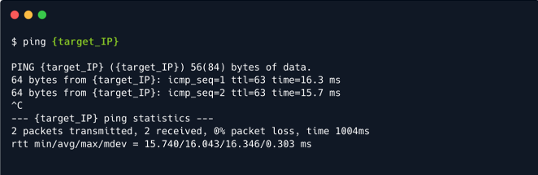
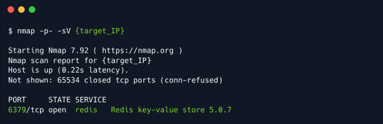
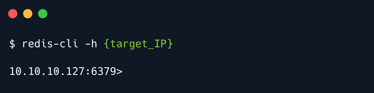
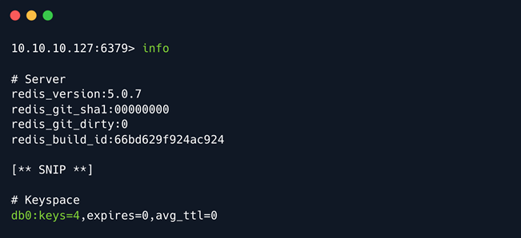
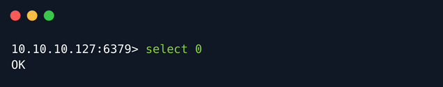
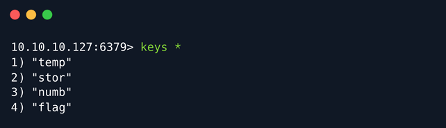
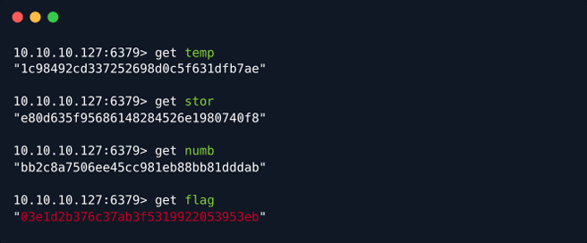

# Redeemer

## Introduction

Cơ sở dữ liệu là tập hợp thông tin được sắp xếp có thể dễ dàng truy cập, quản lý và cập nhật. Trong hầu hết các môi trường, hệ thống cơ sở dữ liệu rất quan trọng vì chúng truyền đạt thông tin liên quan đến giao dịch bán hàng, hàng tồn kho sản phẩm, hồ sơ khách hàng và hoạt động tiếp thị.

Có nhiều loại cơ sở dữ liệu khác nhau và một trong số đó là Redis, đây là cơ sở dữ liệu 'trong bộ nhớ'. Cơ sở dữ liệu trong bộ nhớ là cơ sở dữ liệu chủ yếu dựa vào bộ nhớ chính để lưu trữ dữ liệu (có nghĩa là cơ sở dữ liệu được quản lý trong RAM của hệ thống); trái ngược với cơ sở dữ liệu lưu trữ dữ liệu trên đĩa hoặc SSD. Vì bộ nhớ chính nhanh hơn đáng kể so với bộ nhớ thứ cấp nên thời gian truy xuất dữ liệu trong trường hợp cơ sở dữ liệu 'trong bộ nhớ' rất nhỏ, do đó cung cấp thời gian phản hồi rất hiệu quả và tối thiểu.

Cơ sở dữ liệu trong bộ nhớ như Redis thường được sử dụng để lưu trữ dữ liệu thường xuyên được yêu cầu để truy xuất nhanh. Ví dụ: nếu có một trang web trả về một số giá trên trang đầu của trang web. Trang web có thể được viết để kiểm tra trước xem giá cần thiết có trong Redis không, nếu không, hãy kiểm tra cơ sở dữ liệu truyền thống (như MySQL hoặc MongoDB). Khi giá trị được tải từ cơ sở dữ liệu, giá trị đó sẽ được lưu trữ trong Redis trong một khoảng thời gian ngắn hơn (giây hoặc phút hoặc giờ) để xử lý bất kỳ yêu cầu tương tự nào đến trong khung thời gian đó. Đối với một trang web có nhiều lưu lượng truy cập, cấu hình này cho phép truy xuất nhanh hơn nhiều đối với phần lớn các yêu cầu, đồng thời vẫn có bộ lưu trữ ổn định lâu dài trong cơ sở dữ liệu chính.

Lab này tập trung vào việc liệt kê máy chủ Redis từ xa rồi dump cơ sở dữ liệu của máy chủ đó để truy xuất flag. Trong quá trình này sẽ tìm hiểu về cách sử dụng tiện ích dòng lệnh `redis-cli` giúp tương tác với dịch vụ Redis. Cũng sẽ tìm hiểu về một số lệnh `redis-cli` cơ bản, được sử dụng để tương tác với máy chủ Redis và cơ sở dữ liệu khóa-giá trị.

Bây giờ hãy đi sâu vào lab.

## Enumeration

Để xác minh khả năng kết nối và tính khả dụng của mục tiêu, có thể chạy lệnh `ping` với địa chỉ IP của máy mục tiêu. Sau hai lần phản hồi thành công, có thể ngắt lệnh `ping` vì hài lòng với chất lượng kết nối. Không phải lúc nào cũng cần chạy lệnh trong thời gian dài. Đôi khi, việc lấy một đoạn trích kết quả hoặc tổng quan thay vì báo cáo chi tiết sẽ tiết kiệm thời gian hơn so với phương án thay thế.



Ngay sau đó, có thể theo dõi bằng cách quét sơ bộ mục tiêu. Sử dụng `nmap` với công tắc phát hiện phiên bản dịch vụ phù hợp, quét địa chỉ IP để tìm bất kỳ cổng và dịch vụ nào đang mở.

```
-sV: Kiểm tra các cổng mở để xác định thông tin dịch vụ/phiên bản
```



Có thể suy ra từ kết quả quét rằng chỉ có một cổng mở trên máy mục tiêu, tức là `port 6379` đang chạy máy chủ Redis.

### What is Redis?

Redis (REmote DIctionary Server) là kho dữ liệu khóa-giá trị NoSQL nâng cao mã nguồn mở được sử dụng làm cơ sở dữ liệu, bộ nhớ đệm và môi giới tin nhắn. Dữ liệu được lưu trữ theo định dạng từ điển có cặp khóa-giá trị. Nó thường được sử dụng để lưu trữ dữ liệu ngắn hạn cần truy xuất nhanh. Redis sao lưu dữ liệu vào ổ cứng để đảm bảo tính nhất quán.

#### The server

Redis chạy như phần mềm phía máy chủ nên chức năng cốt lõi của nó nằm trong thành phần máy chủ. Máy chủ lắng nghe các kết nối từ máy khách, theo chương trình hoặc thông qua giao diện dòng lệnh.

#### The CLI

Giao diện dòng lệnh (CLI) là một công cụ mạnh mẽ cung cấp quyền truy cập hoàn toàn vào dữ liệu của Redis và các chức năng của nó nếu đang phát triển phần mềm hoặc công cụ cần tương tác với nó.

#### Database

Cơ sở dữ liệu được lưu trữ trong RAM của máy chủ để cho phép truy cập dữ liệu nhanh. Redis cũng ghi nội dung của cơ sở dữ liệu vào đĩa theo các khoảng thời gian khác nhau để duy trì như một bản sao lưu, trong trường hợp xảy ra lỗi.

## Installing `redis-cli`

Bây giờ, để có thể tương tác từ xa với máy chủ Redis, cần tải tiện ích `redis-cli`. Có thể tải xuống bằng lệnh sau:

```
sudo apt install redis-tools
```

Ngoài ra, cũng có thể kết nối với máy chủ Redis bằng tiện ích netcat, nhưng sử dụng redis-cli trong write-up này vì nó thuận tiện hơn.

## Enumerating Redis Server

Sau khi cài đặt thành công tiện ích `redis-cli`, hãy xem trang trợ giúp của tiện ích này bằng cách nhập lệnh `redis-cli --help` vào terminal để nhận danh sách tất cả các công tắc có thể có cho công cụ này và mô tả của chúng.

```
redis-cli --help

Usage: redis-cli [OPTIONS] [cmd [arg [arg ...]]]
  -h  <hostname>     Server hostname (default: 127.0.0.1).
  -p <port>          Server port (default: 6379).
  -s <socket>        Server socket (overrides hostname and port).
  -a <password>      Password to use when connecting to the server.
  -r <repeat>        Execute specified command N times.
  -i <interval>      When -r is used, waits <interval> seconds per command.
                     It is possible to specify sub-second times like -i 0.1.
  -n <db>            Database number.
  -x                 Read last argument from STDIN.
  -d <delimiter>     Multi-bulk delimiter in for raw formatting (default: \n).
  -c                 Enable cluster mode (follow -ASK and -MOVED redirections).
  --raw              Use raw formatting for replies (default when STDOUT is
                     not a tty).
  --no-raw           Force formatted output even when STDOUT is not a tty.
  --csv              Output in CSV format.
  --stat             Print rolling stats about server: mem, clients, ...
  --latency          Enter a special mode continuously sampling latency.
  --latency-history  Like --latency but tracking latency changes over time.
                     Default time interval is 15 sec. Change it using -i.
  --latency-dist     Shows latency as a spectrum, requires xterm 256 colors.
                     Default time interval is 1 sec. Change it using -i.
  --lru-test <keys>  Simulate a cache workload with an 80-20 distribution.
  --slave            Simulate a slave showing commands received from the master.
  --rdb <filename>   Transfer an RDB dump from remote server to local file.
  --pipe             Transfer raw Redis protocol from stdin to server.
  --pipe-timeout <n> In --pipe mode, abort with error if after sending all data.
                     no reply is received within <n> seconds.
                     Default timeout: 30. Use 0 to wait forever.
  --bigkeys          Sample Redis keys looking for big keys.
  --scan             List all keys using the SCAN command.
  --pattern <pat>    Useful with --scan to specify a SCAN pattern.
  --intrinsic-latency <sec> Run a test to measure intrinsic system latency.
                     The test will run for the specified amount of seconds.
  --eval <file>      Send an EVAL command using the Lua script at <file>.
  --help             Output this help and exit.
  --version          Output version and exit.
```

Trong trường hợp này, chỉ cần sử dụng công tắc sau để chỉ định máy chủ cần kết nối tới:

```
-h <tên máy chủ>: chỉ định tên máy chủ của mục tiêu để kết nối tới
```

Hãy kết nối với máy chủ redis bằng lệnh sau:

```
 redis-cli -h {target_IP}
```



Sau khi kết nối thành công với máy chủ Redis, sẽ thấy một prompt trong terminal như trong hình trên.
Một trong những lệnh liệt kê Redis cơ bản là `info` trả về thông tin và số liệu thống kê về máy chủ Redis. Vì đầu ra của lệnh này khá dài, đã cắt bỏ thông tin ít liên quan:



Phần keyspace cung cấp số liệu thống kê về dictionary chính của mỗi cơ sở dữ liệu. Số liệu thống kê bao gồm số lượng khóa và số lượng khóa có ngày hết hạn.

Trong trường hợp này, trong phần `Keyspace`, có thể thấy rằng chỉ có một cơ sở dữ liệu tồn tại với chỉ mục `0`.

Hãy chọn cơ sở dữ liệu logic Redis này bằng cách sử dụng lệnh `select` theo sau là số chỉ mục của cơ sở dữ liệu cần chọn:

```
select 0
```



Hơn nữa, có thể liệt kê tất cả các khóa có trong cơ sở dữ liệu bằng lệnh:

```
keys *
```



Cuối cùng, có thể xem các giá trị được lưu trữ cho một khóa tương ứng bằng cách sử dụng lệnh `get` theo sau là keynote:

```
get <key>
```



Đã lấy thành công giá trị flag từ cơ sở dữ liệu Redis.