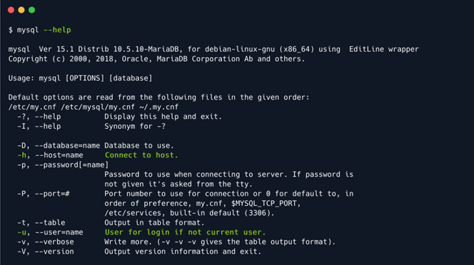

# Sequel

## Introduction

Học cách điều hướng cơ sở dữ liệu có tầm quan trọng đáng kể vì hầu hết dữ liệu quan trọng đều được lưu trữ trong đó, bao gồm tên người dùng và mật khẩu, có khả năng được sử dụng để có được quyền truy cập đặc quyền cao nhất vào hệ thống mục tiêu. Đã đề cập đến chủ đề cơ sở dữ liệu trong các write-up trước. Tuy nhiên, trong write-up này, sẽ học cách điều hướng qua chúng.

Lý do máy chủ web và các dịch vụ khác sử dụng cơ sở dữ liệu như MySQL, MariaDB hoặc các công nghệ khác là để lưu trữ dữ liệu tích lũy ở một nơi dễ truy cập và được tổ chức tốt. Dữ liệu đó có thể biểu thị tên người dùng, mật khẩu, bài đăng, tin nhắn, ngày chính xác khi người dùng tham gia và thông tin khác - tùy thuộc vào mục đích của trang web. Mỗi cơ sở dữ liệu đều chứa các bảng, lần lượt chứa các hàng và cột. Ví dụ: nếu có một trang web có phần mạng xã hội và thương mại điện tử nhỏ, sẽ cần có một số phần riêng biệt không được phép truy cập lẫn nhau:

- Một phần chứa thông tin riêng tư của người dùng, chẳng hạn như địa chỉ email, vị trí địa lý, lịch sử đăng nhập và địa chỉ IP được đính kèm, tên thật, thông tin thẻ tín dụng, v.v.

- Chứa thông tin có thể tìm kiếm công khai như sản phẩm, dịch vụ, nhạc, video và các loại thông tin khác.


Một ví dụ tuyệt vời về cách thức hoạt động thông thường của Dịch vụ SQL là quy trình đăng nhập được sử dụng cho bất kỳ người dùng nào. Mỗi lần người dùng muốn đăng nhập, ứng dụng web sẽ gửi đầu vào trang đăng nhập (kết hợp tên người dùng/mật khẩu) đến Dịch vụ SQL, so sánh với các mục nhập cơ sở dữ liệu được lưu trữ cho người dùng cụ thể đó. Giả sử tên người dùng và mật khẩu được chỉ định khớp với bất kỳ mục nhập nào trong cơ sở dữ liệu. Trong trường hợp đó, Dịch vụ SQL sẽ báo cáo lại cho ứng dụng web, sau đó, ứng dụng web sẽ đăng nhập người dùng, cấp cho họ quyền truy cập vào các phần bị hạn chế của trang web. Sau khi đăng nhập, ứng dụng web sẽ đặt cho người dùng một quyền đặc biệt dưới dạng cookie hoặc mã thông báo xác thực liên kết sự hiện diện trực tuyến của người dùng với sự hiện diện đã xác thực của người dùng trên trang web. Cookie này được lưu trữ cục bộ, trên bộ nhớ trình duyệt của người dùng và máy chủ web.

Sau đó, nếu người dùng muốn tìm kiếm qua các mục danh sách được liệt kê trên trang cho một mục cụ thể, họ sẽ nhập tên đối tượng vào thanh tìm kiếm, điều này sẽ kích hoạt cùng một Dịch vụ SQL để chạy truy vấn SQL thay mặt cho người dùng. Giả sử một mục nhập cho mục được tìm kiếm tồn tại trong cơ sở dữ liệu, thường là dưới một bảng khác. Trong trường hợp đó, thông tin liên quan được truy xuất và gửi đến ứng dụng web để được trình bày dưới dạng hình ảnh, văn bản, liên kết và các loại khác, chẳng hạn như bình luận và đánh giá.


Tuy nhiên, trong trường hợp này sẽ không cần truy cập SQL Service thông qua Web Application. Khi quét mục tiêu, sẽ tìm ra cách trực tiếp để "nói chuyện" với SQL Service.

## Enumeration

Bắt đầu bằng quét nmap để có thể kiểm tra cổng nào đang mở và dịch vụ nào đang chạy trên các cổng đó:

```
-sC: Thực hiện quét tập lệnh bằng bộ tập lệnh mặc định. Nó tương đương với --script=default. Một số tập lệnh trong danh mục này được coi là xâm phạm và không nên chạy trên mạng đích mà không được phép.

-sV: Bật phát hiện phiên bản, tính năng này sẽ phát hiện phiên bản nào đang chạy trên cổng nào.
```


Chỉ tìm thấy một cổng mở - 3306, chạy một dịch vụ có tên `MySQL 5.5.5-10.3.27-MariaDB-0+deb10u1`. MySQL là một dịch vụ được thiết kế để quản lý cơ sở dữ liệu: tạo, sửa đổi và cập nhật cơ sở dữ liệu, thay đổi và thêm dữ liệu, v.v.

## Foothold

Để giao tiếp với cơ sở dữ liệu, cần cài đặt mysql hoặc mariadb trên máy local. Để làm điều đó, cần chạy lệnh sau. Đảm bảo bao gồm ký hiệu * ở cuối lệnh để bao gồm tất cả các gói MySQL liên quan có sẵn. Điều này sẽ đáp ứng tất cả các nhu cầu ngay bây giờ.

```
sudo apt update && sudo apt install mysql*
```

Sau khi cài đặt hoàn tất, có thể chạy lệnh sau để xem các lệnh dịch vụ được sử dụng như thế nào.



Lưu ý rằng các máy khách MySQL thường xác thực với dịch vụ bằng tổ hợp tên người dùng/mật khẩu. Tuy nhiên, điều cần thiết là phải kiểm tra xác thực không cần mật khẩu, vì có thể có cấu hình sai cố ý trong dịch vụ, điều này sẽ cho phép nhân viên dễ dàng đăng nhập vào dịch vụ trong giai đoạn triển khai của dự án để dễ dàng tương tác với dịch vụ trước khi cung cấp cho các đồng nghiệp khác. Trong tình huống hiện tại, một nỗ lực ban đầu có thể là cố gắng đăng nhập với tư cách là người dùng `root`, tất nhiên có cấp độ đặc quyền cao nhất trên hệ thống.

```
-h: Kết nối với máy chủ.

-u: Người dùng để đăng nhập nếu không phải là người dùng hiện tại.
```


Với một chút may mắn, kết nối được chấp nhận mà không cần yêu cầu mật khẩu, được đặt trong một shell dịch vụ MySQL, từ đó có thể khám phá các bảng và dữ liệu có sẵn trong đó. Nếu cần trợ giúp về cú pháp lệnh MySQL, có thể tham khảo bảng hướng dẫn do MySQLTutorial cung cấp.

Các lệnh sẽ sử dụng rất cần thiết cho việc điều hướng:

```
SHOW databases;         :  In ra các cơ sở dữ liệu có thể truy cập.
USE {database_name};    :  Sử dụng cơ sở dữ liệu có tên là {database_name}.
SHOW tables;            :  In ra các bảng có sẵn bên trong cơ sở dữ liệu hiện tại.
SELECT * FROM {table_name};   : In ra tất cả dữ liệu từ bảng {table_name}.
```

Lưu ý rằng điều cần thiết là kết thúc mỗi lệnh bằng ký hiệu `;` vì nó khai báo kết thúc lệnh. Ngoài ra, SQL là ngôn ngữ hướng truy vấn, nghĩa là cung cấp cho nó một truy vấn tại một thời điểm.


Từ đầu ra, cơ sở dữ liệu `htb` có vẻ có giá trị. Để xem những gì nằm bên trong nó, sẽ cần "select" cơ sở dữ liệu `htb` làm cơ sở dữ liệu đang hoạt động - cơ sở dữ liệu muốn tương tác tích cực cho các lệnh tiếp theo. Để đạt được điều này, có thể sử dụng lệnh `USE htb;`.


Đã thay đổi cơ sở dữ liệu thành công. Bước tiếp theo là kiểm tra xem cơ sở dữ liệu `htb` chứa những bảng nào. Có thể thực hiện việc này bằng cách theo dõi lệnh `SHOW tables;`.


Có hai bảng: `config` và `users`. Có thể kiểm tra tuần tự nội dung của chúng bằng lệnh `SELECT * FROM {table_name}`, trong đó `{table_name}` là tên chính xác của bảng muốn khám phá, lấy từ đầu ra ở trên. Khi truy vấn bảng `config` để biết nội dung, mục `flag` sẽ được xuất ra trong terminal, cùng với giá trị của nó.


Với việc thu thập được `flag` mong muốn, mục tiêu này có thể được hoàn thành.